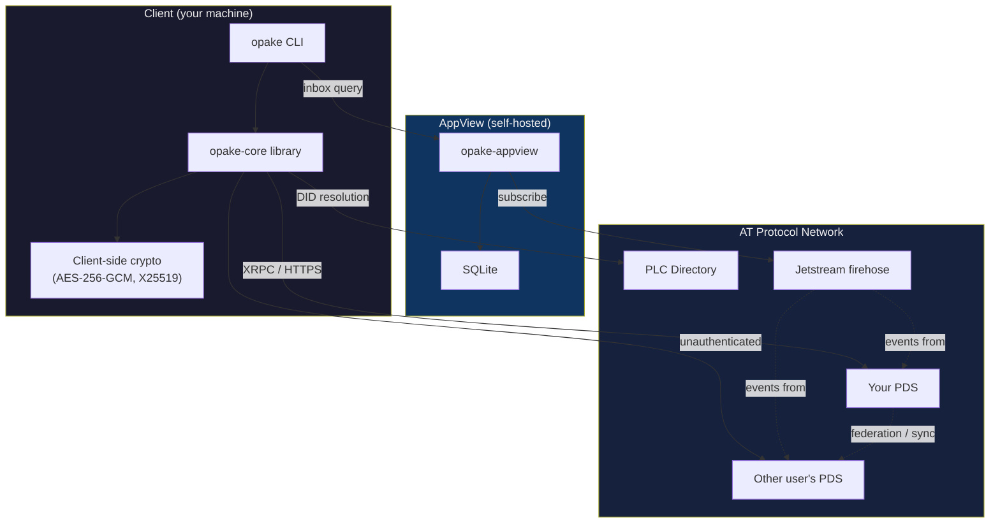
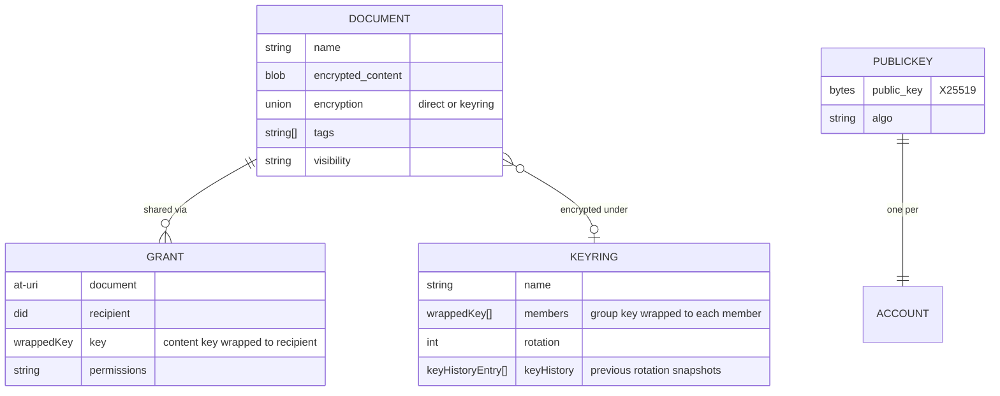

# Opake — Architecture

## System Overview



The CLI talks directly to PDS instances over XRPC. No PDS modifications needed. All encryption and decryption happens on your machine. The AppView is an optional component that indexes grants and keyrings from the firehose for discovery.

## Crate Structure

```
crates/
  opake-core/          Platform-agnostic library (compiles to WASM)
    src/
      atproto.rs       AT-URI parsing, shared AT Protocol primitives
      resolve.rs       Handle/DID → PDS → public key resolution pipeline
      error.rs         Typed error hierarchy (thiserror)
      test_utils.rs    MockTransport + response queue (behind test-utils feature)
      crypto/
        mod.rs         Type defs, constants, re-exports
        content.rs     AES-256-GCM: generate_content_key(), encrypt_blob(), decrypt_blob()
        key_wrapping.rs  X25519-HKDF-A256KW: wrap_key(), unwrap_key(), create_group_key()
        keyring_wrapping.rs  Symmetric AES-KW: wrap/unwrap content key under group key
      records/
        mod.rs         SCHEMA_VERSION, Versioned trait, check_version(), re-exports
        defs.rs        WrappedKey, EncryptionEnvelope, KeyringRef
        document.rs    DirectEncryption, KeyringEncryption, Encryption, Document
        public_key.rs  PublicKeyRecord, collection/rkey constants
        grant.rs       Grant
        keyring.rs     KeyHistoryEntry, Keyring
      client/
        mod.rs         Re-exports
        transport.rs   Transport trait (HTTP abstraction for WASM compat)
        did.rs         Unauthenticated DID resolution and cross-PDS queries
        list.rs        Generic paginated collection fetcher
        xrpc/
          mod.rs       XrpcClient struct, Session, response types, check_response()
          auth.rs      login(), refresh_session()
          blobs.rs     upload_blob(), get_blob()
          repo.rs      create_record(), put_record(), get_record(), list_records(), delete_record()
      documents/
        mod.rs         Re-exports, shared test fixtures
        upload.rs      encrypt_and_upload()
        download.rs    download_and_decrypt() — direct-encrypted documents
        download_grant.rs  download_shared() — cross-PDS via grant URI
        download_keyring.rs  download_keyring_document() — keyring-encrypted documents
        list.rs        list_documents()
        delete.rs      delete_document()
        resolve.rs     Filename → AT-URI resolution
      keyrings/
        mod.rs         Re-exports, resolve_keyring_uri()
        create.rs      create_keyring() → group key + record
        list.rs        list_keyrings()
        add_member.rs  add_member() — wrap GK to new member
        remove_member.rs remove_member() — rotate GK, re-wrap to remaining
      sharing/
        mod.rs         Re-exports
        create.rs      create_grant()
        list.rs        list_grants()
        revoke.rs      revoke_grant()

  opake-cli/           CLI binary wrapping opake-core
    src/
      main.rs          Clap app, command dispatch
      config.rs        Multi-account config (default DID, account map)
      session.rs       Per-account session persistence (JWT tokens)
      identity.rs      Per-account X25519 + Ed25519 keypair persistence
      keyring_store.rs Local group key persistence (per-keyring)
      transport.rs     reqwest-based Transport implementation
      utils.rs         Test harness, env helpers
      commands/
        login.rs       Auth + key publish
        upload.rs      File → encrypt → upload (direct or --keyring)
        download.rs    Download + decrypt (direct, keyring, or --grant)
        ls.rs          List documents
        rm.rs          Delete with confirmation prompt
        resolve.rs     Identity resolution display
        share.rs       Grant creation
        revoke.rs      Grant deletion
        shared.rs      List created grants
        keyring.rs     Keyring CRUD (create, ls, add-member, remove-member)
        accounts.rs    List accounts
        logout.rs      Remove account
        set_default.rs Switch default account

  opake-appview/       Indexer + REST API for grant/keyring discovery
    src/
      main.rs          Clap app (run/index/serve/status subcommands)
      config.rs        AppView config (appview.toml)
      state.rs         AppState (Database, indexer status, key cache)
      error.rs         Typed error hierarchy (thiserror)
      indexer.rs       Event loop: firehose → parse → store
      api/
        mod.rs         Axum router (public + protected routes, rate limiting)
        auth.rs        DID-scoped Ed25519 auth middleware
        key_cache.rs   Signing key cache with TTL
        health.rs      GET /api/health (unauthenticated)
        inbox.rs       GET /api/inbox (grants by recipient DID)
        keyrings.rs    GET /api/keyrings (memberships by DID)
        types.rs       API response types
      db/
        mod.rs         Database wrapper (SQLite, WAL mode)
        schema.rs      Table definitions
        cursor.rs      Firehose cursor persistence
        grants.rs      Grant upsert/query/delete
        keyrings.rs    Keyring member upsert/query/delete
      firehose/
        mod.rs         Re-exports
        subscribe.rs   WebSocket connection to Jetstream
        events.rs      Event parsing → IndexableEvent
      commands/
        mod.rs         Shared helpers (build_state, serve_http)
        run.rs         Indexer + API (default)
        index.rs       Indexer only
        serve.rs       API only
        status.rs      Print cursor + stats
```

The boundary is strict: `opake-core` never touches the filesystem, stdin, or any platform-specific API. All I/O happens in the binary crates. This keeps `opake-core` compilable to WASM for the future web UI.

## Encryption Model

Every file is encrypted before it leaves your machine. The PDS stores opaque ciphertext.

### Hybrid Encryption

Same pattern as git-crypt: symmetric content encryption + asymmetric key wrapping.

```
plaintext file
  → AES-256-GCM with random content key K → ciphertext blob
  → X25519-HKDF-A256KW wraps K to owner's public key → wrappedKey in document record
```

**Content encryption** (AES-256-GCM) — fast, handles arbitrary-size data. A random 256-bit key and 96-bit nonce are generated per file.

**Key wrapping** (x25519-hkdf-a256kw) — wraps the 256-bit content key to a recipient's X25519 public key. Uses ephemeral ECDH + HKDF-SHA256 + AES-256-KW. The wrapped key ciphertext is `[32-byte ephemeral pubkey ‖ 40-byte AES-KW output]`.

The algorithm name `x25519-hkdf-a256kw` is intentionally distinct from JWE's `ECDH-ES+A256KW` — we use HKDF-SHA256, not JWE's Concat KDF. The HKDF info string includes the schema version for domain separation: `opake-v1-x25519-hkdf-a256kw-{did}`.

### Two Sharing Modes

**Direct encryption** — the content key is wrapped individually to each authorized DID. The `keys` array in the document's encryption envelope holds one entry per authorized user. Good for ad-hoc sharing of individual files.

**Keyring encryption** — a named group has a shared group key (GK), wrapped to each member's X25519 public key. Documents have their content key wrapped under GK (AES-256-KW) instead of individual public keys. Adding a member to the keyring gives them access to all its documents without per-document changes. Removing a member rotates GK and re-wraps to the remaining members.

### Revocation

Deleting a grant record removes the recipient's wrapped key from the network. However, if they previously cached the key or the decrypted content, that access can't be revoked retroactively. True forward secrecy requires re-encrypting the blob with a new content key and deleting the old blob. The schema supports this workflow.

### Public Key Discovery

AT Protocol DID documents only contain signing keys (secp256k1/P-256), not encryption keys. Opake publishes `app.opake.cloud.publicKey/self` singleton records on each user's PDS containing:

- **X25519 encryption public key** — used for key wrapping (sharing)
- **Ed25519 signing public key** — used for AppView authentication

Key discovery is an unauthenticated `getRecord` call — no auth needed to look up someone's public key. Both keys are published automatically on every `opake login` via an idempotent `putRecord`.

## Data Model

All records live under the `app.opake.cloud.*` NSID namespace. See [lexicons/README.md](../lexicons/README.md) for the schema reference and [lexicons/EXAMPLES.md](../lexicons/EXAMPLES.md) for annotated example records.



### Plaintext Metadata Tradeoff

File names, tags, MIME types, and descriptions are stored unencrypted in the document record. This allows a personal AppView to index and search files server-side without access to encryption keys.

For full opacity, set these fields to generic values and embed real metadata inside the encrypted blob. The schema supports both approaches.

## Cross-PDS Access

When you share a file, the data stays on your PDS. The recipient's client fetches everything directly from the source:

1. Grant record (contains wrapped content key)
2. Document record (contains blob reference and nonce)
3. Blob (encrypted file content)

All three are unauthenticated reads — AT Protocol records and blobs are public by design. The encryption is the access control, not the transport.

## Multi-Account Support

The CLI supports multiple authenticated accounts. Each account has its own:

- Session tokens (access + refresh JWT)
- X25519 keypair
- PDS URL and handle

Both binaries resolve their config directory through the same chain: `--config-dir` flag → `OPAKE_DATA_DIR` env → `XDG_CONFIG_HOME/opake` → `~/.config/opake`. Resolution logic lives in `opake-core/src/paths.rs`.

Storage layout:

```
~/.config/opake/
  config.toml            CLI config (default DID, account map)
  appview.toml           AppView config (jetstream URL, listen addr, db path)
  accounts/
    <did>/
      session.json       JWT tokens
      identity.json      X25519 + Ed25519 keypairs (plaintext for MVP)
      keyrings/
        <rkey>.json      Group keys for each keyring (per-rotation)
```

Group keys are stored locally because they never appear in plaintext on the PDS — only wrapped copies exist in the keyring record. Each keyring file holds an array of `{ rotation, group_key }` entries so that keys from previous rotations remain available for decrypting older documents. Legacy files (single `group_key` without rotation) are auto-migrated to rotation 0 on read.

The `--as <handle-or-did>` flag overrides the default account for any command. Future improvement: seed phrase derivation for the keypair instead of storing it in plaintext.
