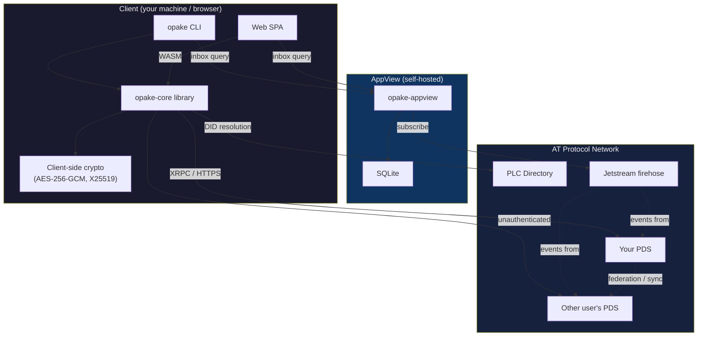
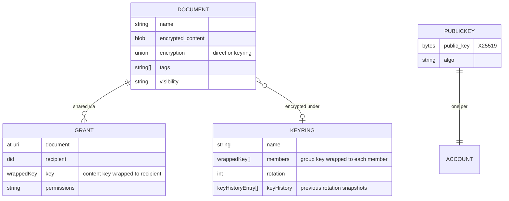

# Opake — Architecture

## System Overview



Both the CLI and the web frontend talk directly to PDS instances over XRPC. No PDS modifications needed. All encryption and decryption happens client-side — on your machine (CLI) or in the browser (Web via WASM). The AppView is an optional component that indexes grants and keyrings from the firehose for discovery.

## Crate Structure

```
crates/
  opake-core/          Platform-agnostic library (compiles to WASM)
    src/
      atproto.rs       AT-URI parsing, shared AT Protocol primitives
      resolve.rs       Handle/DID → PDS → public key resolution pipeline
      storage.rs       Config, Identity types + Storage trait (cross-platform contract)
      error.rs         Typed error hierarchy (thiserror)
      test_utils.rs    MockTransport + response queue (behind test-utils feature)
      crypto/
        mod.rs         Type defs, constants, re-exports
        content.rs     AES-256-GCM: generate_content_key(), encrypt_blob(), decrypt_blob()
        key_wrapping.rs  X25519-HKDF-A256KW: wrap_key(), unwrap_key(), create_group_key()
        keyring_wrapping.rs  Symmetric AES-KW: wrap/unwrap content key under group key
      records/
        mod.rs         SCHEMA_VERSION, Versioned trait, check_version(), re-exports
        defs.rs        WrappedKey, EncryptionEnvelope, KeyringRef
        document.rs    DirectEncryption, KeyringEncryption, Encryption, Document
        public_key.rs  PublicKeyRecord, collection/rkey constants
        grant.rs       Grant
        keyring.rs     KeyHistoryEntry, Keyring
      client/
        mod.rs         Re-exports
        transport.rs   Transport trait (HTTP abstraction for WASM compat)
        did.rs         Unauthenticated DID resolution and cross-PDS queries
        list.rs        Generic paginated collection fetcher
        dpop.rs        DPoP keypair (P-256/ES256) + proof JWT generation
        oauth_discovery.rs  OAuth AS discovery + PKCE S256 generation
        oauth_token.rs PAR, authorization code exchange, token refresh (all with DPoP)
        xrpc/
          mod.rs       XrpcClient struct, Session enum (Legacy/OAuth), dual auth dispatch
          auth.rs      login(), refresh_session() (legacy + OAuth)
          blobs.rs     upload_blob(), get_blob()
          repo.rs      create_record(), put_record(), get_record(), list_records(), delete_record()
      directories/
        mod.rs         Re-exports, collection constants, shared test fixtures
        create.rs      create_directory()
        delete.rs      delete_directory() — single empty directory
        entries.rs     add_entry(), remove_entry() — fetch-modify-put on parent
        get_or_create_root.rs  Root singleton (rkey "self") management
        list.rs        list_directories()
        tree.rs        DirectoryTree — in-memory snapshot for path resolution
        remove.rs      remove() — path-aware deletion (recursive, with parent cleanup)
      documents/
        mod.rs         Re-exports, shared test fixtures
        upload.rs      encrypt_and_upload()
        download.rs    download_and_decrypt() — direct-encrypted documents
        download_grant.rs  download_shared() — cross-PDS via grant URI
        download_keyring.rs  download_keyring_document() — keyring-encrypted documents
        list.rs        list_documents()
        delete.rs      delete_document()
        resolve.rs     Filename → AT-URI resolution
      keyrings/
        mod.rs         Re-exports, resolve_keyring_uri()
        create.rs      create_keyring() → group key + record
        list.rs        list_keyrings()
        add_member.rs  add_member() — wrap GK to new member
        remove_member.rs remove_member() — rotate GK, re-wrap to remaining
      sharing/
        mod.rs         Re-exports
        create.rs      create_grant()
        list.rs        list_grants()
        revoke.rs      revoke_grant()
      pairing/
        mod.rs         Re-exports
        request.rs     create_pair_request() — write ephemeral key to PDS
        respond.rs     respond_to_pair_request() — encrypt + wrap identity
        receive.rs     receive_pair_response() — decrypt + verify identity
        cleanup.rs     cleanup_pair_records() — delete request + response

  opake-cli/           CLI binary wrapping opake-core
    src/
      main.rs          Clap app, command dispatch
      config.rs        FileStorage (impl Storage for filesystem), anyhow wrappers
      session.rs       CommandContext resolution, session persistence
      identity.rs      Keypair generation, migration, permission checks
      keyring_store.rs Local group key persistence (per-keyring)
      transport.rs     reqwest-based Transport implementation
      oauth.rs         OAuth loopback redirect server + browser open
      utils.rs         Test harness, env helpers
      commands/
        login.rs       Auth + key publish (OAuth-first with --legacy fallback)
        upload.rs      File → encrypt → upload (direct or --keyring)
        download.rs    Download + decrypt (direct, keyring, or --grant)
        ls.rs          List documents
        metadata.rs    View/edit document metadata (rename, tags, description)
        mkdir.rs       Create directory
        rm.rs          Path-aware delete (documents, directories, recursive)
        resolve.rs     Identity resolution display
        share.rs       Grant creation
        revoke.rs      Grant deletion
        shared.rs      List created grants
        keyring.rs     Keyring CRUD (create, ls, add-member, remove-member)
        pair.rs        Device pairing (request, approve)
        accounts.rs    List accounts
        logout.rs      Remove account
        set_default.rs Switch default account

  opake-appview/       Indexer + REST API for grant/keyring discovery
    src/
      main.rs          Clap app (run/index/serve/status subcommands)
      config.rs        AppView config (appview.toml)
      state.rs         AppState (Database, indexer status, key cache)
      error.rs         Typed error hierarchy (thiserror)
      indexer.rs       Event loop: firehose → parse → store
      api/
        mod.rs         Axum router (public + protected routes, rate limiting)
        auth.rs        DID-scoped Ed25519 auth middleware
        key_cache.rs   Signing key cache with TTL
        health.rs      GET /api/health (unauthenticated)
        inbox.rs       GET /api/inbox (grants by recipient DID)
        keyrings.rs    GET /api/keyrings (memberships by DID)
        types.rs       API response types
      db/
        mod.rs         Database wrapper (SQLite, WAL mode)
        schema.rs      Table definitions
        cursor.rs      Firehose cursor persistence
        grants.rs      Grant upsert/query/delete
        keyrings.rs    Keyring member upsert/query/delete
      firehose/
        mod.rs         Re-exports
        subscribe.rs   WebSocket connection to Jetstream
        events.rs      Event parsing → IndexableEvent
      commands/
        mod.rs         Shared helpers (build_state, serve_http)
        run.rs         Indexer + API (default)
        index.rs       Indexer only
        serve.rs       API only
        status.rs      Print cursor + stats

  opake-derive/        Proc-macro crate (RedactedDebug derive)
    src/
      lib.rs           #[derive(RedactedDebug)] + #[redact] attribute

web/                   React SPA (Vite + TanStack Router + Tailwind + daisyUI)
  src/
    lib/
      storage.ts       Storage interface (mirrors opake-core Storage trait)
      storage-types.ts Config, Identity, Session types (mirrors opake-core)
      indexeddb-storage.ts  IndexedDbStorage (impl Storage over Dexie.js/IndexedDB)
      api.ts           API client helpers
      crypto-types.ts  Crypto type definitions
    stores/
      auth.ts          Auth state (Zustand)
    routes/
      __root.tsx       Root layout with auth guard
      index.tsx        Landing page
      login.tsx        Login form
      cabinet.tsx      File cabinet (main UI)
    components/cabinet/
      PanelStack.tsx   Stacked panel navigation
      PanelContent.tsx File grid/list view
      Sidebar.tsx      Navigation sidebar
      TopBar.tsx       Header with account switcher
      FileGridCard.tsx Grid card with file icon + metadata
      FileListRow.tsx  List row variant
      types.ts         Discriminated union types for cabinet state
    wasm/opake-wasm/   WASM build of opake-core (via wasm-pack)
    workers/
      crypto.worker.ts Web Worker for off-main-thread crypto (Comlink)
  tests/
    lib/
      indexeddb-storage.test.ts  Storage contract tests (fake-indexeddb)
```

The boundary is strict: `opake-core` never touches the filesystem, stdin, or any platform-specific API. All I/O happens through the `Storage` trait — `FileStorage` (CLI, filesystem) and `IndexedDbStorage` (web, IndexedDB) implement the same contract with platform-specific backends. This keeps `opake-core` compilable to WASM, which the web frontend uses via `wasm-pack`.

## Encryption Model

Every file is encrypted before it leaves your machine. The PDS stores opaque ciphertext.

### Hybrid Encryption

Same pattern as git-crypt: symmetric content encryption + asymmetric key wrapping.

```
plaintext file
  → AES-256-GCM with random content key K → ciphertext blob
  → X25519-HKDF-A256KW wraps K to owner's public key → wrappedKey in document record
```

**Content encryption** (AES-256-GCM) — fast, handles arbitrary-size data. A random 256-bit key and 96-bit nonce are generated per file.

**Key wrapping** (x25519-hkdf-a256kw) — wraps the 256-bit content key to a recipient's X25519 public key. Uses ephemeral ECDH + HKDF-SHA256 + AES-256-KW. The wrapped key ciphertext is `[32-byte ephemeral pubkey ‖ 40-byte AES-KW output]`.

The algorithm name `x25519-hkdf-a256kw` is intentionally distinct from JWE's `ECDH-ES+A256KW` — we use HKDF-SHA256, not JWE's Concat KDF. The HKDF info string includes the schema version for domain separation: `opake-v1-x25519-hkdf-a256kw-{did}`.

### Two Sharing Modes

**Direct encryption** — the content key is wrapped individually to each authorized DID. The `keys` array in the document's encryption envelope holds one entry per authorized user. Good for ad-hoc sharing of individual files.

**Keyring encryption** — a named group has a shared group key (GK), wrapped to each member's X25519 public key. Documents have their content key wrapped under GK (AES-256-KW) instead of individual public keys. Adding a member to the keyring gives them access to all its documents without per-document changes. Removing a member rotates GK and re-wraps to the remaining members.

### Revocation

Deleting a grant record removes the recipient's wrapped key from the network. However, if they previously cached the key or the decrypted content, that access can't be revoked retroactively. True forward secrecy requires re-encrypting the blob with a new content key and deleting the old blob. The schema supports this workflow.

### Public Key Discovery

AT Protocol DID documents only contain signing keys (secp256k1/P-256), not encryption keys. Opake publishes `app.opake.publicKey/self` singleton records on each user's PDS containing:

- **X25519 encryption public key** — used for key wrapping (sharing)
- **Ed25519 signing public key** — used for AppView authentication

Key discovery is an unauthenticated `getRecord` call — no auth needed to look up someone's public key. Both keys are published automatically on every `opake login` via an idempotent `putRecord`.

## Data Model

All records live under the `app.opake.*` NSID namespace. See [lexicons/README.md](../lexicons/README.md) for the schema reference and [lexicons/EXAMPLES.md](../lexicons/EXAMPLES.md) for annotated example records.



### Plaintext Metadata Tradeoff

File names, tags, MIME types, and descriptions are stored unencrypted in the document record. This allows a personal AppView to index and search files server-side without access to encryption keys.

For full opacity, set these fields to generic values and embed real metadata inside the encrypted blob. The schema supports both approaches.

## Cross-PDS Access

When you share a file, the data stays on your PDS. The recipient's client fetches everything directly from the source:

1. Grant record (contains wrapped content key)
2. Document record (contains blob reference and nonce)
3. Blob (encrypted file content)

All three are unauthenticated reads — AT Protocol records and blobs are public by design. The encryption is the access control, not the transport.

## Storage Abstraction

Config, identity, and session types live in `opake-core/src/storage.rs` alongside the `Storage` trait. This lets both platforms share the same data model and mutation logic (e.g. `Config::add_account`, `Config::remove_account`, `Config::set_default`).

| Method | Contract |
|--------|----------|
| `load_config` / `save_config` | Read/write the global config (accounts map, default DID) |
| `load_identity` / `save_identity` | Read/write per-account encryption keypairs |
| `load_session` / `save_session` | Read/write per-account JWT tokens |
| `remove_account` | Full cleanup: mutate config + delete identity/session data + persist |

**CLI (`FileStorage`)** — TOML config at `~/.config/opake/config.toml`, JSON files in per-account directories, unix permissions (0600/0700).

**Web (`IndexedDbStorage`)** — Dexie.js over IndexedDB with three object stores (`configs`, `identities`, `sessions`). `removeAccount` runs config mutation + data deletion in a single transaction for atomicity.

## Authentication

The CLI authenticates via AT Protocol OAuth 2.0 with DPoP (Demonstrating Proof-of-Possession). On `opake login`, the CLI:

1. Discovers the PDS's authorization server via `/.well-known/oauth-protected-resource` and `/.well-known/oauth-authorization-server`
2. Generates a DPoP keypair (P-256/ES256) and PKCE S256 challenge
3. Sends a Pushed Authorization Request (PAR) with DPoP proof
4. Opens the browser for user authorization
5. Listens on a loopback server (`127.0.0.1`) for the OAuth callback
6. Exchanges the authorization code for tokens with DPoP proof

If OAuth discovery fails (PDS doesn't support it), the CLI falls back to legacy password-based `createSession` with a warning.

`Session` is a discriminated union — `Legacy(LegacySession)` or `OAuth(OAuthSession)`. The XRPC client dispatches auth headers based on the variant: `Authorization: Bearer` for legacy, `Authorization: DPoP` + `DPoP` proof header for OAuth. Token refresh also dispatches per-variant. Existing `session.json` files without a `"type"` field deserialize as `Legacy` for backward compatibility.

The DPoP key is per-session (generated at login time), not per-identity. It's a separate key from the X25519 encryption key and Ed25519 signing key.

## Multi-Account Support

The CLI supports multiple authenticated accounts. Each account has its own:

- Session (OAuth tokens + DPoP key, or legacy JWTs)
- X25519 keypair
- PDS URL and handle

Both binaries resolve their config directory through the same chain: `--config-dir` flag → `OPAKE_DATA_DIR` env → `XDG_CONFIG_HOME/opake` → `~/.config/opake`. Resolution logic lives in `opake-core/src/paths.rs`.

Storage layout:

```
~/.config/opake/
  config.toml            CLI config (default DID, account map)
  appview.toml           AppView config (jetstream URL, listen addr, db path)
  accounts/
    <did>/
      session.json       JWT tokens
      identity.json      X25519 + Ed25519 keypairs (0600, checked on load)
      keyrings/
        <rkey>.json      Group keys for each keyring (per-rotation)
```

Group keys are stored locally because they never appear in plaintext on the PDS — only wrapped copies exist in the keyring record. Each keyring file holds an array of `{ rotation, group_key }` entries so that keys from previous rotations remain available for decrypting older documents. Legacy files (single `group_key` without rotation) are auto-migrated to rotation 0 on read.

The `--as <handle-or-did>` flag overrides the default account for any command. Future improvement: seed phrase derivation for the keypair instead of storing it in plaintext.

## Device Pairing

When a user logs in on a new device, they need their X25519 identity keypair from the existing device. The PDS acts as a relay — both devices are authenticated to the same DID and can read/write records in the same repo.

The protocol uses ephemeral X25519 Diffie-Hellman to establish a shared secret. The identity payload is encrypted with AES-256-GCM and the content key is wrapped to the ephemeral public key using the same `x25519-hkdf-a256kw` scheme as document encryption. Both `pairRequest` and `pairResponse` records are deleted after a successful transfer.

```
Device B (new)                    PDS                    Device A (existing)
     |                             |                              |
     |-- createRecord pairReq --->|                              |
     |   { ephemeralKey }          |                              |
     |                             |<--- listRecords pairReq ----|
     |                             |--- return pairRequest ------>|
     |                             |                              |
     |                             |          DH + encrypt identity
     |                             |                              |
     |                             |<--- createRecord pairResp --|
     |-- listRecords pairResp --->|   { wrappedKey, ciphertext } |
     |<-- return pairResponse ----|                              |
     |                             |                              |
     |  unwrap + decrypt identity  |                              |
     |  verify pubkey matches      |                              |
     |  save identity.json         |                              |
     |                             |                              |
     |-- deleteRecord pairReq --->|                              |
     |-- deleteRecord pairResp -->|                              |
```

Login on a second device detects an existing `publicKey/self` record and skips identity generation, directing the user to `opake pair request` instead. This prevents accidental key overwrites.

See [docs/flows/pairing.md](flows/pairing.md) for the full sequence diagrams.

## File Permissions

All sensitive files (identity, session, config, keyring keys) are written with
0600 permissions. Directories are created with 0700. Loading `identity.json`
checks permissions and bails with a `chmod 600` hint if the file is
group- or world-readable, matching SSH's `StrictModes` behavior.
