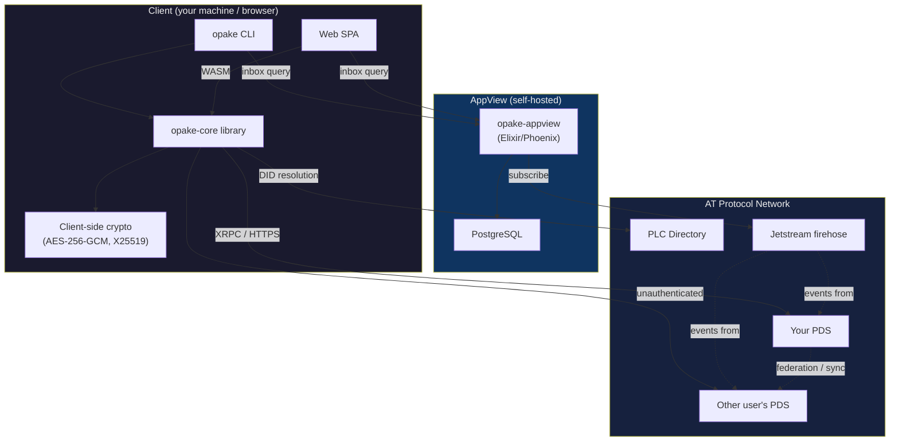
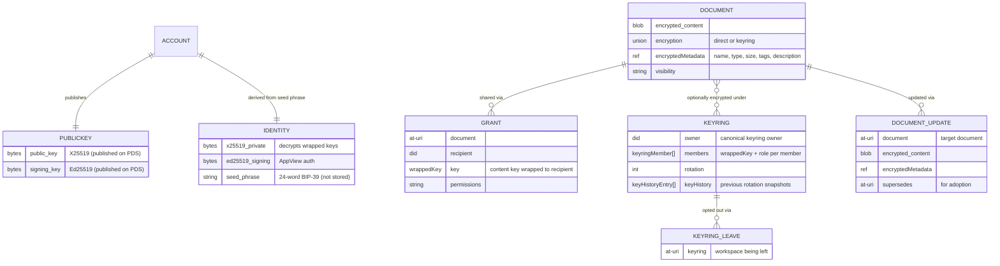

<!--
  NOTE TO EDITORS:
  Opake uses a dual-documentation system. If you modify the architectural model,
  encryption schemes, or data flows in this file, you MUST also update the
  corresponding MDX content in `web/src/content/` to prevent documentation drift.
-->

# Opake — Architecture

## System Overview



Both the CLI and the web frontend talk directly to PDS instances over XRPC. No PDS modifications needed. All encryption and decryption happens client-side — on your machine (CLI) or in the browser (Web via WASM). The AppView is an optional component that indexes grants and keyrings from the firehose for discovery.

## Encryption Model

Every file is encrypted before it leaves your machine. The PDS stores opaque ciphertext.

### Hybrid Encryption

Same pattern as git-crypt: symmetric content encryption + asymmetric key wrapping.

```
plaintext file
  → AES-256-GCM with random content key K → ciphertext blob
  → X25519-HKDF-A256KW wraps K to owner's public key → wrappedKey in document record
```

**Content encryption** (AES-256-GCM) — fast, handles arbitrary-size data. A random 256-bit key and 96-bit nonce are generated per file.

**Key wrapping** (x25519-hkdf-a256kw) — wraps the 256-bit content key to a recipient's X25519 public key. Uses ephemeral ECDH + HKDF-SHA256 + AES-256-KW. The wrapped key ciphertext is `[32-byte ephemeral pubkey ‖ 40-byte AES-KW output]`.

The algorithm name `x25519-hkdf-a256kw` is intentionally distinct from JWE's `ECDH-ES+A256KW` — we use HKDF-SHA256, not JWE's Concat KDF. The HKDF info string includes the schema version for domain separation: `opake-v1-x25519-hkdf-a256kw-{did}`.

### Two Sharing Modes

**Direct encryption** — the content key is wrapped individually to each authorized DID. The `keys` array in the document's encryption envelope holds one entry per authorized user. Good for ad-hoc sharing of individual files.

**Keyring encryption (workspaces)** — a named group has a shared group key (GK), wrapped to each member's X25519 public key with a role (manager, editor, viewer). The keyring has a canonical `owner` DID. Documents have their content key wrapped under GK (AES-256-KW) instead of individual public keys. Adding a member gives them access to all documents without per-document changes. Removing a member rotates GK and re-wraps to remaining members. Editors propose changes via `documentUpdate` records on their own PDS; the owner applies them. Members can opt out via `keyringLeave` records.

**Workspace directories** — workspace folder hierarchies reuse `app.opake.directory` with `keyringKeyWrapping` (content key wrapped under the group key). Directories live on the owner's PDS only — members read them via public fetches. The workspace root uses a deterministic rkey (`ws-{keyring_rkey}`). Non-owner members propose structural changes (add/move/rename/delete entries) via `directoryUpdate` records on their own PDS; the owner's daemon applies them. Directories use `KeyWrapping` instead of the document `Encryption` type — no `algo`/`nonce` since directories have no blob.

### Revocation

Deleting a grant record removes the recipient's wrapped key from the network. However, if they previously cached the key or the decrypted content, that access can't be revoked retroactively. True forward secrecy requires re-encrypting the blob with a new content key and deleting the old blob. The schema supports this workflow.

### Public Key Discovery

AT Protocol DID documents only contain signing keys (secp256k1/P-256), not encryption keys. Opake publishes `app.opake.publicKey/self` singleton records on each user's PDS containing:

- **X25519 encryption public key** — used for key wrapping (sharing)
- **Ed25519 signing public key** — used for AppView authentication

Key discovery is an unauthenticated `getRecord` call — no auth needed to look up someone's public key. Both keys are published automatically on every `opake login` via an idempotent `putRecord`.

## Identity Derivation

Identity keypairs are deterministically derived from a BIP-39 mnemonic (24 words / 256-bit entropy). The same phrase always produces the same keys.

```
256 bits entropy (CSPRNG)
  → BIP-39 encode → 24-word mnemonic
  → PBKDF2-HMAC-SHA512 (2048 rounds, salt = "mnemonic")
  → 512-bit master seed
  → HKDF-SHA256 (info = "opake-v1-x25519-identity")  → X25519 private key
  → HKDF-SHA256 (info = "opake-v1-ed25519-signing")   → Ed25519 signing key
```

The PBKDF2 salt is `"mnemonic"` per the [BIP-39 specification](https://github.com/bitcoin/bips/blob/master/bip-0039.mediawiki#from-mnemonic-to-seed) — security comes from the 256-bit entropy, not the salt. The HKDF info strings include the schema version for domain separation, consistent with the key wrapping convention.

The mnemonic is shown once at first login and never stored. Recovery is via `opake recover` (CLI) or the "Use your recovery phrase" flow (web). See [flows/seed-phrase-recovery.md](flows/seed-phrase-recovery.md) for sequence diagrams.

## Data Model

All records live under the `app.opake.*` NSID namespace. See [lexicons/README.md](../lexicons/README.md) for the schema reference and [lexicons/EXAMPLES.md](../lexicons/EXAMPLES.md) for annotated example records.



### Encrypted Metadata

All document metadata (name, MIME type, size, tags, description) is encrypted inside `encryptedMetadata` using the same content key as the blob. The PDS never sees real filenames or tags. This means server-side search/indexing requires client-side decryption — a deliberate tradeoff for privacy.

## Cross-PDS Access

When you share a file, the data stays on your PDS. The recipient's client fetches everything directly from the source:

1. Grant record (contains wrapped content key)
2. Document record (contains blob reference and nonce)
3. Blob (encrypted file content)

All three are unauthenticated reads — AT Protocol records and blobs are public by design. The encryption is the access control, not the transport.

## Domain API

opake-core exposes a domain-driven API through three types:

- **`Opake<T, R, S>`** — Root context. Bundles the authenticated PDS client, identity, RNG, platform time, and storage layer. Owns the storage so it can auto-persist sessions after mutations. All CLI commands except `pair request` (new device, no identity yet) route through Opake. Key method categories:
  - **Context:** `file_context(workspace_name?)`, `file_manager(&context)`, `workspace_admin()`, `resolve_workspace(name)`, `did()`, `identity()`, `now()`, `session()`
  - **Workspaces:** `create_workspace`, `list_workspaces`, `add_workspace_member`, `leave_workspace`, `unwrap_workspace_key`
  - **Sharing:** `download_from_grant`, `download_as_workspace_member`, `list_pending_shares`, `cancel_pending_share`, `retry_pending_shares`
  - **Identity/account:** `resolve_identity`, `publish_public_key`, `save_identity`, `remove_account`, `get_account_config`, `set_account_config`
  - **Pairing:** `create_pair_request`, `list_pair_requests`, `list_pair_responses`, `approve_pair_request`, `receive_pair_response`, `cleanup_pair_records`, `cleanup_expired_pair_requests`
  - **Maintenance:** `heal_stale_grants`, `purge_collection`
  - **Low-level:** `create_record`, `get_record`

- **`FileManager<'a, T, R, S>`** — Borrows `&'a mut Opake` and `&'a FileContext`. Unified file operations for both cabinet (personal) and workspace (shared) contexts, dispatching internally based on `FileContext`. All mutations use `applyWrites` for atomicity — no ghost documents or dangling directory references on partial failure. Path-based methods: `upload_at`, `download_at`, `create_directory_at`, `resolve_entry`, `resolve_document_names`, `resolve_document_names_in`, `resolve_document_metadata_in`, `read_metadata`, `delete_recursive`, `create_record`. Also: `load_tree`, `update_metadata`, `update_content`, `fetch_content_key`, `move_entry`, `share`, `revoke_share`, `list_shares`.

- **`WorkspaceAdmin<T, R, S>`** — Created via `opake.workspace_admin()`. Workspace membership operations: `add_member`, `remove_member`, `leave`. Separated from `Opake` because these operate on a resolved workspace context, not individual files.

Construction example:
```rust
let mut opake = Opake::new(client, identity, rng, storage, now, now_micros);
let ctx = opake.file_context(Some("family-photos")).await?;
let mut mgr = opake.file_manager(&ctx);
mgr.upload_at(&plaintext, "photo.jpg", "image/jpeg", None, None).await?;
// session auto-persisted via signoff — no manual into_opake/persist step
```

Every public mutation method on `FileManager` and `Opake` uses the `#[signoff]` proc-macro attribute (from opake-derive). This generates a wrapper + inner method split: the wrapper calls the inner method, then calls `signoff(result).await` to persist the session if it was refreshed during the call. Two variants: `#[signoff]` (FileManager — routes through `self.opake.signoff()`) and `#[signoff(self)]` (Opake — calls `self.signoff()` directly). If the operation itself failed, signoff is best-effort — the original error is preserved.

`Workspace` and `Cabinet` are domain types carrying decrypted key material, both with `ZeroizeOnDrop` — key bytes are overwritten when the context is dropped. The WASM layer uses `WasmFileManagerHandle` which owns `Opake + FileContext` and creates temporary `FileManager` borrows per JS method call (wasm_bindgen can't have lifetimes). `NoopStorage` is used for WASM (JS handles persistence externally) and tests. Raw functions (`encrypt_and_upload`, etc.) are `pub(crate)` — `FileManager` is the public API.

## Further Reading

- **[CRYPTO.md](CRYPTO.md)** — Algorithms, constants, key hierarchy, operation reference
- **[CRATE_STRUCTURE.md](CRATE_STRUCTURE.md)** — Detailed file tree for all crates and the web frontend
- **[STORAGE.md](STORAGE.md)** — Storage abstraction, local record cache, file permissions
- **[AUTH.md](AUTH.md)** — OAuth/DPoP authentication, multi-account support, device pairing
- **[appview.md](appview.md)** — AppView indexer: tables, endpoints, deployment
