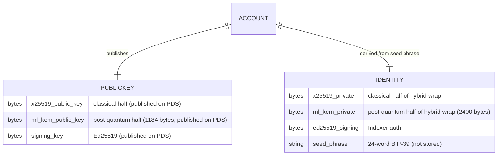
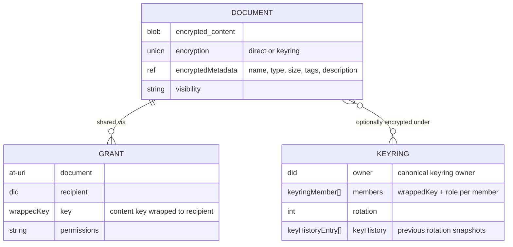
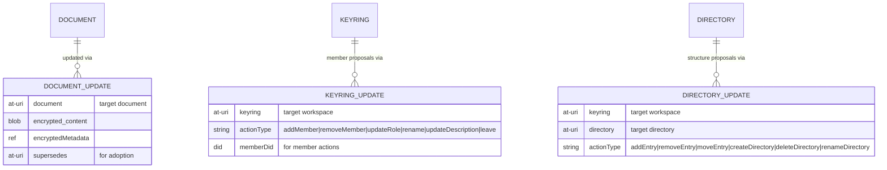

<!--
  NOTE TO EDITORS:
  Opake uses a dual-documentation system. If you modify the architectural model,
  encryption schemes, or data flows in this file, you MUST also update the
  corresponding MDX content in `apps/web/src/content/` to prevent documentation drift.
-->

# Opake — Architecture

## System Overview


Both the CLI and the web frontend talk directly to PDS instances over XRPC. No PDS modifications needed. All encryption and decryption happens client-side — on your machine (CLI) or in the browser (Web via WASM). The Indexer is an optional component that indexes grants and keyrings from the firehose for discovery.

The Indexer fills the atproto "appview" protocol role — it reads the firehose and serves indexed records through a REST API. We call it the indexer because all payloads are ciphertext; it serves no rendered views.

## Encryption Model

Every file is encrypted before it leaves your machine. The PDS stores opaque ciphertext.

### Hybrid Encryption

Same pattern as git-crypt: symmetric content encryption + asymmetric key wrapping. The asymmetric half is itself *hybrid* — classical X25519 combined with post-quantum ML-KEM-768.

```
plaintext file
  → AES-256-GCM with random content key K → ciphertext blob
  → x25519-mlkem768-hkdf-a256kw-v2 wraps K to recipient's hybrid pubkey bundle → wrappedKey in document record
```

**Content encryption** (AES-256-GCM) — fast, handles arbitrary-size data. A random 256-bit key and 96-bit nonce are generated per file.

**Key wrapping** (`x25519-mlkem768-hkdf-a256kw-v2`) — wraps the 256-bit content key to a recipient's hybrid public-key bundle (X25519 + ML-KEM-768). Construction:

1. Ephemeral X25519 ECDH between sender and recipient → `x25519_shared` (32 bytes)
2. ML-KEM-768 Encaps to recipient's KEM public key → `(ml_kem_ct, ml_kem_shared)` (1088 + 32 bytes)
3. HKDF-SHA256 combiner: `salt = eph_pub ‖ recipient_x25519_pub ‖ ml_kem_ct`, `ikm = x25519_shared ‖ ml_kem_shared`, `info` = the length-prefixed context transcript over (schema version, algo, wrap-context tag, scoping URI, recipient DID) — see [CRYPTO.md](CRYPTO.md), "Context transcripts" → 32-byte AES-KW key
4. AES-256-KW wraps the content key → 40 bytes

The wire envelope is `[X25519 ephemeral pubkey (32) ‖ ML-KEM-768 ciphertext (1088) ‖ AES-KW wrapped (40)]` = 1160 bytes total.

The combiner's salt commits to the entire transcript (both halves of the public input + the ML-KEM ciphertext). An attacker who can flip or substitute the post-quantum half — say, by compromising ML-KEM and trying to redirect the wrap — breaks the AES-KW integrity check at the recipient. This is the splice-resistance property from [Bindel-Brendel-Fischlin-Goncalves-Stebila (PQCrypto 2019)](https://eprint.iacr.org/2018/903).

The construction follows BSI TR-02102 (Germany) and ANSSI (France) guidance for hybrid post-quantum key establishment. ML-KEM-768 byte sizes follow [NIST FIPS-203](https://csrc.nist.gov/pubs/fips/203/final). Library: [`libcrux-ml-kem`](https://github.com/cryspen/libcrux), formally verified in F\*.

### Two Sharing Modes

**Direct encryption** — the content key is wrapped individually to each authorized DID's hybrid public-key bundle. The `keys` array in the document's encryption envelope holds one entry per authorized user. Good for ad-hoc sharing of individual files.

**Keyring encryption (workspaces)** — a named group has a shared group key (GK), hybrid-wrapped to each member's `PublicKeyBundle` with a role (manager, editor, viewer). The keyring has a canonical `owner` DID. Documents have their content key wrapped under GK (AES-256-KW, no post-quantum needed — symmetric) instead of individual public keys. Adding a member gives them access to all documents without per-document changes. Removing a member rotates GK and re-wraps to remaining members.

**Federated workspace documents** — workspace docs federate across members' PDSes. Each member uploads files to their own PDS, encrypted under the shared group key. The directory records (which hold the `entries` list) and the keyring (which holds the wrapped group key) live on the workspace owner's PDS — that's the coordinator pattern, the same shape as a Bluesky thread root. Reads walk the directory's at-URIs and fetch each doc from whichever PDS hosts it. Storage and egress costs land on the contributor that wrote the file, not the workspace owner.

Member contributions register with the workspace via proposal records: `documentUpdate` proposals propose changes to existing documents (`updateContent` / `updateMetadata`); `directoryUpdate` proposals propose structural changes (`addEntry`, `removeEntry`, `moveEntry`, `createDirectory`, `deleteDirectory`, `renameDirectory`); `keyringUpdate` proposals propose membership changes (`addMember`, `removeMember`, `updateRole`, `rename`, `updateDescription`, `leave`). Each proposal lives on the proposer's PDS. The owner's daemon applies them by mutating the canonical record on the owner's PDS. After apply, editor-side cleanup deletes the proposal once the target record's `modifiedAt` advances past the proposal's `createdAt` — caught by SSE for online editors, by sync-time bootstrap reconciliation otherwise.

**Workspace directories** — workspace folder hierarchies reuse `at.opake.directory` with `keyringKeyWrapping` (content key wrapped under the group key). Directories live on the owner's PDS only — members read them via public fetches. The workspace root uses a deterministic rkey (`ws-{keyring_rkey}`). Directories use `KeyWrapping` instead of the document `Encryption` type — no `algo`/`nonce` since directories have no blob.

### Revocation

Deleting a grant record removes the recipient's wrapped key from the network. However, if they previously cached the key or the decrypted content, that access can't be revoked retroactively. True forward secrecy requires re-encrypting the blob with a new content key and deleting the old blob. The schema supports this workflow.

### Public Key Discovery

AT Protocol DID documents only contain signing keys (secp256k1/P-256), not encryption keys. Opake publishes `at.opake.publicKey/self` singleton records on each user's PDS containing:

- **X25519 encryption public key** — classical half of the hybrid wrap
- **ML-KEM-768 encapsulation public key** — post-quantum half of the hybrid wrap
- **Ed25519 signing public key** — used for Indexer authentication

Key discovery is an unauthenticated `getRecord` call — no auth needed to look up someone's public key. All three keys are published automatically on every `opake login` via an idempotent `putRecord`. The `at.opake.publicKey` lexicon requires both encryption halves; a record missing either fails validation and the consumer rejects it.

## Identity Derivation

Identity keypairs are deterministically derived from a BIP-39 mnemonic (24 words / 256-bit entropy). The same phrase always produces the same X25519, ML-KEM-768, and Ed25519 keys.

```
256 bits entropy (CSPRNG)
  → BIP-39 encode → 24-word mnemonic
  → PBKDF2-HMAC-SHA512 (2048 rounds, salt = "mnemonic")
  → 512-bit master seed
  → HKDF-SHA256 (info = "opake-v1-x25519-identity")    → 32-byte X25519 private key
  → HKDF-SHA256 (info = "opake-v1-mlkem768-keygen")    → 64-byte seed for ML-KEM keygen (FIPS-203 §7.1)
  → HKDF-SHA256 (info = "opake-v1-ed25519-signing")    → 32-byte Ed25519 signing key
```

The PBKDF2 salt is `"mnemonic"` per the [BIP-39 specification](https://github.com/bitcoin/bips/blob/master/bip-0039.mediawiki#from-mnemonic-to-seed) — security comes from the 256-bit entropy, not the salt. Each HKDF info string carries the schema version for domain separation, so a future version bump produces different keys from the same mnemonic without touching the BIP-39 layer.

ML-KEM-768 KeyGen is itself deterministic given a 64-byte randomness seed, so the entire identity (all three keypairs) is reproducible from the mnemonic alone — verified by the `derive_kat_pinned` regression test in `crypto/mnemonic_tests.rs`.

The mnemonic is shown once at first login and never stored. Recovery is via `opake recover` (CLI) or the "Use your recovery phrase" flow (web). See [flows/seed-phrase-recovery.md](flows/seed-phrase-recovery.md) for sequence diagrams.

## Data Model

All records live under the `at.opake.*` NSID namespace. See [lexicons/README.md](../lexicons/README.md) for the schema reference and [lexicons/EXAMPLES.md](../lexicons/EXAMPLES.md) for annotated example records.

### Identity and Key Material



### Records and Sharing



### Workspaces and Proposals



### Encrypted Metadata

All document metadata (name, MIME type, size, tags, description) is encrypted inside `encryptedMetadata` using the same content key as the blob. The PDS never sees real filenames or tags. This means server-side search/indexing requires client-side decryption — a deliberate tradeoff for privacy.

## Cross-PDS Access

When you share a file, the data stays on your PDS. The recipient's client fetches everything directly from the source:

1. Grant record (contains wrapped content key)
2. Document record (contains blob reference and nonce)
3. Blob (encrypted file content)

All three are unauthenticated reads — AT Protocol records and blobs are public by design. The encryption is the access control, not the transport.

## Domain API

opake-core exposes a domain-driven API through three types:

- **`Opake<T, R, S>`** — Root context. Bundles the authenticated PDS client, identity, RNG, platform time, and storage layer. Owns the storage so it can auto-persist sessions after mutations. A constructed `Opake` always has an Identity: `for_account` returns `Error::IdentityMissing` when the account is authenticated but has no encryption keys yet, and callers route to the bootstrap flows (`recover` or `pair`) to produce one. Key method categories:
  - **Context:** `file_context(workspace_name?)`, `file_manager(&context)`, `workspace_admin()`, `resolve_workspace(name)`, `did()`, `identity()`, `now()` (the WASM handle exposes a narrower surface — `getDid` / `tokenExpiresAt` only, no session accessor — to keep tokens and DPoP keys from crossing into JS-managed memory)
  - **Workspaces:** `create_workspace`, `list_workspaces`, `add_workspace_member`, `leave_workspace`, `unwrap_workspace_key`
  - **Sharing:** `download_from_grant`, `download_as_workspace_member`, `list_pending_shares`, `cancel_pending_share`, `retry_pending_shares`
  - **Identity/account:** `resolve_identity`, `publish_public_key`, `save_identity`, `remove_account`, `get_account_config`, `set_account_config`
  - **Pairing (existing device):** `list_pair_requests`, `approve_pair_request`, `cleanup_expired_pair_requests`
  - **Maintenance:** `heal_stale_grants`, `purge_collection`
  - **Low-level:** `create_record`, `get_record`

  The new-device side of pairing runs *before* an Identity exists, so it is exposed as free functions in `crate::pairing` — `create_pair_request`, `try_complete_pair`, `cancel_pair_request` — which take `&S: Storage` and `did` directly. The ephemeral private bundle (X25519 + ML-KEM-768, 32 + 2400 = 2432 bytes concatenated) is persisted via `Storage::save_pair_state` and never crosses the WASM/JS boundary; the resulting Identity is written to Storage by `try_complete_pair` on success, at which point the standard `Opake::for_account` path succeeds.

- **`FileManager<'a, T, R, S>`** — Borrows `&'a mut Opake` and `&'a FileContext`. Unified file operations for both cabinet (personal) and workspace (shared) contexts, dispatching internally based on `FileContext`. All mutations use `applyWrites` for atomicity — no ghost documents or dangling directory references on partial failure. Path-based methods: `upload_at`, `download_at`, `create_directory_at`, `resolve_entry`, `resolve_document_names`, `resolve_document_names_in`, `resolve_document_metadata_in`, `read_metadata`, `delete_recursive`, `create_record`. Also: `load_tree`, `update_metadata`, `update_content`, `fetch_content_key`, `move_entry`, `share`, `revoke_share`, `list_shares`.

- **`WorkspaceAdmin<T, R, S>`** — Created via `opake.workspace_admin()`. Workspace membership operations: `add_member`, `remove_member`, `leave`. Separated from `Opake` because these operate on a resolved workspace context, not individual files.

Construction example:
```rust
let mut opake = Opake::new(client, did, identity, rng, storage, now_micros);
let ctx = opake.file_context(Some("family-photos")).await?;
let mut mgr = opake.file_manager(&ctx);
mgr.upload_at(&plaintext, "photo.jpg", "image/jpeg", None, None).await?;
// session auto-persisted via signoff — no manual into_opake/persist step
```

Every public mutation method on `FileManager` and `Opake` uses the `#[signoff]` proc-macro attribute (from opake-derive). This generates a wrapper + inner method split: the wrapper calls the inner method, then calls `signoff(result).await` to persist the session if it was refreshed during the call. Two variants: `#[signoff]` (FileManager — routes through `self.opake.signoff()`) and `#[signoff(self)]` (Opake — calls `self.signoff()` directly). If the operation itself failed, signoff is best-effort — the original error is preserved.

`Workspace` and `Cabinet` are domain types carrying decrypted key material, both with `ZeroizeOnDrop` — key bytes are overwritten when the context is dropped. `Workspace::from_keyring` is `pub(crate)`, so the only way to produce a `Workspace` outside opake-core is through the resolution methods (`resolve_workspace`, `file_context`, `workspaceByUri`) — this keeps the invariant that the URI, owner, group key, and rotation all came from the same verified keyring record. The WASM layer uses `WasmFileManagerHandle`, which shares an `Rc<Mutex<WasmOpake>>` with the parent `WasmOpakeHandle` and creates short-lived `FileManager` borrows inside each JS method (wasm_bindgen can't carry lifetimes across the boundary). The shared `Mutex` queues concurrent async operations instead of panicking on aliased `&mut self`. WASM persistence goes through `JsStorage`, a `Storage` impl that calls back into a JS-side `IndexedDbStorage`; `NoopStorage` is tests only. Raw functions (`encrypt_and_upload`, etc.) are `pub(crate)` — `FileManager` is the public API.

## Background Work

Some maintenance runs outside any user action: retrying a share to a recipient who wasn't ready, deleting expired pair requests, and (with the key-rotation change) re-wrapping keyring entries after a rotation. Two tiers run it. The **CLI daemon** is a committed runner — long-lived, unthrottled, expected to drain work sets. The **web client** is an opportunistic runner — it runs maintenance only while a tab is open and visible, and promises nothing, because a tab's lifetime isn't ours to extend and the service-worker alternative is disqualified (group keys can't leave page-WASM; see decision 12 above).

The design that follows from this: no protocol guarantee depends on background work completing, each task's remaining work is *derived* from records rather than stored (a dead runner leaves nothing to recover), and duplicate execution is harmless. When two runners collide on one record, they arbitrate per-record at the PDS — an idempotent upsert at a derived rkey, or a `swapRecord` compare-and-swap — never a lease, leader, or ownership claim. See **[BACKGROUND_WORK.md](BACKGROUND_WORK.md)** for the full contract, the multi-device walkthrough, and the checklist for designing a new task.

## Further Reading

- **[BACKGROUND_WORK.md](BACKGROUND_WORK.md)** — Background-task contract, runner tiers, multi-device CAS coordination
- **[CRYPTO.md](CRYPTO.md)** — Algorithms, constants, key hierarchy, operation reference
- **[CRATE_STRUCTURE.md](CRATE_STRUCTURE.md)** — Detailed file tree for all crates and the web frontend
- **[STORAGE.md](STORAGE.md)** — Storage abstraction, local record cache, file permissions
- **[AUTH.md](AUTH.md)** — OAuth/DPoP authentication, multi-account support, device pairing
- **[indexer.md](indexer.md)** — Indexer: tables, endpoints, deployment
