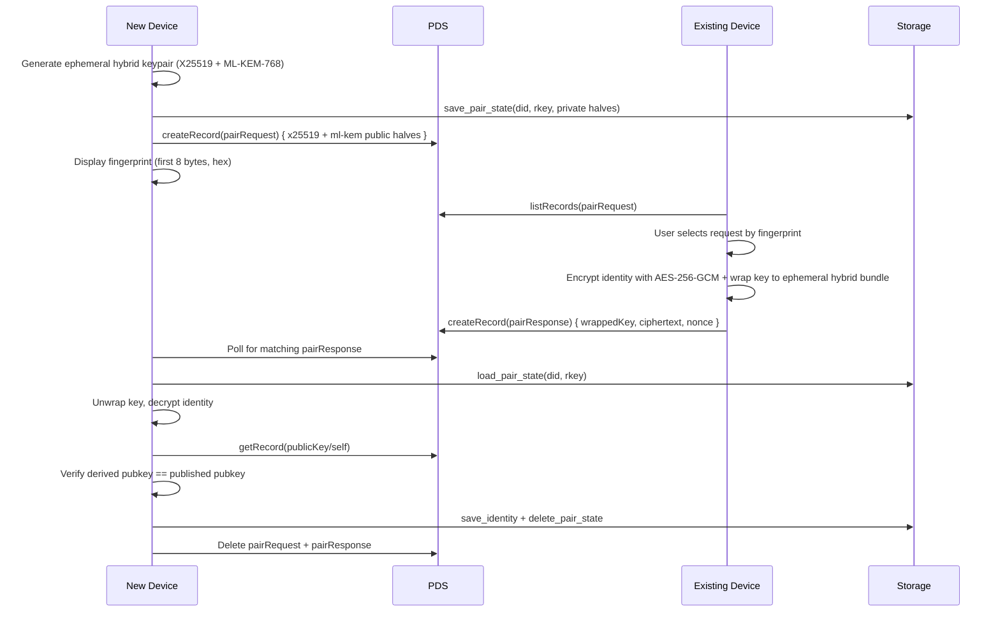

# Opake — Authentication & Identity

## Authentication

Opake supports two authentication modes against the PDS. OAuth is the default; legacy password auth is a fallback for PDS instances that don't advertise OAuth discovery.

### OAuth Flow

All token handling happens in WASM (opake-core). JS never parses token responses, constructs session objects, or holds DPoP private keys (`spec:wasm-security-boundary § Login flows construct sessions inside WASM`). The WASM exports `startOAuthLogin`, `completeOAuthLogin`, and `loginWithAppPasswordWasm` compose core primitives into complete login flows.

1. Resolve handle to PDS URL (`resolve_pds_for_login` — .well-known, public API, DID document)
2. Discover OAuth Authorization Server via `/.well-known/oauth-protected-resource` → `/.well-known/oauth-authorization-server`; PAR endpoint resolved via `AuthorizationServerMetadata::par_endpoint()`
3. Generate DPoP keypair (P-256/ES256), PKCE S256 challenge, CSRF state
4. Push Authorization Request (PAR) with DPoP proof, PKCE challenge, and `login_hint` (pre-fills the AS consent page)
5. Open browser to authorization URL; CLI starts a loopback HTTP server on `127.0.0.1`
6. User authorizes in the browser; PDS redirects with `code` and `state`
7. CSRF validation, authorization code exchange with DPoP proof + PKCE verifier — all in WASM
8. WASM builds `OAuthSession` and saves to storage. Tokens never enter JS memory.
9. Publish `at.opake.publicKey/self` via idempotent `putRecord`

The web frontend uses a two-step flow: `Opake.startLogin()` returns the auth URL + serializable `PendingLogin` state. The consumer saves this via `Opake.savePendingLogin()` (sessionStorage with 10-minute TTL), redirects, then calls `Opake.completeLogin()` on the callback page. `PendingLogin` — DPoP private key and PKCE verifier included — is the one secret allowed to cross into JS, because an OAuth redirect discards WASM memory across the page unload. The crossing is bounded: `Opake.loadPendingLogin()` discards state past the TTL and clears the sessionStorage key on every read (success, expiry, or failure), so key material does not linger after the flow ends (`spec:wasm-security-boundary § The PendingLogin exception is bounded by TTL and clear-on-read`).

### OAuth Scopes

Opake requests granular per-collection scopes instead of the catch-all `transition:generic`:

```
atproto repo:at.opake.accountConfig repo:at.opake.directory ... repo:at.opake.publicKey blob:*/*
```

The scope string is built from `crate::scope::OPAKE_COLLECTIONS` (single source of truth; `spec:auth-session § The OAuth scope derives from one collection registry`). A compile-time test fails the build if a collection constant is added without registering its scope, so a missing grant surfaces as a red test rather than an opaque runtime 403. The same scope is embedded in the loopback client ID via `build_client_id(redirect_uri, scope)` and passed to the PAR body — they must match.

A permission set lexicon (`at.opake.authFullAccess`) bundles all collections for when `include:` scopes are supported by PDSes.

### Legacy Flow

Password-based via `com.atproto.server.createSession`. Used when `--legacy` is passed or OAuth discovery fails. The WASM export `loginWithAppPasswordWasm` handles resolution, authentication, and session storage. Tokens are saved as a `LegacySession`.

### Token Refresh

Proactive (`spec:auth-session § Token refresh is proactive, threshold-gated, and single-flight`). The SDK's `withTokenGuard` decorator calls `tokenExpiresAt()` (WASM export — returns only the expiry timestamp, or `-1` when unknown or the session lock is held, so an in-flight operation is never blocked) before every authenticated operation. If the token expires within the SDK's 30-second threshold, `proactiveRefresh()` (WASM export — refreshes and re-persists inside WASM) is triggered. Concurrent callers share a single-flight promise. The core refresh primitive gates on its own 60-second threshold and never persists itself — the caller persists.

Reactive refresh is the fallback: the XRPC client detects `ExpiredToken` / `AuthenticationFailed` errors and refreshes automatically. DPoP nonces are captured from every response and replayed on subsequent requests.

See [flows/authentication.md](flows/authentication.md) for full sequence diagrams.

## Multi-Account Support

The `Config` type tracks all logged-in accounts with a `default_did` pointer; adding an account never disturbs the others, and a client instance binds to one DID for its lifetime — switching accounts destroys the instance and re-initializes against the target (`spec:auth-session § Accounts are per-DID and switching is destroy-then-reinit`). Each account gets isolated storage:

```
~/.config/opake/
  config.toml               # { default_did, accounts: { did → { handle, pds_url } } }
  accounts/
    did:plc:alice/
      identity.json          # X25519 + ML-KEM-768 + Ed25519 keypairs (0600)
      session.json           # OAuth or legacy tokens (0600)
      cache/                 # Encrypted PDS records, one JSON file per collection
      pair_states/          # Ephemeral pair-state blobs, one per in-flight request
    did:plc:bob/
      identity.json
      session.json
```

Group keys are not a separate on-disk store; the keyring records that carry them live in the record cache (`cache/at.opake.keyring.json`) as ciphertext like any other collection.

On the web, `IndexedDbStorage` uses the same logical layout over IndexedDB tables, keyed by DID.

CLI commands that need an account resolve it via: explicit `--as <did>` flag, then `default_did` from config, then error. `opake account list` lists all accounts (`*` marks the default); `opake account set-default <did>` switches.

## Device Pairing

Transfers an encryption identity from an existing device to a new one, using the PDS as a relay. Both devices must be authenticated to the same DID.



The ephemeral private halves are persisted to the new device's `Storage` as a versioned pair-state blob (0600 file on CLI, dedicated IndexedDB table on web) between `create_pair_request` and `try_complete_pair` — they need to survive page reloads or CLI restarts while the user walks to the other device, so in-memory only isn't sufficient. They never cross the WASM/JS boundary: the SDK exposes `Opake.createPairRequest(storage, did)` → `{uri, rkey, x25519EphemeralPublicKey, mlKemEphemeralPublicKey}` and `Opake.awaitPairCompletion(storage, did, rkey)` → `void`. JS sees the public halves (the fingerprint is the first bytes of the X25519 half) and nothing else. The identity payload uses the same AES-256-GCM + x25519-mlkem768-hkdf-a256kw-v2 primitives as file encryption (`spec:auth-pairing § Pairing wraps the full identity to a device-held ephemeral keypair`).

Before saving, the receiving device verifies that the decrypted identity's X25519 and ML-KEM-768 public keys match the account's published `publicKey/self` — a relay that substitutes a response hands over an identity that fails this check (`spec:auth-pairing § Completion authenticates the received identity against the published key`). Visual fingerprint comparison is a human-verifiable complement, not the security boundary; programmatic SAS is a follow-up.

Login on a new device detects an existing `publicKey/self` record and prompts for pairing instead of generating a new keypair (which would orphan encryption on the existing device).

See [flows/pairing.md](flows/pairing.md) for detailed sequence diagrams.
