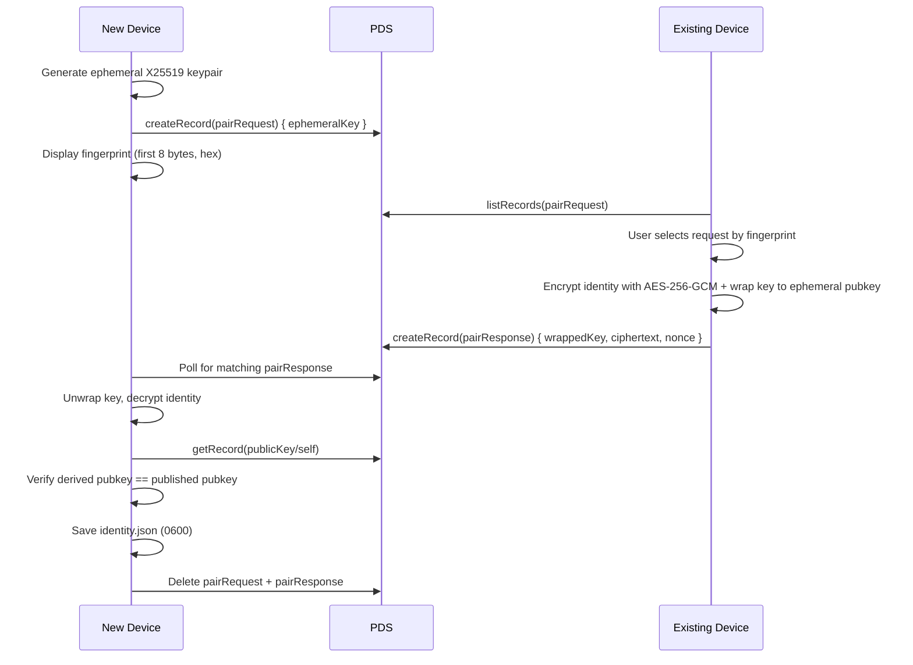

# Opake — Authentication & Identity

## Authentication

Opake supports two authentication modes against the PDS. OAuth is the default; legacy password auth is a fallback for PDS instances that don't advertise OAuth discovery.

### OAuth Flow

1. Resolve handle to PDS URL (public API, DID document)
2. Discover OAuth Authorization Server via `/.well-known/oauth-protected-resource` and `/.well-known/oauth-authorization-server`
3. Generate DPoP keypair (P-256/ES256), PKCE S256 challenge, and state nonce
4. Push Authorization Request (PAR) with DPoP proof and PKCE challenge
5. Open browser to authorization URL; CLI starts a loopback HTTP server on `127.0.0.1`
6. User authorizes in the browser; PDS redirects to loopback with `code` and `state`
7. Verify state (CSRF), exchange authorization code for tokens (with DPoP proof and PKCE verifier)
8. Save `OAuthSession` (access token, refresh token, DPoP keypair)
9. Publish `app.opake.publicKey/self` via idempotent `putRecord`

The web frontend uses the same OAuth flow but with a redirect URI instead of a loopback server.

### Legacy Flow

Password-based via `com.atproto.server.createSession`. Used when `--legacy` is passed or OAuth discovery fails. Tokens are saved as a `LegacySession`.

### Token Refresh

Transparent. The XRPC client detects expired tokens and refreshes automatically. OAuth refresh includes a fresh DPoP proof; legacy refresh uses `com.atproto.server.refreshSession` with the refresh JWT. DPoP nonces are captured from every response and replayed on subsequent requests.

See [flows/authentication.md](flows/authentication.md) for full sequence diagrams.

## Multi-Account Support

The `Config` type tracks all logged-in accounts with a `default_did` pointer. Each account gets isolated storage:

```
~/.config/opake/
  config.toml               # { default_did, accounts: { did → { handle, pds_url } } }
  accounts/
    did:plc:alice/
      identity.json          # X25519 + Ed25519 keypairs (0600)
      session.json           # OAuth or legacy tokens (0600)
      keyrings/              # Cached group keys per keyring
    did:plc:bob/
      identity.json
      session.json
      keyrings/
```

On the web, `IndexedDbStorage` uses the same logical layout over IndexedDB tables, keyed by DID.

CLI commands that need an account resolve it via: explicit `--did` flag, then `default_did` from config, then error. `opake accounts` lists all accounts; `opake set-default` switches.

## Device Pairing

Transfers an encryption identity from an existing device to a new one, using the PDS as a relay. Both devices must be authenticated to the same DID.



The ephemeral private key never leaves memory. The identity payload uses the same AES-256-GCM + x25519-hkdf-a256kw primitives as file encryption. Visual fingerprint comparison is the current SAS mechanism; programmatic verification is a follow-up.

Login on a new device detects an existing `publicKey/self` record and prompts for pairing instead of generating a new keypair (which would orphan encryption on the existing device).

See [flows/pairing.md](flows/pairing.md) for detailed sequence diagrams.
