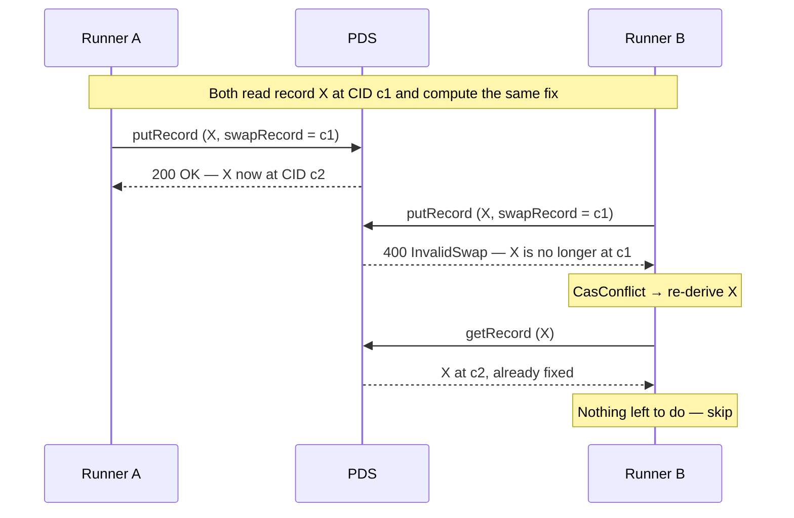

<!--
  NOTE TO EDITORS:
  This file is the prose companion to the `background-work` capability under
  openspec/specs/background-work/. The spec is normative; this document
  explains it and shows how to apply it. If you change one, reconcile the other.
-->

# Background Work

Opake accumulates maintenance that runs outside any user action: retrying a share to a recipient who wasn't ready, deleting expired pair requests, and — arriving with the key-rotation change — re-wrapping keyring entries after a rotation. This document is the contract every such task obeys, and the reasoning behind it. The normative version is the [`background-work`](../openspec/specs/background-work/) capability; this is the version you read before writing a task.

The whole contract reduces to one sentence: **background work is hygiene over an already-correct state, its remaining work is derived rather than stored, duplication is harmless, and multiple runners resolve conflicts per record at the PDS — not with leases, leaders, or ownership.** The rest of this document is why each clause is load-bearing.

## Rule one: correctness never waits on background work

A background task may only improve a state that is already correct. It bounds a key-history walk that would otherwise grow, completes a share that was queued as a convenience, cleans up records past their TTL. No protocol guarantee — decryptability, membership, forward secrecy, share validity — may depend on a background task having run.

This is not a stylistic preference. The web client **structurally cannot promise completion**: a tab closes, and background tabs are throttled to roughly one timer tick per minute. The one platform escape hatch that could promise it — a service worker running detached from the tab — is disqualified by the security boundary. Group keys live in page-WASM (see CLAUDE.md decision 12), and a service worker is a separate context; shipping keys there to keep a background runner alive would breach the boundary that the entire encryption model rests on. So the web tier is opportunistic by construction, and any design that needs work to *finish* has to assign it elsewhere.

The test to apply: if a proposed behavior requires maintenance to complete within some bounded time, the design either moves that work into a synchronous user action, hands it to the committed tier (the CLI daemon), or is wrong. The opportunistic tier cannot carry it, and no amount of runner reliability changes that — the tab lifetime is not yours to extend.

The reassuring corollary: a workspace nobody ever sweeps stays fully correct. Every member still reads every document; membership and forward secrecy still hold. The only cost is unbounded hygiene debt — longer key-history walks, pending shares that sit in the queue, expired pair requests that linger. Debt, not breakage.

## Work is derived, never stored

A task's remaining work must be recomputable at any moment from the records themselves. A pending share whose recipient now has a published key. A pair request past its TTL. A keyring wrap whose rotation trails the current head. The work set is a *query*, not a saved to-do list.

Tasks therefore persist no progress, no checkpoints, no claims. A runner that dies mid-task leaves nothing to recover: any runner, on any device, resumes by re-deriving the work set and finding exactly the items still outstanding. This is what lets a daemon crash, a tab close, or a laptop sleep without a repair step — there is no partial state to repair.

The web daemon's task store makes the invariant visible in the type system: a persisted `TaskRecord` carries `status` and timestamps for UI visibility, and its `progress` field is typed `null` — literally not a place work-set progress can be recorded (`packages/opake-daemon/src/types.ts`). Scheduler bookkeeping ("when did this timer last fire") is fine; it is derivable-independent and does not gate correctness. Work-set progress is what may not be stored.

## The two runner tiers

Two tiers exist, and conflating them is the mistake the contract exists to prevent.

| | **Committed runner** | **Opportunistic runner** |
|---|---|---|
| Where | CLI daemon (`apps/cli` daemon loop) | Web client timers (`@opake/daemon`, cabinet route) |
| Lifetime | Long-lived, unthrottled | Only while a tab is open and visible |
| Timers | Reliable, periodic | Best-effort; throttled hard in background tabs |
| May promise | Draining a work set over time | **Nothing.** No completion, ever |
| Coordination | Web Locks leader election across tabs (an optimization, not required) | — |

The committed tier is entitled to schedule periodic work and is *expected* to drain queues. The opportunistic tier runs maintenance only as a courtesy while the user is looking at the app. Nothing anywhere — no requirement, no UI copy, no doc — may present opportunistic maintenance as a guarantee. "Your share will complete when they sign up" is honest only because the daemon exists; if the web tab were the only runner, the honest phrasing is "will complete next time you open the app, maybe."

The web tier's multi-tab leader election (Web Locks) and the observational backoff described below are both **optimizations under the duplication requirement** — they reduce wasted work, never fix a correctness bug, and a build that skipped them would still be correct.

## Duplicate execution is harmless

Two runners executing the same task at once — a daemon plus a tab, two devices, two members of one workspace — must reach the same final state as a single runner, differing only in wasted reads. Item-level idempotence is the mechanism, and because it holds, runner coordination is *always* an optimization and never a correctness fix. That single property is what buys the whole no-lease design: if duplication were harmful, you would need ownership to prevent it, and ownership is stored state that violates derivation and imports the stale-lock liveness bugs (a crashed holder blocking healthy runners, clock-skewed TTLs, reaper logic) to prevent something that is merely wasteful.

Idempotence has to be built per task; it is not free. The two shapes we use:

- **Upsert at a derived rkey.** When completion writes a new record, derive its rkey deterministically so that two runners writing "the same" record target the same slot. Pending-share completion does this: the grant is written with `putRecord` at the *pending share's own rkey*, not `createRecord` at a fresh PDS-allocated one. Two runners derive the same rkey and upsert there; the repo converges on one grant, the loser overwriting the winner with an equivalent record instead of appending a duplicate. (Before this, completion used `createRecord` + a separate `deleteRecord`, so two racing runners produced two grants — and a single runner whose delete failed produced a duplicate on the next pass. See the audit note in the task table.)
- **Compare-and-swap on an in-place mutation.** When the fix mutates an existing record rather than creating one, condition the write on the record's CID (next section).

## Item granularity

Each item is individually durable: one record write completes one item. A task must not span items with multi-record state that, torn mid-way, leaves an inconsistency. Interrupting a runner between any two items is always safe — items `1..N` are complete and visible, `N+1` onward remain derivable work, and no record sits in an intermediate state.

Pending-share completion is two writes (the grant `putRecord`, then the pending `deleteRecord`), which looks like it violates this — but it doesn't, because both writes are idempotent and the ordering is safe in every interleaving: grant-then-delete means a tear after the grant leaves the pending record derivable (next pass upserts the same grant, harmless, and re-deletes), and the delete tolerates a `NotFound` as success. The invariant that matters is not "one write per item" literally but "no tear leaves a record in a state a re-derive can't recover from."

## The multi-device walkthrough

Coordination happens at the record, at the PDS, using atproto's optimistic concurrency. There is no lease, no leader that must be elected, nothing to crash-recover. `n` runners interleave item by item with no waiting.

For the upsert-at-derived-rkey shape (pending-share completion), the race resolves itself — see the drawn sequence under [Background maintenance in FLOWS.md](FLOWS.md#background-maintenance--multi-runner-coordination). Both runners choose the same rkey, so the second `putRecord` overwrites rather than duplicates, and the second `deleteRecord` finding the record already gone is the expected idempotent outcome.

For the in-place-mutation shape — the key-rotation re-wrap sweep is the first consumer — the coordination is a genuine compare-and-swap. A runner reads the item's record and its CID, computes the fix, and writes conditioned on that CID via `swapRecord` (`put_record_conditional` / `delete_record_conditional` in the XRPC layer). If the CID moved between read and write, the PDS rejects the write with the `InvalidSwap` error, which the client surfaces as `Error::CasConflict`. **A CAS conflict is not an error.** It means the record changed — almost always because another runner finished the item first — so the runner re-derives that item, finds no work remains, and skips.

X was fixed exactly once. B waited on nothing and recovered nothing; it paid one wasted read.

### The head moves mid-sweep

A sweep plan is a hint, not a commitment. Derivation targets are re-resolved **per item, at write time, against the current chain head** — never against the head that was current when the sweep started.

The failure this prevents: a re-wrap sweep is planned at keyring rotation `n`; before the runner reaches item X, a manager rotates the keyring to `n+1`. If the runner wrote X's fix targeting rotation `n`, it would move a record onto a superseded rotation — a wrong write. Because the target is re-derived at write time, the runner instead computes X's fix against `n+1` and writes that. The stale plan's items don't produce wrong writes; they produce *fresh* derived work. A head that moves mid-sweep is safe by construction, not by luck.

### Derivation may read the indexer; the CAS runs at the PDS

Deriving a work set often means reading indexer snapshots (which chain heads exist, who's a member). That read can be stale — the indexer is honestly eventually consistent, and acceptance of a write does not imply the indexer can answer for it yet (see [`indexer-consistency` § Acceptance does not imply visibility](../openspec/specs/indexer-consistency/spec.md)). But the CAS itself executes against the live PDS record. So indexer lag can cause a **wasted attempt** — a runner derives an item that's already done and gets a CAS conflict — but never a **wrong write**: the PDS is the source of truth at the moment of the conditional write. Lag costs cycles, not correctness.

### Observational backoff (optional)

A runner subscribed to SSE sees the echoes of a sibling runner's same-task writes arriving. It may use that as a politeness signal — defer, recheck later — to cut down wasted CAS attempts. This is strictly an optimization: correctness never reads the signal, and a stale or missed observation costs only extra attempts. Do not build a task that *depends* on seeing another runner's echo; that would be leader election wearing a disguise.

## Designing a new task

Before you write a background task, answer these. Each maps to one requirement in the [spec](../openspec/specs/background-work/), and a task that can't answer one cleanly is not ready.

1. **Correctness independence** — *If this task never runs, what breaks?* The only acceptable answer is "nothing breaks; hygiene debt accumulates." If any protocol guarantee weakens, the work belongs in a user action or the committed tier, not here.
2. **Derivation** — *Given only the records, how do I compute what's left to do?* If you need a stored checkpoint or claim to answer, redesign. The work set is a query.
3. **Idempotence** — *If two runners do this item simultaneously, is the final state identical to one runner doing it?* If not, pick an idempotence shape (upsert at a derived rkey, or CAS on the mutation) until it is.
4. **Item granularity** — *If I'm killed between any two items, is every record either fully done or fully outstanding?* No item may leave a record in a state a re-derive can't recover from.
5. **Tier honesty** — *Does anything assume this completes in bounded time?* If so, it can't live on the opportunistic tier — and no UI or doc may imply the web tab guarantees completion.
6. **Concurrency** — *When two runners collide on one record, what arbitrates?* The answer is per-record CAS (or derived-rkey upsert), executed at the PDS. It is never a lease, a leader, or an ownership claim — those store task state and import the stale-lock bug family.

## Task inventory

| Task | Tier(s) | Work derived from | Idempotence shape | Notes |
|---|---|---|---|---|
| Pending-share retry | CLI daemon; web (opportunistic) | `at.opake.pendingShare` records whose recipient now has a published `publicKey/self`, minus those past the 7-day TTL | Upsert grant at the pending share's rkey; idempotent `deleteRecord` cleanup | Completion was `createRecord` + `deleteRecord` (two racing runners → duplicate grants; a torn single runner → duplicate on next pass). Fixed to `putRecord` at the derived rkey. `crates/opake-core/src/sharing/pending.rs` |
| Pair-request cleanup | CLI daemon; web (opportunistic) | `at.opake.pairRequest` records past their 15-minute TTL, plus orphaned `pairResponse` records | Idempotent `deleteRecord` of own ephemeral records | Deletes only the runner's own short-lived records; no shared-record CAS needed. `crates/opake-core/src/pairing/cleanup.rs` |
| Key-rotation re-wrap sweep | not scheduled | — | — | Disabled: with members admitted without a current wrap, replacing a document's sole wrap would strip historical-only readers. The planner (`crates/opake-core/src/rewrap.rs` `plan_rewrap`) remains as the CAS-shaped reference; no daemon tier runs it until a fresh-head, per-item exclusion guard exists at the write boundary. |

## References

- Normative contract: [`openspec/specs/background-work/`](../openspec/specs/background-work/)
- CAS sequence diagrams: [FLOWS.md § Background maintenance](FLOWS.md#background-maintenance--multi-runner-coordination)
- Why lag can't corrupt a sweep: [`indexer-consistency` § Acceptance does not imply visibility](../openspec/specs/indexer-consistency/spec.md)
- Security boundary that disqualifies service workers: CLAUDE.md decision 12; [ARCHITECTURE.md](ARCHITECTURE.md)
