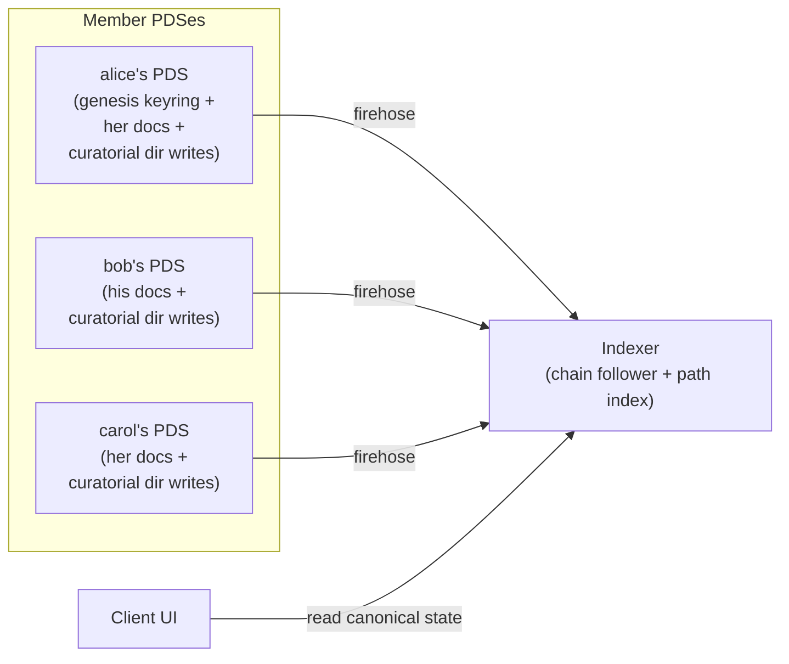

# Opake — Workspace Federation

How workspaces store and reconcile state across multiple PDSes. This doc covers the architecture; lexicon-level details are in `lexicons/README.md`.

## Premise

A workspace is a shared scope where multiple members contribute encrypted content. The model splits cleanly across record types:

- **Documents federate.** Each member writes their own docs to their own PDS. A document's identity, content, and metadata stay with its author.
- **Directories are coordinative.** A single supersede chain per path. At any moment, path P has exactly one canonical directory record — the head of that path's chain. Curatorial writes (anyone with authority) propagate the chain forward, and the chain alternates PDSes as different curators take turns.
- **Keyrings are coordinative-with-authority.** A single supersede chain per workspace, written only by managers. The chain captures membership, rotation, and any other workspace-level structural change.



## Authority

| Role    | Documents (own) | Directories                                                          | Keyring   |
| ------- | --------------- | -------------------------------------------------------------------- | --------- |
| Viewer  | read            | read                                                                 | read      |
| Editor  | write           | curatorial supersede, **additive only** (entries ⊇ prior canonical)  | read      |
| Manager | write           | unrestricted curatorial supersede (add, remove, substitute, reorder) | supersede |

Editors contribute their own docs by writing a directory supersede that adds their new entry to the prior canonical's entries. The indexer enforces additivity: an editor's supersede must include every entry from the prior canonical. Editors cannot remove, substitute, or reorder.

Managers face no additivity constraint — they can omit entries (delete), substitute one entry for another (rename), and reorder. Manager-level edits are how moderation, cross-author renames, and reorganization happen.

There is no "owner" role. The DID that authored the genesis keyring is the workspace creator — that's a historical fact recorded in the genesis record's at-uri, not an ongoing authorization level. After genesis, the creator is a manager, identical in capability to any other manager.

## Records

### Keyring

Single-canonical chain. The genesis keyring is written by the workspace creator on their own PDS. Subsequent versions live on whichever manager's PDS last wrote (via supersede).

```
at://{author-did}/app.opake.keyring/{rkey}
```

Carries member set, wrapped group keys, rotation counter, key history, and (for non-genesis keyrings) a `supersedes` field referencing the prior keyring URI. No discriminator — every supersede is the same operation conceptually ("the keyring got updated"), even when the update is a rotation, a member change, or a workspace rename. **Workspace identity is the genesis keyring's at-uri** — an opaque string the indexer treats as immortal. The string remains valid even after the genesis keyring record itself is deleted from the originating PDS; it identifies the workspace, not a live record.

### Directory

Single-canonical chain per path. Each curatorial write produces a new directory record on the writer's PDS, with `supersedes: <prior canonical URI>` and updated `entries`.

```
at://{author-did}/app.opake.directory/{rkey}
```

Every directory record uses a PDS-assigned `tid` rkey, including the workspace-root chain. There are no deterministic URIs anywhere in the model. Records in the workspace-root chain are marked by an explicit `isWorkspaceRoot: true` flag (see [The workspace root](#the-workspace-root)).

The directory record carries:

```
{
  opakeVersion,
  workspaceId: <genesis keyring at-uri>,  // omitted for cabinet records
  keyWrapping: { keyringKeyWrapping: { keyringRef } },
  encryptedMetadata: <directory's own name, encrypted under group key>,
  entries: [{ target: at-uri, targetCid: cid }, ...],
  supersedes: <prior canonical URI>,    // omitted for genesis at this path
  isWorkspaceRoot: true,                // omitted (= false) for non-root directories
  createdAt,
}
```

Listings carry only the at-uri and CID of each entry. No name, no type. Names live in the target record's `encryptedMetadata`. File-vs-folder distinction is inherent in the target's collection (`app.opake.document` vs `app.opake.directory`).

### Document

Per-member, on the writing member's PDS. The doc record carries the encrypted blob reference, key wrapping under the keyring's group key (`keyringRef`), and the doc's `encryptedMetadata` (which contains its name, mime type, etc).

```
at://{member-did}/app.opake.document/{rkey}
```

Documents may carry an optional `supersedes` field for history annotation (e.g., "this was renamed from X by manager Y"). The field is non-load-bearing — directory curatorial supersedes do the actual rename mechanics.

## The workspace root

The workspace-root has no anchor URI. Every record in the workspace-root chain — genesis and every subsequent supersede — is an ordinary directory record with a PDS-assigned `tid` rkey, carrying `isWorkspaceRoot: true` and `workspaceId: <genesis keyring at-uri>`. The chain alternates PDSes as different members take curatorial turns.

Genesis creation is an ordinary directory write: the workspace creator writes a directory record on their PDS with empty `entries`, `isWorkspaceRoot: true`, no `supersedes`, and the genesis keyring's at-uri as `workspaceId`. The indexer recognizes it as the workspace-root genesis purely from the flag.

The indexer enforces:

- Only managers may write a record with `isWorkspaceRoot: true`.
- At most one active root chain per workspace at a time, via compare-and-set on `chain_heads (workspace_id, kind='workspace_root')`. Concurrent genesis attempts resolve into a fork the same way directory races elsewhere do.
- `isWorkspaceRoot` must not flip relative to predecessor in a supersede; mismatch is rejected.

Finding the current workspace-root: query the indexer for the chain head at `(workspace_id, kind='workspace_root')`. The indexer's `chain_heads` table is the source of truth — clients never reconstruct the head URI from a deterministic convention.

## Identity and naming

- **At-uri is identity.** A record's at-uri is its identity for the lifetime of that record.
- **Names live in target records' `encryptedMetadata`.** Display: fetch each entry's target, decrypt metadata, get name. The indexer can serve a "directory listing with target metadata pre-decrypted" join to amortize the per-target fetch cost.
- **Self-rename a doc** = update the doc record in place (atproto `putRecord` with same rkey, new `encryptedMetadata`). Same at-uri, new CID.
- **Cross-author rename a doc** = manager curatorial supersede of the directory at the doc's path, substituting the old doc's at-uri for a new doc's at-uri (with the new name in its `encryptedMetadata`). Editor cannot do this — additivity-only.
- **Rename a directory** = manager curatorial supersede of the parent directory substituting the directory entry, OR update the directory record's own `encryptedMetadata` in place.
- **Rename the workspace** = manager writes a new keyring record that supersedes the current with updated `encryptedMetadata.name`.
- **Move** = curatorial supersedes at both the old and new paths. Manager removes the entry at old, adds at new.

## Cascade-with-CID

Every directory listing entry pins both an at-uri and a CID. This makes each directory record's CID content-address its entire reachable subtree.

When a curator edits a directory, they:

1. Fetch the current canonical at that path
2. Modify entries (add, remove, substitute)
3. Write a new directory record on their PDS with new entries + `supersedes: <prior canonical>`
4. Walk up to root, writing a new canonical at each ancestor that needs its `targetCid` updated to point at the new child CID
5. Bundle in one signed `applyWrites` on the curator's PDS

O(depth) records updated per change. In typical workspaces depth is 3–7, so write amplification is bounded.

## Curatorial writes: carry-forward responsibility

A curatorial write IS a full statement of the directory's current state, not a delta. The writer must:

1. Fetch the prior canonical's entries
2. Apply their intended modification (add, remove, substitute)
3. Include all unmodified prior entries in the new record

If an editor (additivity-bound) writes a record that omits any prior entry, the indexer rejects the supersede as invalid. The supersede stays on the writer's PDS but isn't reflected in the canonical chain.

Managers face no additivity constraint but should still pull-then-modify rather than write blindly, to avoid accidentally clobbering recent contributions.

## Concurrent writes: last-write-wins, retry

If two members fetch the same prior canonical and write concurrent supersedes pointing at it, the supersede chain forks:

- bob: `entries: [..., bob-doc-X], supersedes: <alice-prior>`
- carol: `entries: [..., carol-doc-Y], supersedes: <alice-prior>`

Both records exist; both supersede the same target. Resolution:

1. Indexer detects fork (a record's `supersedes` target already has a successor).
2. Indexer picks winner by `createdAt`, with `(did, rkey)` tiebreak.
3. Loser's record stays on its PDS but is marked "forked-out" — not part of the canonical chain.
4. Indexer fires a `chain-forked` SSE event for the affected workspace.
5. Loser's client receives the event, refetches new canonical, replays its intended change on top, writes a new supersede.

This is optimistic concurrency control with retry. In Opake's storage workload, races on the same directory are rare in practice. Pathological concurrency (many simultaneous writers on one path) is out of scope — true collaborative-editing primitives would layer on top later, with a CRDT/OT merge instead of last-write-wins.

## Snapshots

A workspace snapshot at time T captures two CIDs:

```
{
  workspaceRootCid: <cid of the canonical workspace-root at time T>,
  keyringCid: <cid of the canonical keyring at time T>,
  takenAt: T,
}
```

Cascade-with-CID makes `workspaceRootCid` content-address the entire workspace tree deterministically. Walking down via cascade-pinned target CIDs reaches every reachable record.

Resolvability depends on PDSes retaining the snapshotted record versions. atproto repos retain rev history by default, but the protocol does not mandate retention forever. Snapshots are a primitive available for recovery, audit, and future fork-readiness — they are not load-bearing for any current operation.

## Keyring supersede

Any update to a workspace's keyring — adding a member, removing a member, rotating the group key, renaming the workspace, or relocating the keyring to a new PDS after a manager goes offline — is the same operation: a manager writes a new keyring record on their own PDS with `supersedes: <prior-canonical-uri>` and whatever fields are being updated.

```
new_keyring {
  opakeVersion,
  algo,
  members: [...],            // possibly modified set
  rotation: N or N+1,        // bumped if rotating, same otherwise
  keyHistory: [...],         // extended if rotating
  encryptedMetadata: ...,    // workspace name, possibly updated
  supersedes: <prior keyring uri>,
  createdAt,
}
```

There is no `kind` discriminator — every supersede is conceptually the same operation. The fact of supersede is the operation; the field-level diff is the intent.

### Common shapes

- **Add a member.** Members array gets the new member's wrapped group key.
- **Remove a member.** Members array drops them. Typically paired with rotation (bump `rotation`, generate fresh group key, append the prior generation to `keyHistory` so remaining members can still decrypt pre-rotation content).
- **Rotate the group key.** New rotation counter, new wrapped keys for all members, `keyHistory` preserves the prior generation.
- **Rename the workspace.** New `encryptedMetadata.name`.
- **Relocate the keyring.** Any other manager writes the next supersede on their own PDS — the chain naturally moves to a new host.

### Authority

Manager+ at the supersede's `createdAt`, validated against the keyring state in effect immediately before. Demoted-after-write does not retroactively invalidate historical supersedes.

## Self-delete

When a member deletes their own records:

- **Self-delete on a doc** is paired with a directory curatorial supersede at the doc's path that drops the entry. One `applyWrites` on the member's PDS: doc deletion + directory supersede + cascade up. Atomic.
- **Mid-chain self-delete on a directory record** creates a gap in the supersede chain. Live state is unaffected (the head is still resolvable). Snapshots that pinned the deleted CID are unresolvable — accepted as historical lossy.
- **Self-delete on the head canonical directory** rolls the chain back to the prior version. Anyone with authority can supersede the rolled-back-to head.
- **Self-delete on a keyring record** is record cleanup, never workspace destruction. The indexer resolves the delete against the chain and broadcasts the resolution as an `outcome` on `keyring:delete`: a non-head delete (genesis included) is `unchanged`; a head delete is `rolled_back` — the chain rolls back to the newest live record, which is re-broadcast as a `keyring:upsert` so clients rebuild their projection (rolling back a membership change reinstates the member — inherent to rollback, the restored record still carries their wrapped key); deleting the last live record is `torn_down` — no wrapped group keys survive anywhere, and the workspace's tracked chains are removed. Clients act on the outcome, never on matching the deleted URI against tracked state. Normative contract: the keyring-tombstones spec (`openspec/specs/keyring-tombstones/spec.md`).

**Orphan documents.** Mid-chain directory deletion (or a sloppy doc-delete-without-paired-directory-update) can leave doc records that are no longer referenced by any canonical directory. These persist on their authors' PDSes as floating content. Garbage collection — finding and removing orphans — is future work.

## Indexer responsibilities

The indexer is load-bearing for correctness in this model:

1. **Follow chains.** Maintain `chain_heads (workspace_id, kind, path) → (head_uri, head_cid)` for every keyring chain, workspace-root chain, and nested directory chain. Updated in-transaction with each record insert via compare-and-set against the prior head.
2. **Validate authority.** At each supersede write, validate against the keyring state at the supersede's `createdAt`. Editor writes must pass the additivity check.
3. **Detect fork conflicts** and emit `chain-forked` events for client retry.
4. **Path lookup.** Clients ask the indexer for the canonical URI at any `(workspace_id, path)` directly; the head is always available in `chain_heads` without traversing the supersede chain.
5. **Filter dangling at-uri references** in canonical listings (silent filter with a debug-flag for tooling).

### Authority validation timing

Authority is validated against the keyring state at the **superseding record's `createdAt`**, not at read time. A member who writes while a manager and is later demoted retains validity for their historical writes. Forward-looking demotions don't apply retroactively.

### Cold-start bootstrap

A fresh indexer with an empty database can build current state for any known keyring URI without history queries:

1. Fetch the keyring at the head of its supersede chain. If given a non-current URI, follow `supersedes` forward to head.
2. The workspace's identity is the genesis keyring's at-uri (walking the keyring chain back to the record with no `supersedes` field).
3. Look up the workspace-root directory: query `chain_heads` for `(workspace_id, kind='workspace_root')`. The indexer's chain follower tracks every directory write tagged with `isWorkspaceRoot: true` and `workspaceId: <this workspace>`, so the head is always known without traversing the directory chain by hand.
4. From the head workspace-root, walk down via cascade-pinned target CIDs.

Cost: O(records reachable in the canonical tree) plus the chain walks. Chain walk length is bounded by total curatorial activity (roughly upload-count). Tree-walk is fully parallelizable; each chain-walk is sequential but per-chain.

Discoverability of which keyrings to bootstrap is separate: typically firehose subscription, optionally a curated keyring list.

## Upward traversal

Directory records carry **no `parent` field**. The indexer's `chain_heads` table resolves parent queries: compute the parent path string from the current path, look up the canonical head at that `(workspace_id, path)`. One index hit per breadcrumb level.

Storing `parent: at-uri` on records would make them fragile under any record-identity change (e.g., supersede), forcing children to be rewritten whenever a parent's identity changes. Indexer-resolved parents survive supersede chains transparently.

## What this gives up

- **Pre-publish moderation.** No content write requires manager approval before becoming visible. Moderation is social: misbehaving editors are removed from the keyring (any manager can do this via keyring supersede). Client-side review layers (non-cryptographic, opt-in) can enforce write-vetoes at UI level if a workspace wants them.
- **Atomic cross-PDS writes.** Two members writing concurrently cannot commit together. Last-write-wins + retry is the only available conflict-resolution mechanism.
- **Multi-writer real-time collaboration.** Many simultaneous writers on one path produce high retry rates. Real-time collaborative editing would need CRDT/OT layered on top of the supersede primitive.

## Future work

Items deliberately out of scope:

- Forking — divergent-branch operations between independent workspace lineages. The supersede primitive could carry a `kind: fork` extension with a snapshot anchor, but no current use case requires it.
- Materialized forks: re-publishing snapshotted records under a fork's scope for retention guarantees beyond the parents' PDSes.
- Live collaborative document editing (CRDT/OT layer over the supersede primitive).
- Cross-workspace document moves (custody transfer between distinct workspaces).
- Garbage collection of orphan doc records.
- Auto-merge resolution for chain-forked supersedes (currently last-write-wins + retry).

## References

- [ARCHITECTURE.md](ARCHITECTURE.md) — encryption model, identity, system overview
- [CRYPTO.md](CRYPTO.md) — algorithms, key wrapping, group keys
- [STORAGE.md](STORAGE.md) — local cache, IndexedDB layout
- [indexer.md](indexer.md) — indexer config, API, firehose details
- [lexicons/README.md](../lexicons/README.md) — lexicon reference
