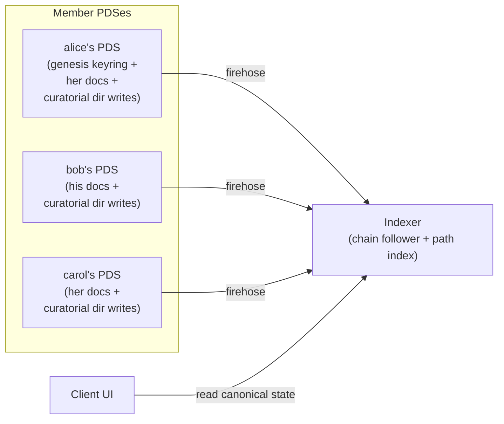

# Opake — Workspace Federation

How workspaces store and reconcile state across multiple PDSes. This doc covers the architecture; lexicon-level details are in `lexicons/README.md`.

## Premise

A workspace is a shared scope where multiple members contribute encrypted content. The model splits cleanly across record types:

- **Documents federate.** Each member writes their own docs to their own PDS. A document's identity, content, and metadata stay with its author.
- **Directories are coordinative.** A single supersede chain per path. At any moment, path P has exactly one canonical directory record — the head of that path's chain. Curatorial writes (anyone with authority) propagate the chain forward, and the chain alternates PDSes as different curators take turns.
- **Keyrings are coordinative-with-authority.** A single supersede chain per workspace, written only by managers. The chain captures membership, rotation, and any other workspace-level structural change.



## What's gone

This model replaces a coordinator pattern that used three sub-lexicons (`documentUpdate`, `directoryUpdate`, `keyringUpdate`) to ship proposed mutations from editors to the owner's daemon for application. None of those exist any more.

- **The `*Update` lexicons** are removed. Nothing to apply, nothing to clean up, nothing to dispatch on.
- **The daemon-as-applier** is gone. Maintenance still runs (re-encryption on rotation, stale pair-request cleanup) but on session-start triggers, not as a long-running authority.
- **Owner-as-gatekeeper for content** is gone. Managers update the keyring directly via supersede. The "owner" role is gone entirely — the workspace creator authors the genesis keyring as a one-time act and is thereafter a manager among managers.

## Authority

| Role    | Documents (own) | Directories                                                          | Keyring   |
| ------- | --------------- | -------------------------------------------------------------------- | --------- |
| Viewer  | read            | read                                                                 | read      |
| Editor  | write           | curatorial supersede, **additive only** (entries ⊇ prior canonical)  | read      |
| Manager | write           | unrestricted curatorial supersede (add, remove, substitute, reorder) | supersede |

Editors contribute their own docs by writing a directory supersede that adds their new entry to the prior canonical's entries. The indexer enforces additivity: an editor's supersede must include every entry from the prior canonical. Editors cannot remove, substitute, or reorder.

Managers face no additivity constraint — they can omit entries (delete), substitute one entry for another (rename), and reorder. Manager-level edits are how moderation, cross-author renames, and reorganization happen.

There is no "owner" role. The DID that authored the genesis keyring is the workspace creator — that's a historical fact recorded in the genesis record's at-uri, not an ongoing authorization level. After genesis, the creator is a manager, identical in capability to any other manager.

## Records

### Keyring

Single-canonical chain. The genesis keyring is written by the workspace creator on their own PDS. Subsequent versions live on whichever manager's PDS last wrote (via supersede).

```
at://{author-did}/app.opake.keyring/{rkey}
```

Carries member set, wrapped group keys, rotation counter, key history, and (for non-genesis keyrings) a `supersedes` field referencing the prior keyring URI. No discriminator — every supersede is the same operation conceptually ("the keyring got updated"), even when the update is a rotation, a member change, or a workspace rename. Workspace identity is anchored at the **genesis keyring's rkey** — that string never changes for the lifetime of the workspace, even as the keyring is superseded onto different PDSes.

The lexicon's `owner` field is **removed**. The genesis keyring's authoring DID lives in its at-uri; that's enough to identify the creator if needed.

### Directory

Single-canonical chain per path. Each curatorial write produces a new directory record on the writer's PDS, with `supersedes: <prior canonical URI>` and updated `entries`.

```
at://{author-did}/app.opake.directory/{rkey}
```

The workspace-root directory uses a deterministic rkey: `ws-{genesisKeyringRkey}`. Subdirectory records use `tid` rkeys.

The directory record carries:

```
{
  opakeVersion,
  keyWrapping: { keyringKeyWrapping: { keyringRef } },
  encryptedMetadata: <directory's own name, encrypted under group key>,
  entries: [{ target: at-uri, targetCid: cid }, ...],
  supersedes: <prior canonical URI>,    // omitted for genesis at this path
  createdAt,
}
```

Listings carry only the at-uri and CID of each entry. No name, no type. Names live in the target record's `encryptedMetadata`. File-vs-folder distinction is inherent in the target's collection (`app.opake.document` vs `app.opake.directory`).

### Document

Per-member, on the writing member's PDS. The doc record carries the encrypted blob reference, key wrapping under the keyring's group key (`keyringRef`), and the doc's `encryptedMetadata` (which contains its name, mime type, etc).

```
at://{member-did}/app.opake.document/{rkey}
```

Documents may carry an optional `supersedes` field for history annotation (e.g., "this was renamed from X by manager Y"). The field is non-load-bearing — directory curatorial supersedes do the actual rename mechanics.

## The workspace root

The workspace-root directory chain is anchored at:

```
at://{author-did}/app.opake.directory/ws-{genesisKeyringRkey}
```

The genesis workspace-root is created at workspace creation by the workspace creator on their PDS, with empty `entries`. Subsequent contributors write their curatorial supersedes at the same rkey on their own PDSes, each pointing at the prior canonical via `supersedes`. The chain alternates PDSes as different members take curatorial turns.

Finding the current workspace-root: walk the supersede chain forward to head. The indexer maintains a `path_index` with the current canonical URI per (workspace, path) for O(1) lookup, so clients ask the indexer rather than walking themselves.

## Identity and naming

- **At-uri is identity.** A record's at-uri is its identity for the lifetime of that record.
- **Names live in target records' `encryptedMetadata`.** Display: fetch each entry's target, decrypt metadata, get name. The indexer can serve a "directory listing with target metadata pre-decrypted" join to amortize the per-target fetch cost.
- **Self-rename a doc** = update the doc record in place (atproto `putRecord` with same rkey, new `encryptedMetadata`). Same at-uri, new CID.
- **Cross-author rename a doc** = manager curatorial supersede of the directory at the doc's path, substituting the old doc's at-uri for a new doc's at-uri (with the new name in its `encryptedMetadata`). Editor cannot do this — additivity-only.
- **Rename a directory** = manager curatorial supersede of the parent directory substituting the directory entry, OR update the directory record's own `encryptedMetadata` in place.
- **Rename the workspace** = manager writes a new keyring record that supersedes the current with updated `encryptedMetadata.name`.
- **Move** = curatorial supersedes at both the old and new paths. Manager removes the entry at old, adds at new.

## Cascade-with-CID

Every directory listing entry pins both an at-uri and a CID. This makes each directory record's CID content-address its entire reachable subtree.

When a curator edits a directory, they:

1. Fetch the current canonical at that path
2. Modify entries (add, remove, substitute)
3. Write a new directory record on their PDS with new entries + `supersedes: <prior canonical>`
4. Walk up to root, writing a new canonical at each ancestor that needs its `targetCid` updated to point at the new child CID
5. Bundle in one signed `applyWrites` on the curator's PDS

O(depth) records updated per change. In typical workspaces depth is 3–7, so write amplification is bounded.

## Curatorial writes: carry-forward responsibility

A curatorial write IS a full statement of the directory's current state, not a delta. The writer must:

1. Fetch the prior canonical's entries
2. Apply their intended modification (add, remove, substitute)
3. Include all unmodified prior entries in the new record

If an editor (additivity-bound) writes a record that omits any prior entry, the indexer rejects the supersede as invalid. The supersede stays on the writer's PDS but isn't reflected in the canonical chain.

Managers face no additivity constraint but should still pull-then-modify rather than write blindly, to avoid accidentally clobbering recent contributions.

## Concurrent writes: last-write-wins, retry

If two members fetch the same prior canonical and write concurrent supersedes pointing at it, the supersede chain forks:

- bob: `entries: [..., bob-doc-X], supersedes: <alice-prior>`
- carol: `entries: [..., carol-doc-Y], supersedes: <alice-prior>`

Both records exist; both supersede the same target. Resolution:

1. Indexer detects fork (a record's `supersedes` target already has a successor).
2. Indexer picks winner by `createdAt`, with `(did, rkey)` tiebreak.
3. Loser's record stays on its PDS but is marked "forked-out" — not part of the canonical chain.
4. Indexer fires a `chain-forked` SSE event for the affected workspace.
5. Loser's client receives the event, refetches new canonical, replays its intended change on top, writes a new supersede.

This is optimistic concurrency control with retry. In Opake's storage workload, races on the same directory should be rare in practice. Pathological concurrency (many simultaneous writers on one path) is out of scope for this rewrite — true collaborative-editing primitives layer on top later, with a CRDT/OT merge instead of last-write-wins.

## Snapshots

A workspace snapshot at time T captures two CIDs:

```
{
  workspaceRootCid: <cid of the canonical workspace-root at time T>,
  keyringCid: <cid of the canonical keyring at time T>,
  takenAt: T,
}
```

Cascade-with-CID makes `workspaceRootCid` content-address the entire workspace tree deterministically. Walking down via cascade-pinned target CIDs reaches every reachable record.

Resolvability depends on PDSes retaining the snapshotted record versions. atproto repos retain rev history by default, but the protocol does not mandate retention forever. Snapshots are useful as a primitive (recovery, audit, future fork-readiness) but are not load-bearing for any current operation in this rewrite.

## Keyring supersede

Any update to a workspace's keyring — adding a member, removing a member, rotating the group key, renaming the workspace, or relocating the keyring to a new PDS after a manager goes offline — is the same operation: a manager writes a new keyring record on their own PDS with `supersedes: <prior-canonical-uri>` and whatever fields are being updated.

```
new_keyring {
  opakeVersion,
  algo,
  members: [...],            // possibly modified set
  rotation: N or N+1,        // bumped if rotating, same otherwise
  keyHistory: [...],         // extended if rotating
  encryptedMetadata: ...,    // workspace name, possibly updated
  supersedes: <prior keyring uri>,
  createdAt,
}
```

There is no `kind` discriminator — every supersede is conceptually the same operation. The fact of supersede is the operation; the field-level diff is the intent.

### Common shapes

- **Add a member.** Members array gets the new member's wrapped group key.
- **Remove a member.** Members array drops them. Typically paired with rotation (bump `rotation`, generate fresh group key, append the prior generation to `keyHistory` so remaining members can still decrypt pre-rotation content).
- **Rotate the group key.** New rotation counter, new wrapped keys for all members, `keyHistory` preserves the prior generation.
- **Rename the workspace.** New `encryptedMetadata.name`.
- **Relocate the keyring.** Any other manager writes the next supersede on their own PDS — the chain naturally moves to a new host.

### Authority

Manager+ at the supersede's `createdAt`, validated against the keyring state in effect immediately before. Demoted-after-write does not retroactively invalidate historical supersedes.

### Forking, deferred

Forking — divergent-branch operations where a workspace splits into two independently-evolving lineages — is **not** part of this rewrite. The supersede primitive could in principle support a `kind: fork` extension with a snapshot embedded as the divergence anchor, but no current Opake use case requires it. The original motivation (recovering from a creator's PDS being unreachable) is fully covered by ordinary keyring supersede. Fork is on the future-work list.

## Self-delete

When a member deletes their own records:

- **Self-delete on a doc** is paired with a directory curatorial supersede at the doc's path that drops the entry. One `applyWrites` on the member's PDS: doc deletion + directory supersede + cascade up. Atomic.
- **Mid-chain self-delete on a directory record** creates a gap in the supersede chain. Live state is unaffected (the head is still resolvable). Snapshots that pinned the deleted CID are unresolvable — accepted as historical lossy.
- **Self-delete on the head canonical directory** rolls the chain back to the prior version. Anyone with authority can supersede the rolled-back-to head.

**Orphan documents.** Mid-chain directory deletion (or a sloppy doc-delete-without-paired-directory-update) can leave doc records that are no longer referenced by any canonical directory. These persist on their authors' PDSes as floating content. Garbage collection — finding and removing orphans — is **future work**, not part of this rewrite.

## Indexer responsibilities

The indexer is load-bearing for correctness in this model. Its responsibilities:

1. **Follow chains.** For every directory chain and the keyring chain, maintain the head URI per workspace.
2. **Validate authority.** At each supersede write, validate against the keyring state at the supersede's `createdAt`. Editor writes must pass the additivity check.
3. **Detect fork conflicts** and emit `chain-forked` events for client retry.
4. **Path index.** `(workspace_id, path) → canonical_uri` for O(1) parent traversal and direct lookup.
5. **Filter dangling at-uri references** in canonical listings (silent filter with a debug-flag for tooling).

### Authority validation timing

Authority is validated against the keyring state at the **superseding record's `createdAt`**, not at read time. A member who writes while a manager and is later demoted retains validity for their historical writes. Forward-looking demotions don't apply retroactively.

### Cold-start bootstrap

A fresh indexer with an empty database can build current state for any known keyring URI without history queries:

1. Fetch the keyring at the head of the supersede chain. If given a non-current URI, follow `supersedes` forward to head.
2. From the keyring's supersede chain, get the genesis keyring's rkey.
3. Walk the workspace-root directory chain to head: starting from any known record at `ws-{genesisKeyringRkey}` (most likely the workspace creator's, since the genesis lives there), follow forward `supersedes` links across PDSes.
4. From the head workspace-root, walk down via cascade-pinned target CIDs.

Cost: O(records reachable in the canonical tree) plus the chain walks. Chain walk length is bounded by total curatorial activity (roughly upload-count). Tree-walk is fully parallelizable; each chain-walk is sequential but per-chain.

Discoverability of which keyrings to bootstrap is separate: typically firehose subscription, optionally a curated keyring list.

## Upward traversal

Directory records carry **no `parent` field**. The indexer's `path_index` resolves parent queries: compute the parent path string from the current path, look up the canonical at that path. One index hit per breadcrumb level.

This was a deliberate choice. Storing `parent: at-uri` on records makes them fragile under any record-identity change (e.g., supersede), forcing children to be rewritten whenever a parent's identity changes. Indexer-resolved parents survive supersede chains transparently.

## What this gives up

- **Pre-publish moderation.** No content write requires manager approval before becoming visible. Moderation is social: misbehaving editors are removed from the keyring (any manager can do this via keyring supersede).
- **Veto-individual-writes.** Same point in different framing. Client-side review layers (non-cryptographic, opt-in) can enforce it at UI level.
- **Atomic cross-PDS writes.** Two members writing concurrently cannot commit together. Last-write-wins + retry is the only available conflict-resolution mechanism.
- **Multi-writer real-time collaboration.** Pathological concurrency on the same path produces high retry rates. Real-time collaborative editing requires CRDT/OT layered on top of the supersede primitive — out of scope.

## Implementation scope

This rewrite delivers the architecture in a single piece. There is no phase split: doc federation, single-canonical directory chains, and keyring supersede all ship together.

In scope:

- Document federation: docs on writers' own PDSes.
- Single-canonical directory chains with curatorial supersede.
- Editor-additive vs manager-unrestricted authority enforced indexer-side.
- Cascade-with-CID on listings.
- Keyring supersede (no `kind` discriminator; uniform operation for membership / rotation / rename / relocation).
- Workspace-root rkey anchored to the genesis keyring's rkey.
- Concurrent-write race detection + `chain-forked` SSE events for client retry.

Out of scope (future work):

- **Forking.** Divergent-branch operations between independent workspace lineages. The supersede primitive could carry a `kind: fork` extension with a snapshot anchor, but no current use case requires it.
- **Materialized forks.** Re-publishing snapshotted records under a fork's scope for retention guarantees beyond the parents' PDSes.
- Live collaborative document editing (CRDT/OT layer over the supersede primitive).
- Cross-workspace document moves (custody transfer between distinct workspaces).
- Garbage collection of orphan doc records.
- Auto-merge resolution for chain-forked supersedes (currently last-write-wins + retry).

## Migration from current shipped state

Current production state (post-rollback `feature/workspace-doc-proposals`) has:

- `*Update` lexicons in active use for proposed mutations.
- Per-member-per-path directory records (introduced in the post-rollback federated branch).
- Listings without `targetCid`.
- No keyring supersede.

The migration to this model:

1. **Stop writing `*Update` records.** Clients update to write content directly.
2. **Drain in-flight proposals.** Daemon applies any outstanding proposals; cleanup module removes them.
3. **Consolidate per-member directory records into single-canonical chains.** For each path with multiple member contributions, write a single curatorial supersede (manager-authored) that consolidates all entries into one canonical. After this pass, every path has one canonical record at the head of its chain.
4. **Add `targetCid` to all listings** during the consolidation pass.
5. **Verify rkey stability.** For pre-existing workspaces, the genesis keyring's rkey IS the current keyring's rkey, so `ws-{genesisKeyringRkey}` resolves to the existing root record without renaming. The first keyring supersede after migration starts the chain.
6. **Drop the keyring's `owner` field.** Existing keyring records written under the old lexicon retain it; a no-op supersede that simply omits the field can be issued by any manager to bring the keyring forward.
7. **Indexer schema migration.** Indexer drops `*Update` event handlers and per-member-merge logic, adds chain-following + path_index, adds keyring-supersede chain following, adjusts merged-view computation to "canonical record fetch" instead of "merge across members."

Migration is one-way; no rollback once consolidation runs. Coordinated release of client + indexer required.

## Open questions

These need answers before this rewrite ships:

- **Chain-fork race detection details.** Specific SSE event shape, client retry strategy with exponential backoff and jitter, retry budget before surfacing user-visible error.
- **Editor additivity check edge cases.** Reorder-preserving supersedes by an editor: allowed (no information loss) or rejected (strict ⊇)? Treatment of malformed entries in the prior canonical?
- **Indexer schema details.** Concrete tables, indexes, and event-processing pipeline for chain-following + path_index + race detection.
- **Optimistic overlay implementation.** SDK-level details for applying client-side updates immediately and reconciling with race-detected forks.

## References

- [ARCHITECTURE.md](ARCHITECTURE.md) — encryption model, identity, system overview
- [CRYPTO.md](CRYPTO.md) — algorithms, key wrapping, group keys
- [STORAGE.md](STORAGE.md) — local cache, IndexedDB layout
- [indexer.md](indexer.md) — indexer config, API, firehose details
- [lexicons/README.md](../lexicons/README.md) — lexicon reference (will be updated alongside this rewrite)
