# Opake — Operation Flows

Sequence diagrams for every CLI operation. All crypto happens client-side — the PDS only stores and serves opaque bytes.

## Authentication

### Login

Authenticates with a PDS, persists session + identity, and publishes the encryption public key as a singleton record.

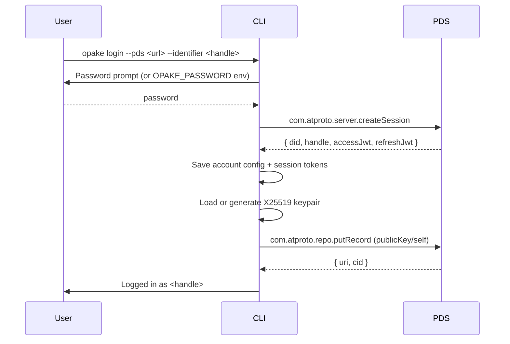

The `putRecord` call is idempotent — same key, same record. Safe to call on every login.

### Token Refresh

Transparent to the user. The XRPC client detects expired tokens and refreshes automatically.

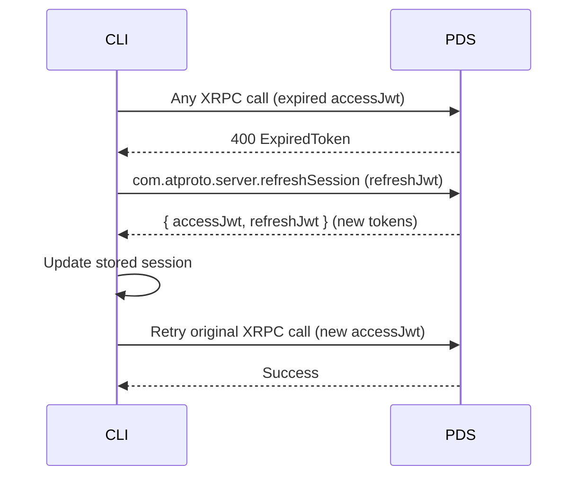

## Document Operations

### Upload

Encrypts a file and uploads it as an opaque blob with a metadata record.

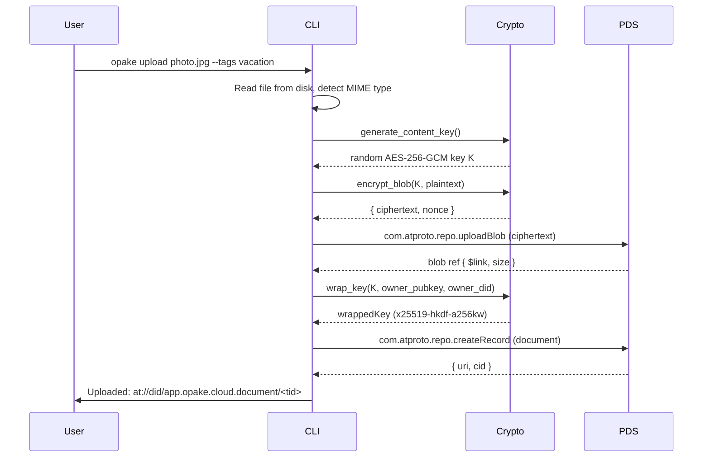

### Download (Own Files)

Fetches a document you own, unwraps the content key, and decrypts.

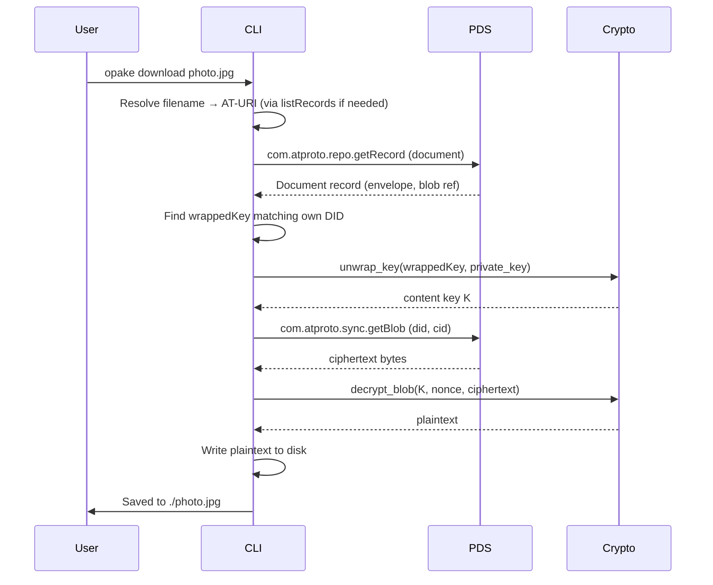

### Download (Shared Files — Cross-PDS)

Downloads a file shared with you by another user. Requires the grant URI (auto-discovery via `inbox` is not yet implemented).

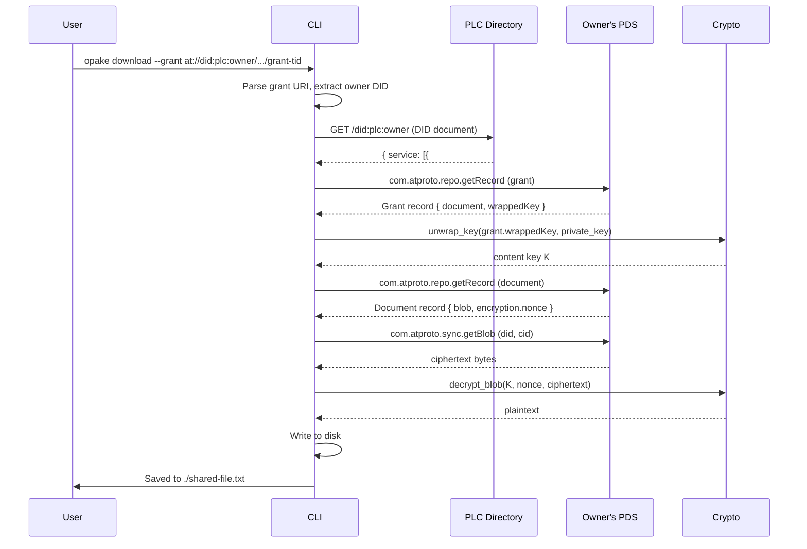

Data never leaves the owner's PDS. The recipient fetches everything directly from the source.

### List

Lists document records on your PDS with optional tag filtering.

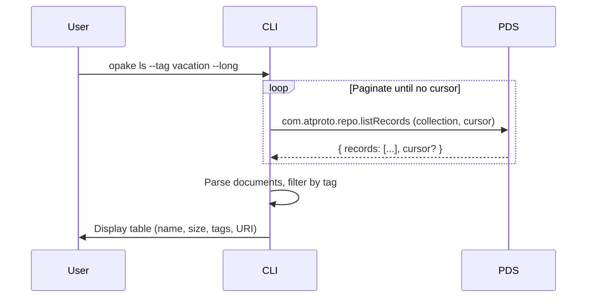

### Delete

Deletes a document record. The blob becomes orphaned and is eventually garbage-collected by the PDS.

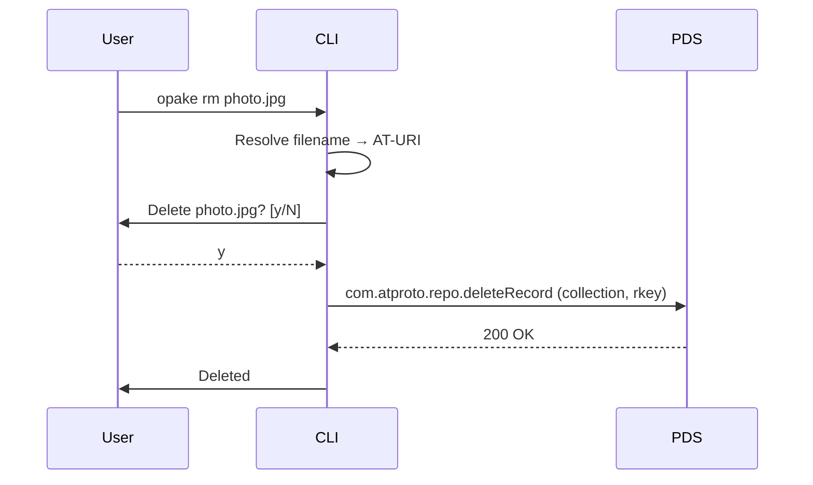

## Sharing

### Resolve

Resolves a handle or DID to its PDS and X25519 public key. Used internally by `share`, exposed as a standalone command for inspection.

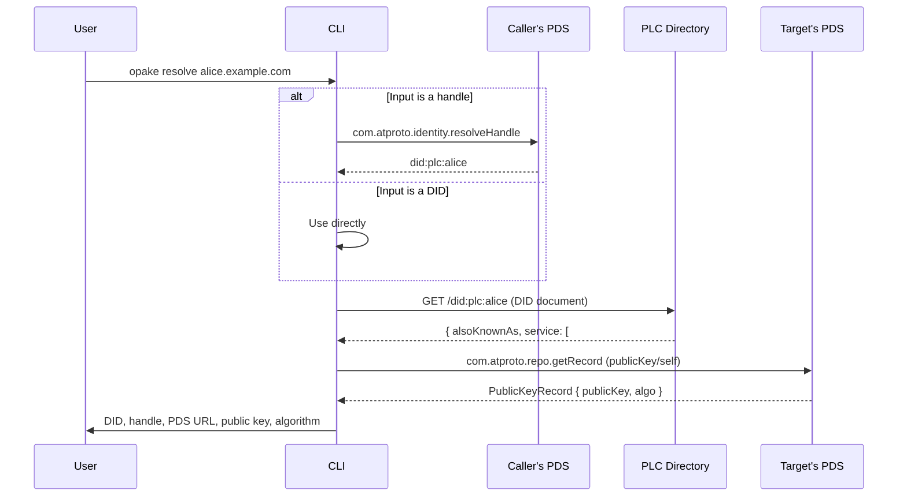

### Share

Grants another user access to a document by wrapping the content key to their public key.

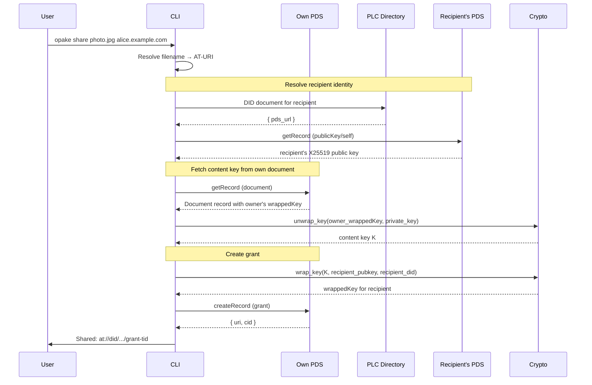

### Revoke

Deletes a grant record. The recipient loses network access to the wrapped key.

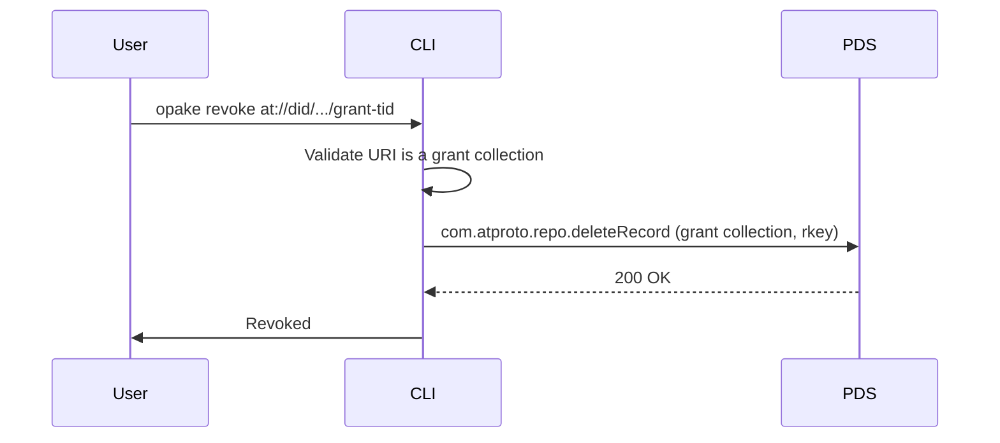

For true forward secrecy, the document should also be re-encrypted with a new content key — the schema supports this but the CLI doesn't automate it yet.

## Encryption Primitives

### Key Wrapping (x25519-hkdf-a256kw)

How a symmetric content key gets wrapped to a recipient's X25519 public key. This is the core crypto operation behind both direct encryption and grant creation.

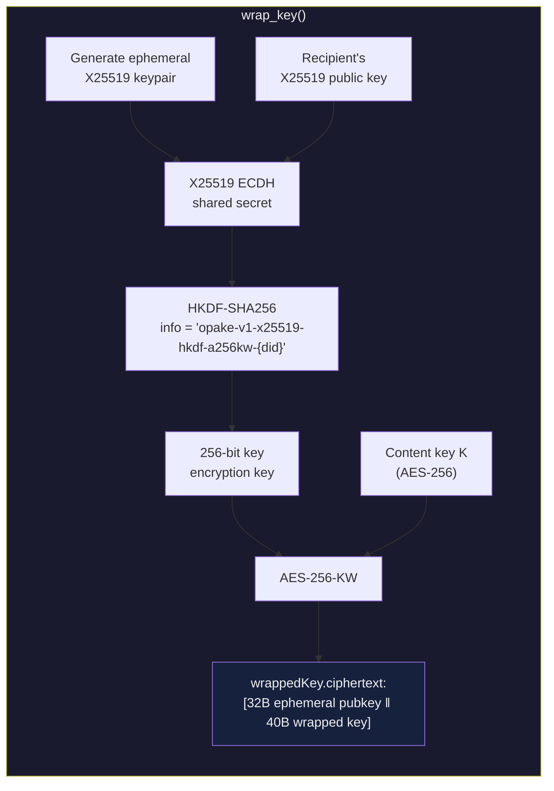

### Content Encryption (AES-256-GCM)

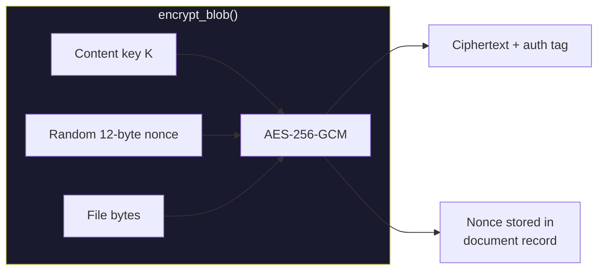

## Keyring Sharing (Planned)

Not yet implemented. This is the two-layer key model for group access.

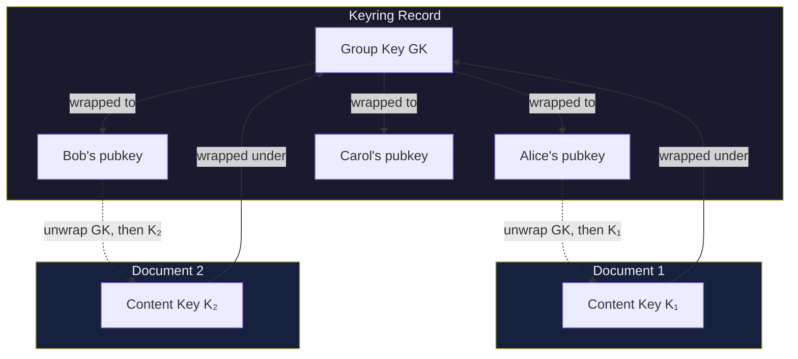

Adding a member wraps GK to their public key. Removing a member rotates GK and re-wraps to the remaining members. Per-document content keys and blobs stay untouched.
