# Opake — Operation Flows

Sequence diagrams for every CLI operation. All crypto happens client-side — the PDS only stores and serves opaque bytes.

## Authentication

### Login

Authenticates with a PDS, persists session + identity, and publishes the encryption public key as a singleton record.

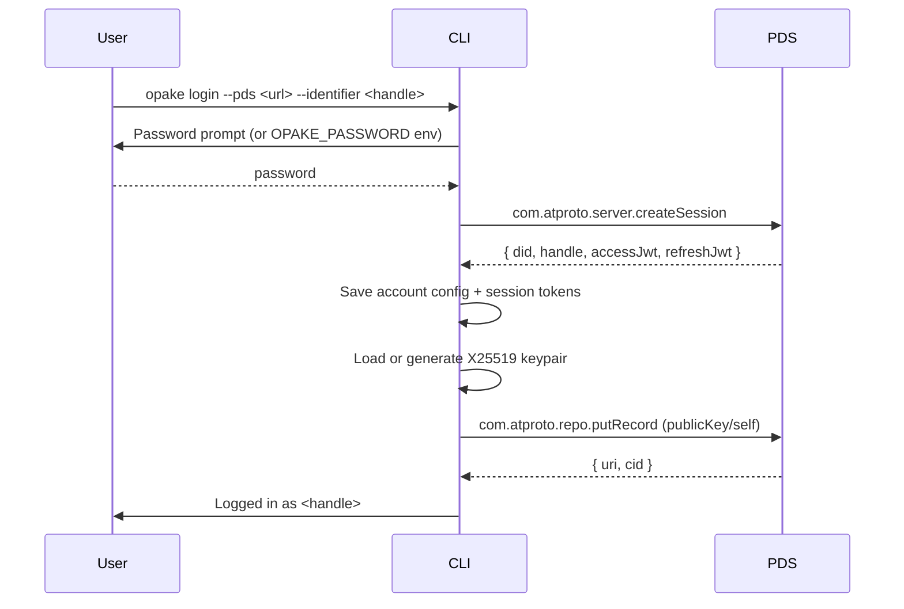
```mermaid
sequenceDiagram
    participant User
    participant CLI
    participant PDS

    User->>CLI: opake login --pds <url> --identifier <handle>
    CLI->>User: Password prompt (or OPAKE_PASSWORD env)
    User-->>CLI: password

    CLI->>PDS: com.atproto.server.createSession
    PDS-->>CLI: { did, handle, accessJwt, refreshJwt }

    CLI->>CLI: Save account config + session tokens
    CLI->>CLI: Load or generate X25519 keypair

    CLI->>PDS: com.atproto.repo.putRecord (publicKey/self)
    PDS-->>CLI: { uri, cid }

    CLI->>User: Logged in as <handle>
```

The `putRecord` call is idempotent — same key, same record. Safe to call on every login.

### Token Refresh

Transparent to the user. The XRPC client detects expired tokens and refreshes automatically.

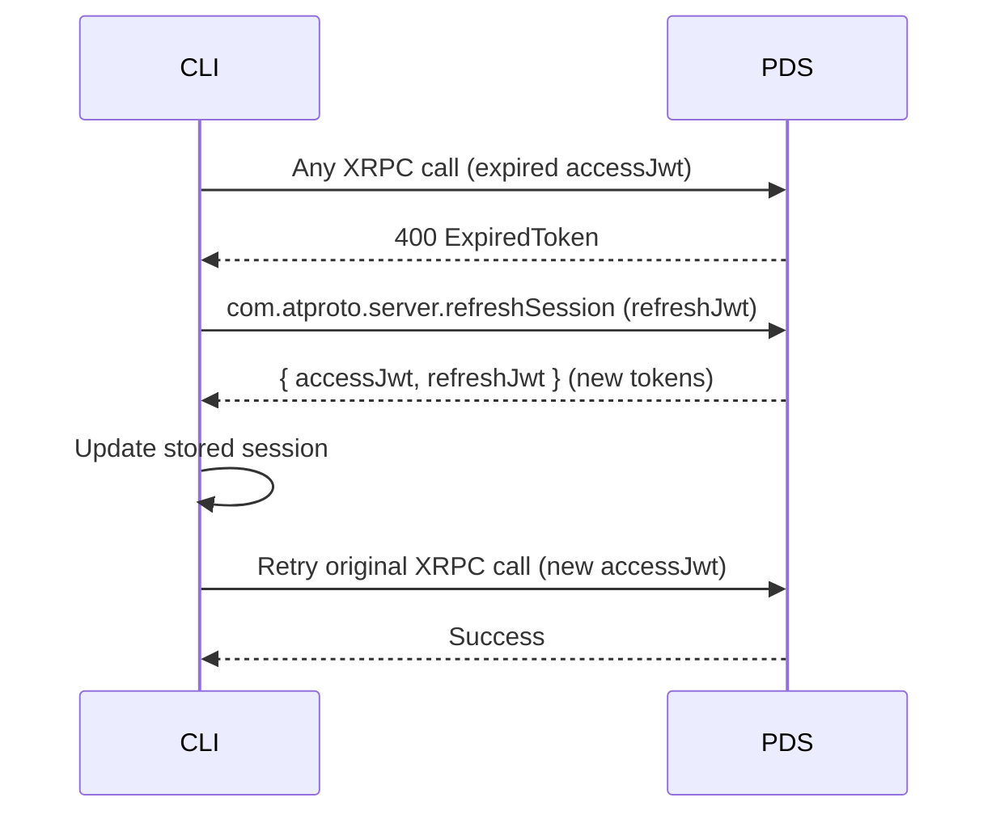
```mermaid
sequenceDiagram
    participant CLI
    participant PDS

    CLI->>PDS: Any XRPC call (expired accessJwt)
    PDS-->>CLI: 400 ExpiredToken

    CLI->>PDS: com.atproto.server.refreshSession (refreshJwt)
    PDS-->>CLI: { accessJwt, refreshJwt } (new tokens)

    CLI->>CLI: Update stored session

    CLI->>PDS: Retry original XRPC call (new accessJwt)
    PDS-->>CLI: Success
```

## Document Operations

### Upload

Encrypts a file and uploads it as an opaque blob with a metadata record.

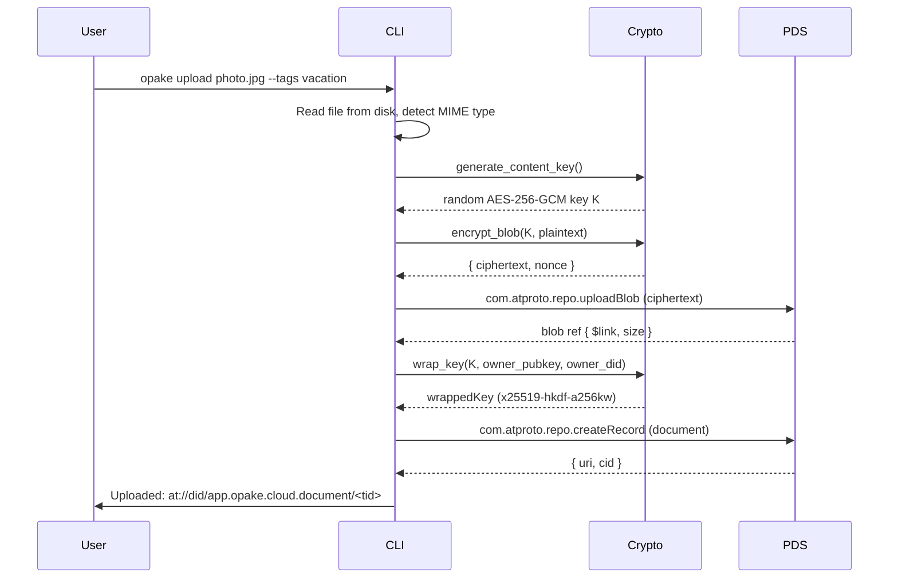
```mermaid
sequenceDiagram
    participant User
    participant CLI
    participant Crypto
    participant PDS

    User->>CLI: opake upload photo.jpg --tags vacation

    CLI->>CLI: Read file from disk, detect MIME type
    CLI->>Crypto: generate_content_key()
    Crypto-->>CLI: random AES-256-GCM key K

    CLI->>Crypto: encrypt_blob(K, plaintext)
    Crypto-->>CLI: { ciphertext, nonce }

    CLI->>PDS: com.atproto.repo.uploadBlob (ciphertext)
    PDS-->>CLI: blob ref { $link, size }

    CLI->>Crypto: wrap_key(K, owner_pubkey, owner_did)
    Crypto-->>CLI: wrappedKey (x25519-hkdf-a256kw)

    CLI->>PDS: com.atproto.repo.createRecord (document)
    PDS-->>CLI: { uri, cid }

    CLI->>User: Uploaded: at://did/app.opake.cloud.document/<tid>
```

### Download (Own Files)

Fetches a document you own, unwraps the content key, and decrypts.

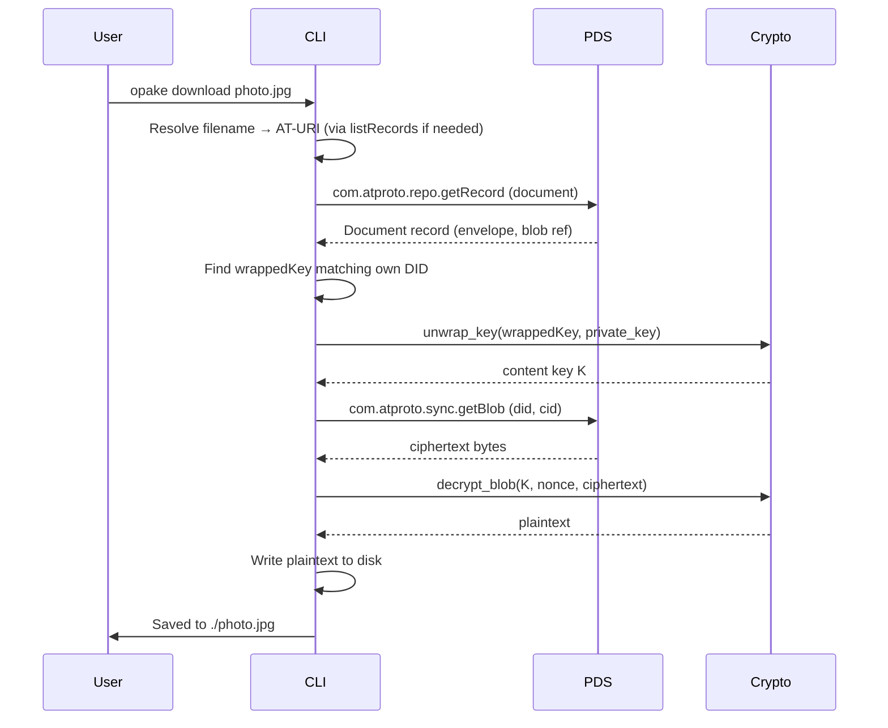
```mermaid
sequenceDiagram
    participant User
    participant CLI
    participant PDS
    participant Crypto

    User->>CLI: opake download photo.jpg

    CLI->>CLI: Resolve filename → AT-URI (via listRecords if needed)

    CLI->>PDS: com.atproto.repo.getRecord (document)
    PDS-->>CLI: Document record (envelope, blob ref)

    CLI->>CLI: Find wrappedKey matching own DID
    CLI->>Crypto: unwrap_key(wrappedKey, private_key)
    Crypto-->>CLI: content key K

    CLI->>PDS: com.atproto.sync.getBlob (did, cid)
    PDS-->>CLI: ciphertext bytes

    CLI->>Crypto: decrypt_blob(K, nonce, ciphertext)
    Crypto-->>CLI: plaintext

    CLI->>CLI: Write plaintext to disk
    CLI->>User: Saved to ./photo.jpg
```

### Download (Shared Files — Cross-PDS)

Downloads a file shared with you by another user. Requires the grant URI (auto-discovery via `inbox` is not yet implemented).

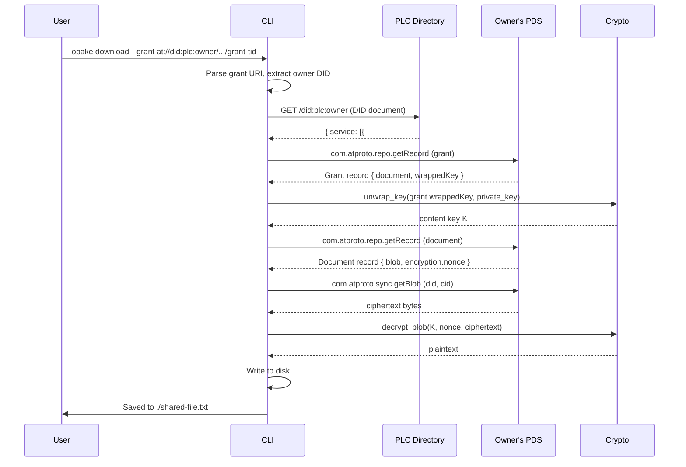
```mermaid
sequenceDiagram
    participant User
    participant CLI
    participant PLC as PLC Directory
    participant OwnerPDS as Owner's PDS
    participant Crypto

    User->>CLI: opake download --grant at://did:plc:owner/.../grant-tid

    CLI->>CLI: Parse grant URI, extract owner DID

    CLI->>PLC: GET /did:plc:owner (DID document)
    PLC-->>CLI: { service: [{ #atproto_pds: owner-pds-url }] }

    CLI->>OwnerPDS: com.atproto.repo.getRecord (grant)
    OwnerPDS-->>CLI: Grant record { document, wrappedKey }

    CLI->>Crypto: unwrap_key(grant.wrappedKey, private_key)
    Crypto-->>CLI: content key K

    CLI->>OwnerPDS: com.atproto.repo.getRecord (document)
    OwnerPDS-->>CLI: Document record { blob, encryption.nonce }

    CLI->>OwnerPDS: com.atproto.sync.getBlob (did, cid)
    OwnerPDS-->>CLI: ciphertext bytes

    CLI->>Crypto: decrypt_blob(K, nonce, ciphertext)
    Crypto-->>CLI: plaintext

    CLI->>CLI: Write to disk
    CLI->>User: Saved to ./shared-file.txt
```

Data never leaves the owner's PDS. The recipient fetches everything directly from the source.

### List

Lists document records on your PDS with optional tag filtering.

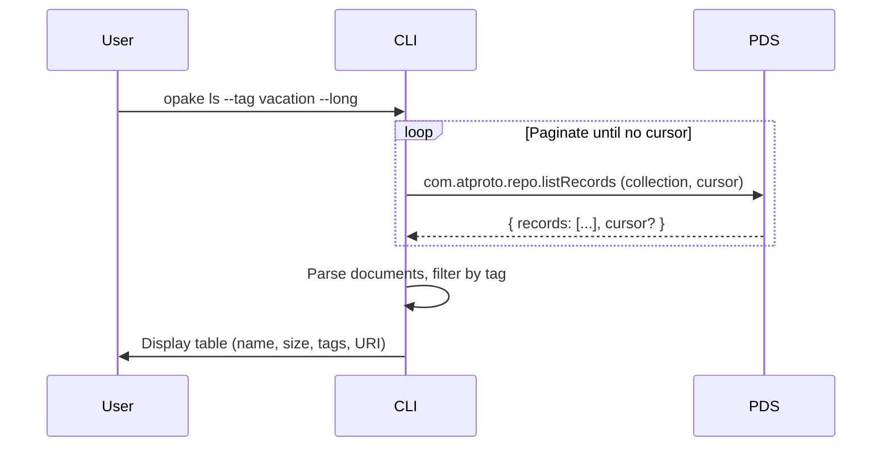
```mermaid
sequenceDiagram
    participant User
    participant CLI
    participant PDS

    User->>CLI: opake ls --tag vacation --long

    loop Paginate until no cursor
        CLI->>PDS: com.atproto.repo.listRecords (collection, cursor)
        PDS-->>CLI: { records: [...], cursor? }
    end

    CLI->>CLI: Parse documents, filter by tag
    CLI->>User: Display table (name, size, tags, URI)
```

### Delete

Deletes a document record. The blob becomes orphaned and is eventually garbage-collected by the PDS.

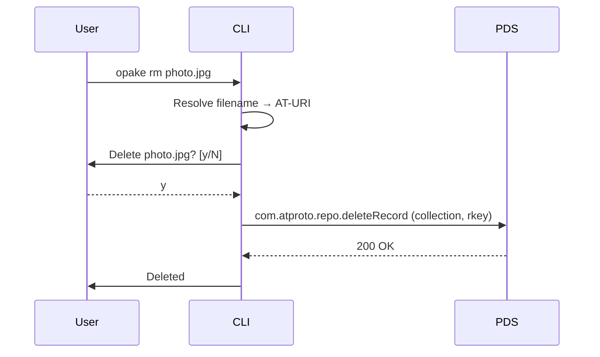
```mermaid
sequenceDiagram
    participant User
    participant CLI
    participant PDS

    User->>CLI: opake rm photo.jpg

    CLI->>CLI: Resolve filename → AT-URI
    CLI->>User: Delete photo.jpg? [y/N]
    User-->>CLI: y

    CLI->>PDS: com.atproto.repo.deleteRecord (collection, rkey)
    PDS-->>CLI: 200 OK

    CLI->>User: Deleted
```

## Sharing

### Resolve

Resolves a handle or DID to its PDS and X25519 public key. Used internally by `share`, exposed as a standalone command for inspection.

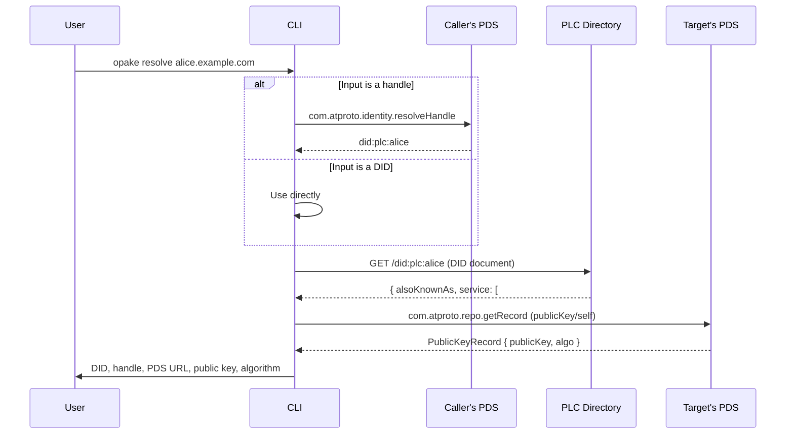
```mermaid
sequenceDiagram
    participant User
    participant CLI
    participant CallerPDS as Caller's PDS
    participant PLC as PLC Directory
    participant TargetPDS as Target's PDS

    User->>CLI: opake resolve alice.example.com

    alt Input is a handle
        CLI->>CallerPDS: com.atproto.identity.resolveHandle
        CallerPDS-->>CLI: did:plc:alice
    else Input is a DID
        CLI->>CLI: Use directly
    end

    CLI->>PLC: GET /did:plc:alice (DID document)
    PLC-->>CLI: { alsoKnownAs, service: [#atproto_pds → pds-url] }

    CLI->>TargetPDS: com.atproto.repo.getRecord (publicKey/self)
    TargetPDS-->>CLI: PublicKeyRecord { publicKey, algo }

    CLI->>User: DID, handle, PDS URL, public key, algorithm
```

### Share

Grants another user access to a document by wrapping the content key to their public key.

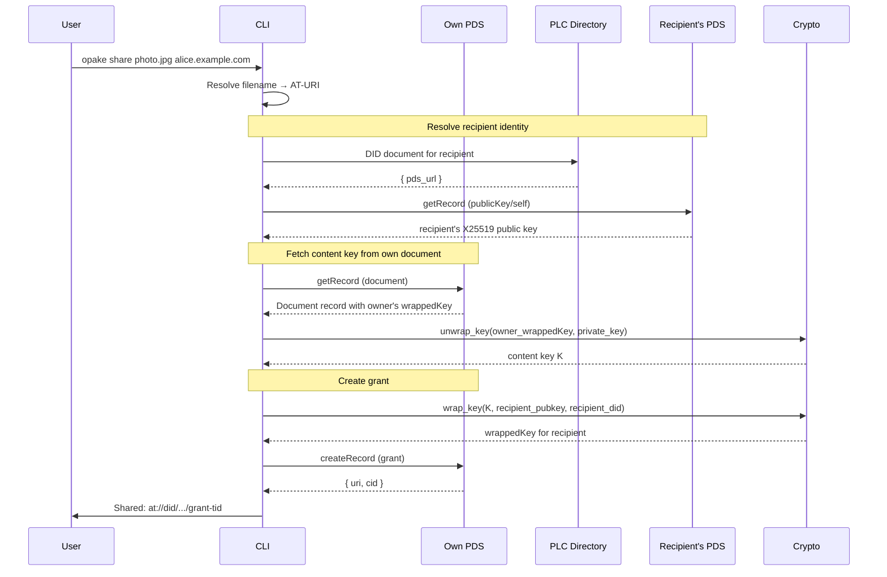
```mermaid
sequenceDiagram
    participant User
    participant CLI
    participant PDS as Own PDS
    participant PLC as PLC Directory
    participant RecipientPDS as Recipient's PDS
    participant Crypto

    User->>CLI: opake share photo.jpg alice.example.com

    CLI->>CLI: Resolve filename → AT-URI

    Note over CLI,RecipientPDS: Resolve recipient identity
    CLI->>PLC: DID document for recipient
    PLC-->>CLI: { pds_url }
    CLI->>RecipientPDS: getRecord (publicKey/self)
    RecipientPDS-->>CLI: recipient's X25519 public key

    Note over CLI,PDS: Fetch content key from own document
    CLI->>PDS: getRecord (document)
    PDS-->>CLI: Document record with owner's wrappedKey
    CLI->>Crypto: unwrap_key(owner_wrappedKey, private_key)
    Crypto-->>CLI: content key K

    Note over CLI,PDS: Create grant
    CLI->>Crypto: wrap_key(K, recipient_pubkey, recipient_did)
    Crypto-->>CLI: wrappedKey for recipient

    CLI->>PDS: createRecord (grant)
    PDS-->>CLI: { uri, cid }

    CLI->>User: Shared: at://did/.../grant-tid
```

### Revoke

Deletes a grant record. The recipient loses network access to the wrapped key.

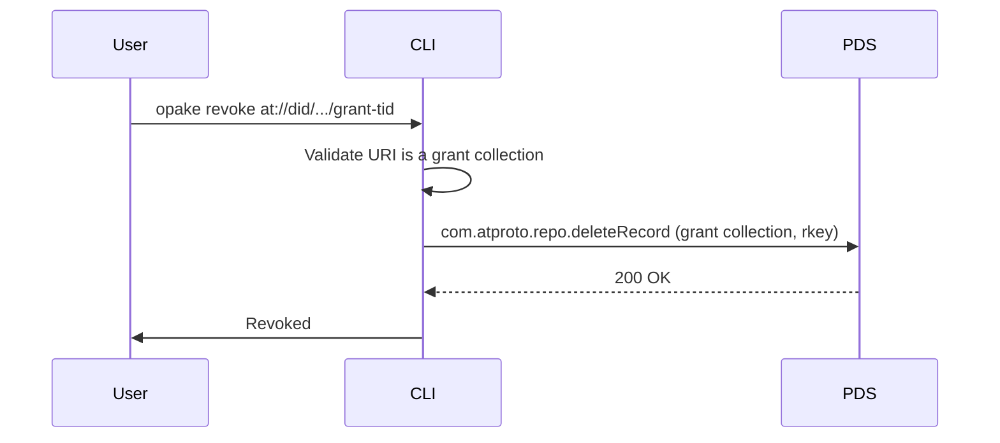
```mermaid
sequenceDiagram
    participant User
    participant CLI
    participant PDS

    User->>CLI: opake revoke at://did/.../grant-tid

    CLI->>CLI: Validate URI is a grant collection
    CLI->>PDS: com.atproto.repo.deleteRecord (grant collection, rkey)
    PDS-->>CLI: 200 OK

    CLI->>User: Revoked
```

For true forward secrecy, the document should also be re-encrypted with a new content key — the schema supports this but the CLI doesn't automate it yet.

## Encryption Primitives

### Key Wrapping (x25519-hkdf-a256kw)

How a symmetric content key gets wrapped to a recipient's X25519 public key. This is the core crypto operation behind both direct encryption and grant creation.

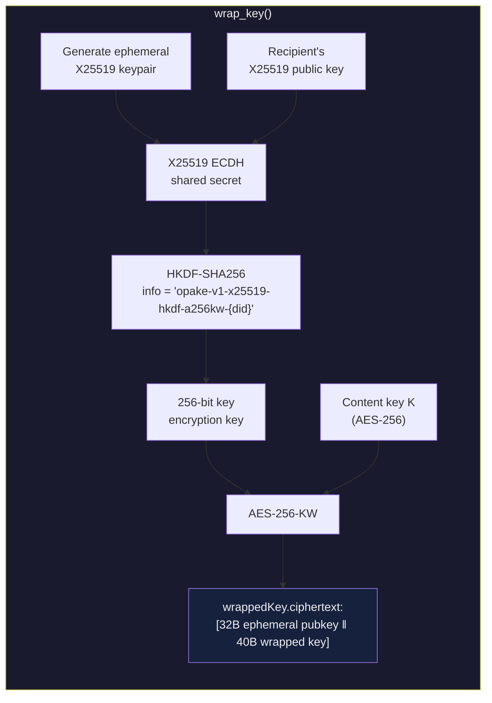
```mermaid
flowchart LR
    subgraph Wrap ["wrap_key()"]
        direction TB
        EphKey["Generate ephemeral<br/>X25519 keypair"] --> ECDH
        RecipPub["Recipient's<br/>X25519 public key"] --> ECDH
        ECDH["X25519 ECDH<br/>shared secret"] --> HKDF
        HKDF["HKDF-SHA256<br/>info = 'opake-v1-x25519-hkdf-a256kw-{did}'"] --> KEK
        KEK["256-bit key<br/>encryption key"] --> AESKW
        ContentKey["Content key K<br/>(AES-256)"] --> AESKW
        AESKW["AES-256-KW"] --> Ciphertext
    end

    Ciphertext["wrappedKey.ciphertext:<br/>[32B ephemeral pubkey ‖ 40B wrapped key]"]

    style Wrap fill:#1a1a2e,color:#eee
    style Ciphertext fill:#16213e,color:#eee
```

### Keyring Key Wrapping (AES-256-KW)

How a content key gets wrapped under a keyring's group key. Symmetric wrap — no ECDH, no ephemeral keys.

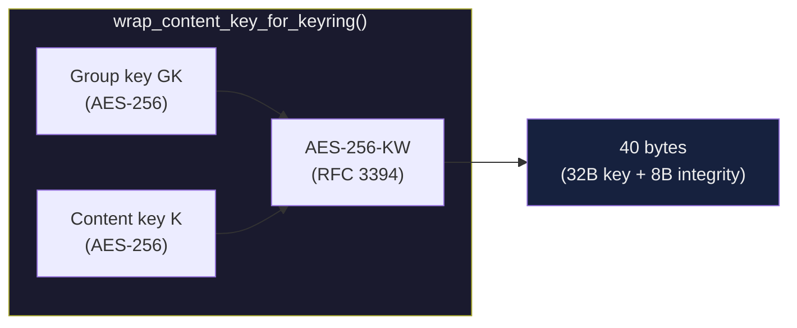
```mermaid
flowchart LR
    subgraph Wrap ["wrap_content_key_for_keyring()"]
        direction TB
        GK["Group key GK<br/>(AES-256)"] --> KEK["AES-256-KW<br/>(RFC 3394)"]
        ContentKey["Content key K<br/>(AES-256)"] --> KEK
    end

    KEK --> Wrapped["40 bytes<br/>(32B key + 8B integrity)"]

    style Wrap fill:#1a1a2e,color:#eee
    style Wrapped fill:#16213e,color:#eee
```

The group key itself is wrapped to each member's X25519 public key using the asymmetric wrapping scheme above.

### Content Encryption (AES-256-GCM)

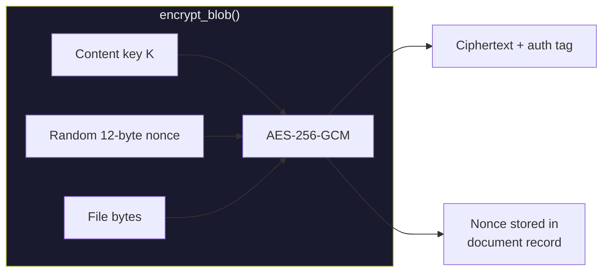
```mermaid
flowchart LR
    subgraph Encrypt ["encrypt_blob()"]
        direction TB
        K["Content key K"] --> GCM
        Nonce["Random 12-byte nonce"] --> GCM
        Plaintext["File bytes"] --> GCM
        GCM["AES-256-GCM"]
    end

    GCM --> Ciphertext["Ciphertext + auth tag"]
    GCM --> StoredNonce["Nonce stored in<br/>document record"]

    style Encrypt fill:#1a1a2e,color:#eee
```

## Keyrings

### Keyring Model

Two-layer key wrapping for group access. Per-document content keys are wrapped under the group key (AES-KW), and the group key is wrapped to each member's X25519 public key.

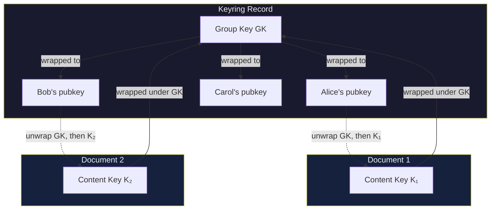
```mermaid
flowchart TB
    subgraph Keyring ["Keyring Record"]
        GK["Group Key GK"]
        GK -->|wrapped to| Alice["Alice's pubkey"]
        GK -->|wrapped to| Bob["Bob's pubkey"]
        GK -->|wrapped to| Carol["Carol's pubkey"]
    end

    subgraph Doc1 ["Document 1"]
        K1["Content Key K₁"] -->|wrapped under GK| GK
    end

    subgraph Doc2 ["Document 2"]
        K2["Content Key K₂"] -->|wrapped under GK| GK
    end

    Alice -.->|unwrap GK, then K₁| K1
    Bob -.->|unwrap GK, then K₂| K2

    style Keyring fill:#1a1a2e,color:#eee
    style Doc1 fill:#16213e,color:#eee
    style Doc2 fill:#16213e,color:#eee
```

### Create Keyring

Generates a group key, wraps it to the owner, creates the keyring record, and stores the group key locally.

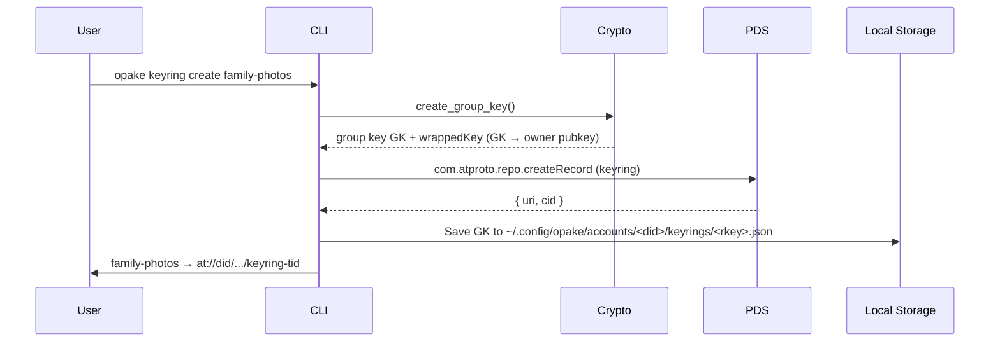
```mermaid
sequenceDiagram
    participant User
    participant CLI
    participant Crypto
    participant PDS
    participant Disk as Local Storage

    User->>CLI: opake keyring create family-photos

    CLI->>Crypto: create_group_key()
    Crypto-->>CLI: group key GK + wrappedKey (GK → owner pubkey)

    CLI->>PDS: com.atproto.repo.createRecord (keyring)
    PDS-->>CLI: { uri, cid }

    CLI->>Disk: Save GK to ~/.config/opake/accounts/<did>/keyrings/<rkey>.json

    CLI->>User: family-photos → at://did/.../keyring-tid
```

The group key is never stored in plaintext on the PDS — only the wrapped copies live in the keyring record.

### List Keyrings

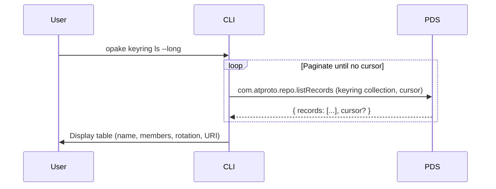
```mermaid
sequenceDiagram
    participant User
    participant CLI
    participant PDS

    User->>CLI: opake keyring ls --long

    loop Paginate until no cursor
        CLI->>PDS: com.atproto.repo.listRecords (keyring collection, cursor)
        PDS-->>CLI: { records: [...], cursor? }
    end

    CLI->>User: Display table (name, members, rotation, URI)
```

### Add Member

Resolves the new member's identity, wraps the group key to their public key, and appends them to the keyring record.

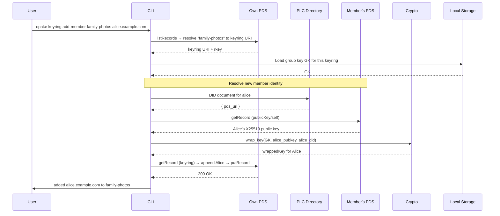
```mermaid
sequenceDiagram
    participant User
    participant CLI
    participant PDS as Own PDS
    participant PLC as PLC Directory
    participant MemberPDS as Member's PDS
    participant Crypto
    participant Disk as Local Storage

    User->>CLI: opake keyring add-member family-photos alice.example.com

    CLI->>PDS: listRecords → resolve "family-photos" to keyring URI
    PDS-->>CLI: keyring URI + rkey

    CLI->>Disk: Load group key GK for this keyring
    Disk-->>CLI: GK

    Note over CLI,MemberPDS: Resolve new member identity
    CLI->>PLC: DID document for alice
    PLC-->>CLI: { pds_url }
    CLI->>MemberPDS: getRecord (publicKey/self)
    MemberPDS-->>CLI: Alice's X25519 public key

    CLI->>Crypto: wrap_key(GK, alice_pubkey, alice_did)
    Crypto-->>CLI: wrappedKey for Alice

    CLI->>PDS: getRecord (keyring) → append Alice → putRecord
    PDS-->>CLI: 200 OK

    CLI->>User: added alice.example.com to family-photos
```

### Remove Member

Removes the member, generates a new group key, re-wraps to all remaining members, and increments the rotation counter.

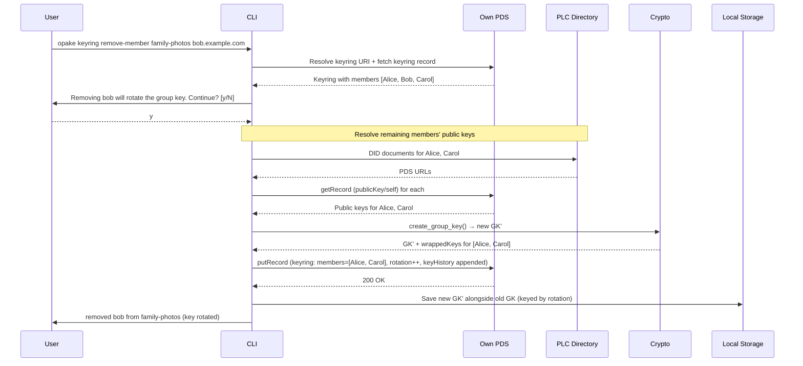
```mermaid
sequenceDiagram
    participant User
    participant CLI
    participant PDS as Own PDS
    participant PLC as PLC Directory
    participant Crypto
    participant Disk as Local Storage

    User->>CLI: opake keyring remove-member family-photos bob.example.com

    CLI->>PDS: Resolve keyring URI + fetch keyring record
    PDS-->>CLI: Keyring with members [Alice, Bob, Carol]

    CLI->>User: Removing bob will rotate the group key. Continue? [y/N]
    User-->>CLI: y

    Note over CLI,PLC: Resolve remaining members' public keys
    CLI->>PLC: DID documents for Alice, Carol
    PLC-->>CLI: PDS URLs
    CLI->>PDS: getRecord (publicKey/self) for each
    PDS-->>CLI: Public keys for Alice, Carol

    CLI->>Crypto: create_group_key() → new GK'
    Crypto-->>CLI: GK' + wrappedKeys for [Alice, Carol]

    CLI->>PDS: putRecord (keyring: members=[Alice, Carol], rotation++, keyHistory appended)
    PDS-->>CLI: 200 OK

    CLI->>Disk: Save new GK' alongside old GK (keyed by rotation)

    CLI->>User: removed bob from family-photos (key rotated)
```

Before replacing the group key, the old rotation's remaining member entries are archived into the keyring's `keyHistory` array. This lets remaining members still decrypt documents uploaded under previous rotations — even on a new device, the old wrapped group keys are preserved in the record.

Existing documents encrypted under the old group key stay as-is. New uploads use the new group key. Removed members' wrapped keys are excluded from history, so they cannot recover old group keys from the record.

### Upload with Keyring

Encrypts a file and wraps the content key under the keyring's group key instead of individual public keys.

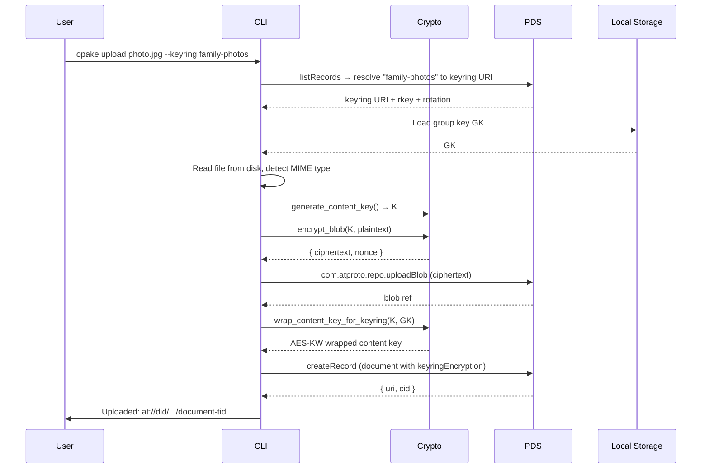
```mermaid
sequenceDiagram
    participant User
    participant CLI
    participant Crypto
    participant PDS
    participant Disk as Local Storage

    User->>CLI: opake upload photo.jpg --keyring family-photos

    CLI->>PDS: listRecords → resolve "family-photos" to keyring URI
    PDS-->>CLI: keyring URI + rkey + rotation

    CLI->>Disk: Load group key GK
    Disk-->>CLI: GK

    CLI->>CLI: Read file from disk, detect MIME type
    CLI->>Crypto: generate_content_key() → K
    CLI->>Crypto: encrypt_blob(K, plaintext)
    Crypto-->>CLI: { ciphertext, nonce }

    CLI->>PDS: com.atproto.repo.uploadBlob (ciphertext)
    PDS-->>CLI: blob ref

    CLI->>Crypto: wrap_content_key_for_keyring(K, GK)
    Crypto-->>CLI: AES-KW wrapped content key

    CLI->>PDS: createRecord (document with keyringEncryption)
    PDS-->>CLI: { uri, cid }

    CLI->>User: Uploaded: at://did/.../document-tid
```

The document record references the keyring URI and stores `wrappedContentKey` (content key wrapped under GK) instead of per-DID wrapped keys.

### Download Keyring-Encrypted Document

Automatically detected — the CLI peeks at the document's encryption type and loads the group key if needed.

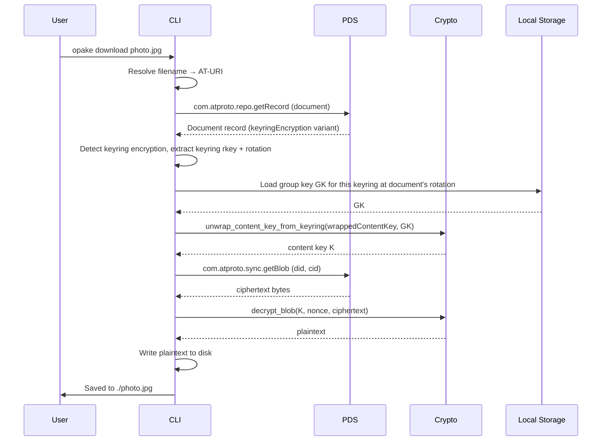
```mermaid
sequenceDiagram
    participant User
    participant CLI
    participant PDS
    participant Crypto
    participant Disk as Local Storage

    User->>CLI: opake download photo.jpg

    CLI->>CLI: Resolve filename → AT-URI

    CLI->>PDS: com.atproto.repo.getRecord (document)
    PDS-->>CLI: Document record (keyringEncryption variant)

    CLI->>CLI: Detect keyring encryption, extract keyring rkey + rotation

    CLI->>Disk: Load group key GK for this keyring at document's rotation
    Disk-->>CLI: GK

    CLI->>Crypto: unwrap_content_key_from_keyring(wrappedContentKey, GK)
    Crypto-->>CLI: content key K

    CLI->>PDS: com.atproto.sync.getBlob (did, cid)
    PDS-->>CLI: ciphertext bytes

    CLI->>Crypto: decrypt_blob(K, nonce, ciphertext)
    Crypto-->>CLI: plaintext

    CLI->>CLI: Write plaintext to disk
    CLI->>User: Saved to ./photo.jpg
```

## Revisions (Planned)

Collaborative editing via revision records. Each member uploads revisions to their own PDS — data stays under their control, and the AppView stitches it together. Same pattern as Bluesky replies: your content lives on your PDS, the AppView presents the thread.

### Propose Revision (Direct Share)

A grant recipient uploads a revised version of a shared document to their own PDS.

```mermaid
sequenceDiagram
    participant Recipient
    participant CLI as Recipient's CLI
    participant Crypto
    participant RecipientPDS as Recipient's PDS

    Recipient->>CLI: opake propose at://owner/.../document/tid photo-edited.jpg

    CLI->>CLI: Read new file, detect MIME type
    CLI->>Crypto: generate_content_key() → K'
    CLI->>Crypto: encrypt_blob(K', plaintext)
    Crypto-->>CLI: { ciphertext, nonce }

    CLI->>RecipientPDS: uploadBlob (ciphertext)
    RecipientPDS-->>CLI: blob ref

    CLI->>Crypto: wrap_key(K', recipient_own_pubkey)
    Crypto-->>CLI: wrappedKey (self-wrap)

    CLI->>RecipientPDS: createRecord (revision)
    Note right of RecipientPDS: origin: at://owner/.../document/tid<br/>blob, encryption, nonce
    RecipientPDS-->>CLI: { uri, cid }

    CLI->>Recipient: Proposed: at://recipient/.../revision/tid
```

The revision record lives on the recipient's PDS. It references the original document via an `origin` AT-URI. The owner's data is untouched.

### Propose Revision (Keyring Member)

A keyring member uploads a revised version, encrypted under the shared group key.

```mermaid
sequenceDiagram
    participant Member
    participant CLI as Member's CLI
    participant Crypto
    participant MemberPDS as Member's PDS
    participant Disk as Local Storage

    Member->>CLI: opake propose at://owner/.../document/tid recipe-v2.pdf --keyring family

    CLI->>Disk: Load group key GK for keyring
    Disk-->>CLI: GK

    CLI->>CLI: Read new file, detect MIME type
    CLI->>Crypto: generate_content_key() → K'
    CLI->>Crypto: encrypt_blob(K', plaintext)
    Crypto-->>CLI: { ciphertext, nonce }

    CLI->>MemberPDS: uploadBlob (ciphertext)
    MemberPDS-->>CLI: blob ref

    CLI->>Crypto: wrap_content_key_for_keyring(K', GK)
    Crypto-->>CLI: AES-KW wrapped content key

    CLI->>MemberPDS: createRecord (revision with keyringEncryption)
    Note right of MemberPDS: origin: at://owner/.../document/tid<br/>keyring ref from original document
    MemberPDS-->>CLI: { uri, cid }

    CLI->>Member: Proposed: at://member/.../revision/tid
```

Any keyring member can decrypt the revision — they already have GK.

### Accept Revision (Owner)

The document owner reviews a proposed revision and applies it by replacing their blob.

```mermaid
sequenceDiagram
    participant Owner
    participant CLI as Owner's CLI
    participant PLC as PLC Directory
    participant ProposerPDS as Proposer's PDS
    participant Crypto
    participant OwnerPDS as Owner's PDS

    Owner->>CLI: opake accept at://proposer/.../revision/tid

    CLI->>CLI: Parse revision URI, extract proposer DID
    CLI->>PLC: DID document for proposer
    PLC-->>CLI: { pds_url }

    CLI->>ProposerPDS: getRecord (revision)
    ProposerPDS-->>CLI: Revision record { origin, blob, encryption }

    CLI->>Crypto: Decrypt revision blob (via grant key or GK)
    Crypto-->>CLI: new plaintext

    Note over CLI: Re-encrypt under owner's own keys
    CLI->>Crypto: generate_content_key() → K''
    CLI->>Crypto: encrypt_blob(K'', plaintext)
    Crypto-->>CLI: { ciphertext, nonce }

    CLI->>OwnerPDS: uploadBlob (ciphertext)
    OwnerPDS-->>CLI: new blob ref

    CLI->>Crypto: Wrap K'' (to owner + keyring/grants as before)
    Crypto-->>CLI: new wrapped keys

    CLI->>OwnerPDS: putRecord (update document with new blob + keys)
    OwnerPDS-->>CLI: 200 OK

    CLI->>Owner: Accepted revision, document updated
```

The owner re-encrypts with a fresh content key rather than reusing the proposer's. This ensures the owner's document record remains self-consistent — all wrapped keys reference the same content key, and the blob is stored on the owner's PDS.

### Discovery via AppView

Without an AppView, revision discovery requires polling known members' PDSes. The AppView automates this by watching firehose events.

```mermaid
sequenceDiagram
    participant AppView
    participant MemberPDS as Member's PDS
    participant OwnerPDS as Owner's PDS

    MemberPDS->>AppView: Firehose event: new revision record
    AppView->>AppView: Index revision by origin URI

    Note over AppView: Later, owner queries pending revisions

    OwnerPDS->>AppView: GET /revisions?origin=at://owner/.../document/tid
    AppView-->>OwnerPDS: [{ revision_uri, proposer, created_at }, ...]
```

Without the AppView, `opake revisions <document>` can fall back to polling each keyring member's PDS for `app.opake.cloud.revision` records whose `origin` matches the document URI. Slow but functional, and zero-trust — no intermediary needed.

## Multi-Device Identity (Planned)

Deterministic keypair derivation from a BIP-39 mnemonic. Same seed on any device produces the same X25519 keypair — no key sync protocol needed. Replaces the current plaintext keypair file at `~/.config/opake/accounts/<did>/identity.json`.

### Keypair Derivation

```mermaid
flowchart TB
    subgraph Generate ["First-time setup (opake init or first login)"]
        direction TB
        Entropy["128 bits of entropy<br/>(from OS CSPRNG)"] --> Mnemonic
        Mnemonic["BIP-39 mnemonic<br/>(12 words)"]
    end

    subgraph Derive ["Keypair derivation (every login)"]
        direction TB
        Mnemonic --> PBKDF["BIP-39 seed derivation<br/>PBKDF2-HMAC-SHA512<br/>2048 rounds, salt = 'mnemonic'"]
        PBKDF --> Seed["512-bit master seed"]
        Seed --> HKDF["HKDF-SHA256<br/>info = 'opake-v1-x25519-identity'"]
        HKDF --> PrivKey["32-byte X25519<br/>private key"]
        PrivKey --> PubKey["X25519 public key<br/>(clamped, published to PDS)"]
    end

    style Generate fill:#1a1a2e,color:#eee
    style Derive fill:#16213e,color:#eee
```

The mnemonic is the root secret — everything else is derived. Losing it means losing access to all encrypted data. The HKDF info string includes the schema version for domain separation, same convention as key wrapping.

### First Login (New Device)

```mermaid
sequenceDiagram
    participant User
    participant CLI
    participant Crypto
    participant PDS

    User->>CLI: opake login --pds <url> --identifier <handle>
    CLI->>User: No identity found. Enter seed phrase or generate new?
    User-->>CLI: "abandon ability able about above absent ..."

    CLI->>Crypto: BIP-39 validate (checksum, wordlist)
    Crypto-->>CLI: valid

    CLI->>Crypto: mnemonic → PBKDF2 → 512-bit seed
    CLI->>Crypto: seed → HKDF-SHA256 → X25519 private key
    Crypto-->>CLI: keypair (private + public)

    CLI->>CLI: Save identity (private key to disk)

    CLI->>PDS: com.atproto.server.createSession
    PDS-->>CLI: { did, handle, accessJwt, refreshJwt }

    CLI->>PDS: putRecord (publicKey/self)
    PDS-->>CLI: { uri, cid }

    CLI->>User: Logged in as <handle>
```

If the published public key doesn't match the derived one, the CLI warns — either a wrong seed phrase or a key was published from a different seed. The user decides whether to overwrite.

### Generate New Identity

```mermaid
sequenceDiagram
    participant User
    participant CLI
    participant Crypto

    User->>CLI: opake init

    CLI->>Crypto: Generate 128 bits entropy (CSPRNG)
    Crypto-->>CLI: entropy
    CLI->>Crypto: BIP-39 encode (entropy → 12 words)
    Crypto-->>CLI: mnemonic

    CLI->>User: Your seed phrase (write this down):<br/>"abandon ability able about ..."

    CLI->>User: Confirm by entering words 3, 7, 11
    User-->>CLI: "able", "absent", "above"
    CLI->>CLI: Verify matches

    CLI->>Crypto: Derive keypair from mnemonic
    Crypto-->>CLI: keypair

    CLI->>CLI: Save identity to disk
    CLI->>User: Identity created. Run `opake login` to connect to a PDS.
```

The confirmation step guards against clipboard-and-forget. The seed phrase is shown exactly once — the CLI never stores or displays it again.

### Key Mismatch Recovery

```mermaid
sequenceDiagram
    participant User
    participant CLI
    participant PDS

    User->>CLI: opake login --pds <url> --identifier <handle>
    CLI->>CLI: Derive keypair from seed phrase

    CLI->>PDS: getRecord (publicKey/self)
    PDS-->>CLI: Published public key ≠ derived public key

    CLI->>User: Warning: PDS has a different public key.<br/>This means either:<br/>1. Wrong seed phrase<br/>2. Key was published from another seed

    CLI->>User: Overwrite published key? [y/N]
    User-->>CLI: y

    CLI->>PDS: putRecord (publicKey/self) with derived key
    PDS-->>CLI: { uri, cid }

    CLI->>User: Public key updated. Previous grants may be unreadable.
```

Overwriting the published key breaks any existing grants or keyring memberships that wrapped keys to the old public key. The CLI should be loud about this.
