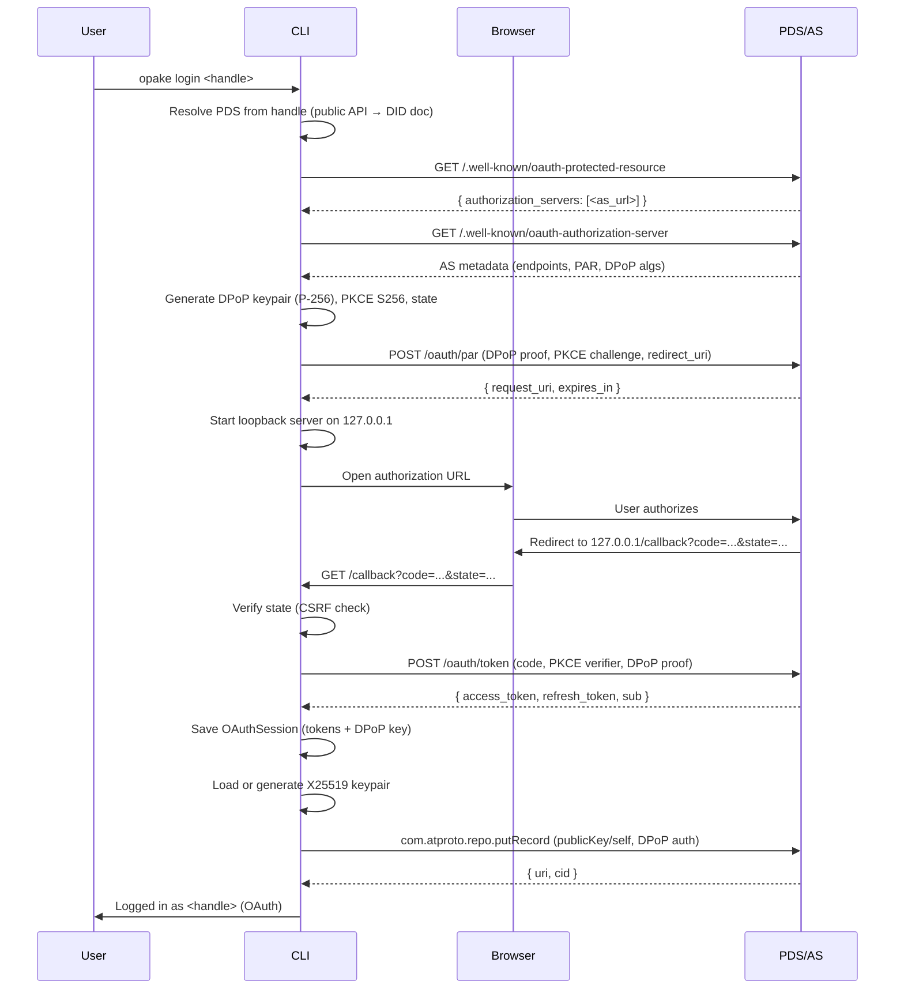
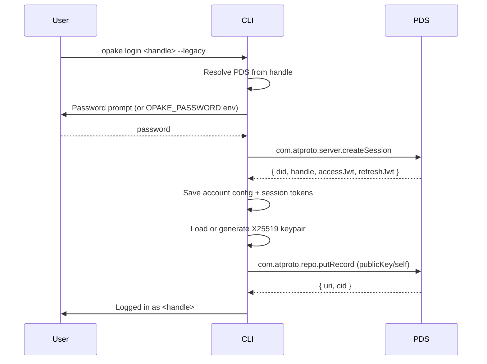
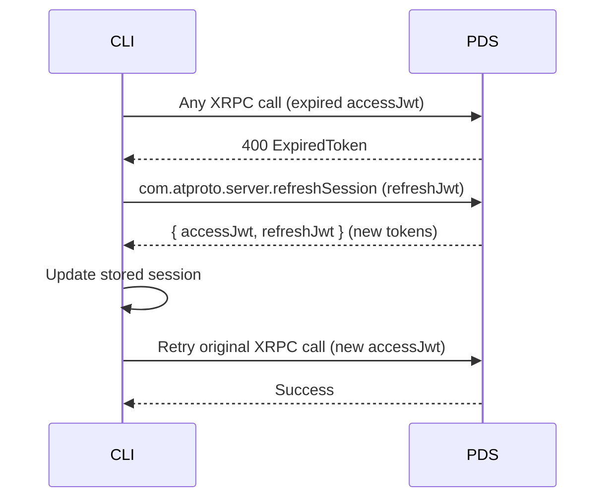
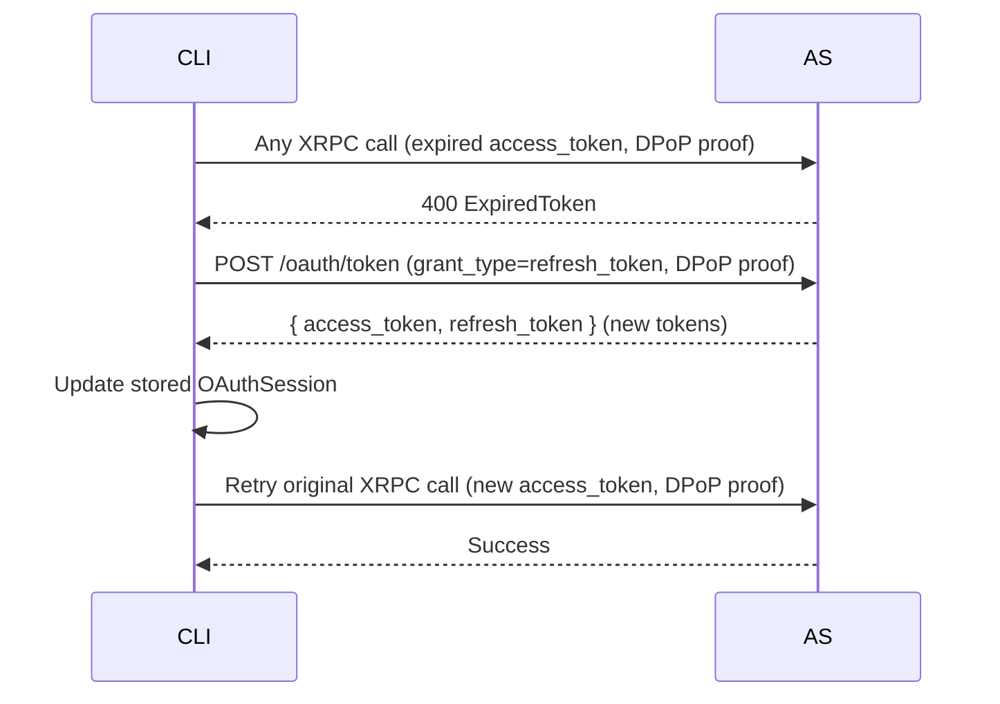

# Authentication

## Login (OAuth)

Default login flow. Uses AT Protocol OAuth 2.0 with DPoP (Demonstrating Proof-of-Possession) and a loopback redirect server for the browser-based authorization.

The loopback server times out after `expires_in` seconds (from the PAR response). If OAuth discovery fails, the CLI falls back to legacy password authentication with a warning. The whole exchange is DPoP-bound with PKCE and CSRF-protected state end to end (`spec:auth-session § OAuth login is DPoP-bound with PKCE and CSRF protection end to end`).

The requested scope is not the catch-all `transition:generic`. Opake asks for exactly the per-collection `repo:at.opake.*` scopes it needs, built from a single collection registry (`OPAKE_COLLECTIONS`) so the grant tracks the record types the app actually writes (`spec:auth-session § The OAuth scope derives from one collection registry`).

On the web, the login flow runs inside WASM and the constructed session — tokens and DPoP key included — never crosses into JS, which cannot zeroize memory. JS reads only an expiry timestamp, never the session itself (`spec:wasm-security-boundary § Login flows construct sessions inside WASM`).

## Login (Legacy)

Password-based authentication via `createSession`. Used when `--legacy` is passed or when the PDS doesn't support OAuth discovery.

The `putRecord` call is idempotent — same key, same record. Safe to call on every login.

## Token Refresh

Transparent to the user. Refresh is proactive: the client checks the access token against an expiry threshold before a call and refreshes ahead of time, with concurrent calls coalesced into a single in-flight refresh (`spec:auth-session § Token refresh is proactive, threshold-gated, and single-flight`). The on-expiry exchange below is the same mechanism reached reactively when a token lapses anyway; the refresh path depends on the session variant.

### Legacy Refresh

### OAuth Refresh

DPoP nonces are captured from every response and included in subsequent proofs. If the server returns a `use_dpop_nonce` error, the client retries once with the fresh nonce.
