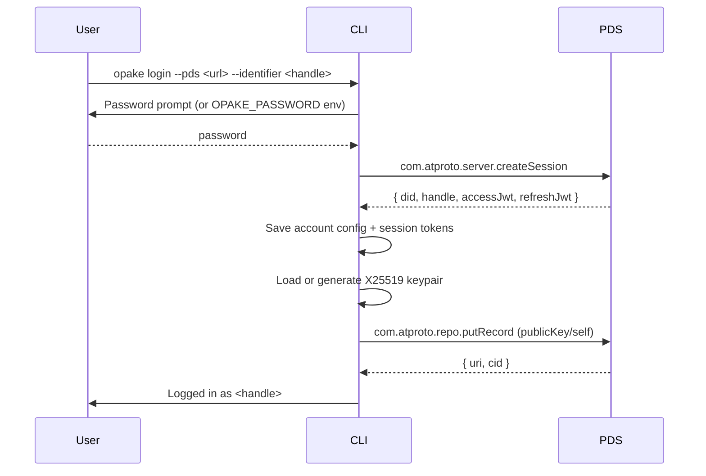
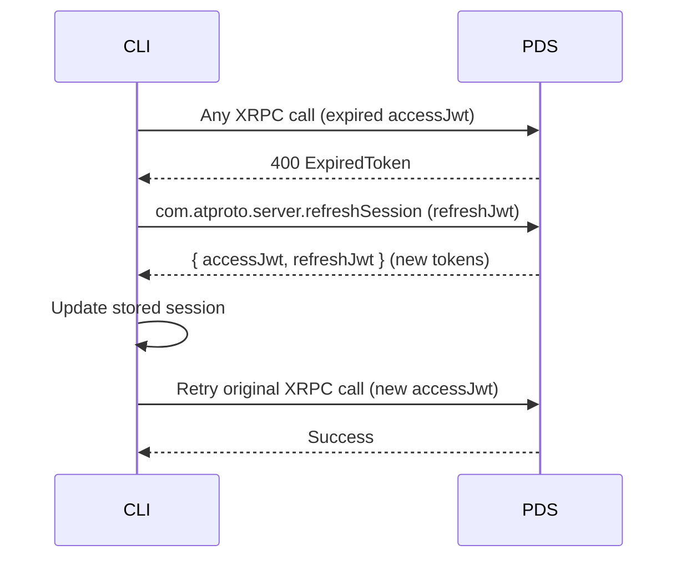

# Authentication

## Login

Authenticates with a PDS, persists session + identity, and publishes the encryption public key as a singleton record.

The `putRecord` call is idempotent — same key, same record. Safe to call on every login.

## Token Refresh

Transparent to the user. The XRPC client detects expired tokens and refreshes automatically.

