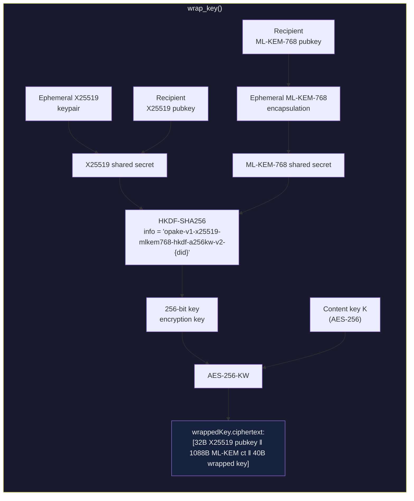
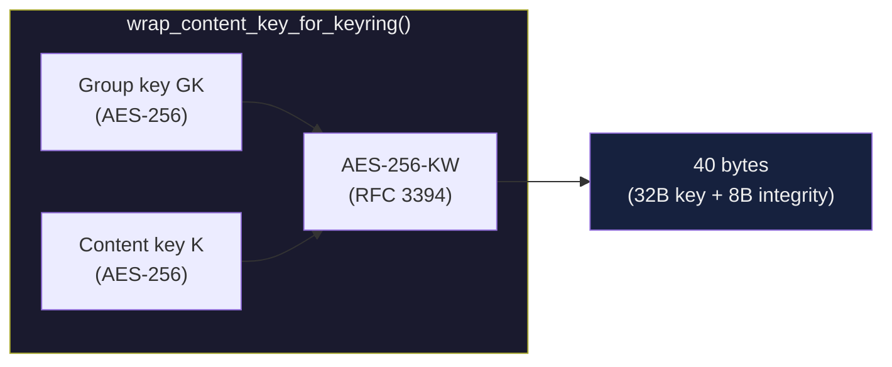
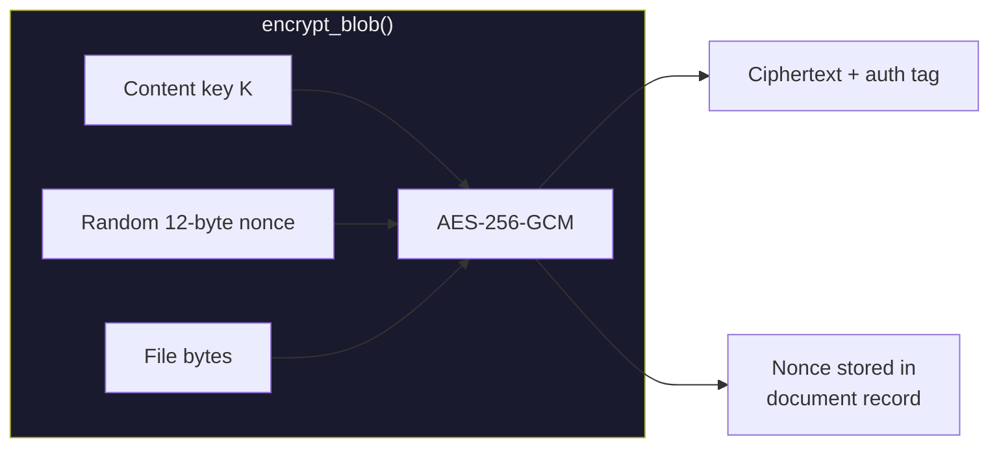

# Encryption Primitives

## Key Wrapping (x25519-mlkem768-hkdf-a256kw-v2)

How a symmetric content key gets wrapped to a recipient's hybrid public key (X25519 + ML-KEM-768). Defends against harvest-now-decrypt-later per BSI TR-02102 / ANSSI guidance. Both KEM outputs are combined via HKDF before use as a KEK.

## Keyring Key Wrapping (AES-256-KW)

How a content key gets wrapped under a keyring's group key. Symmetric wrap — no ECDH, no ephemeral keys.

The group key itself is wrapped to each member's X25519 public key using the asymmetric wrapping scheme above.

## Content Encryption (AES-256-GCM)

