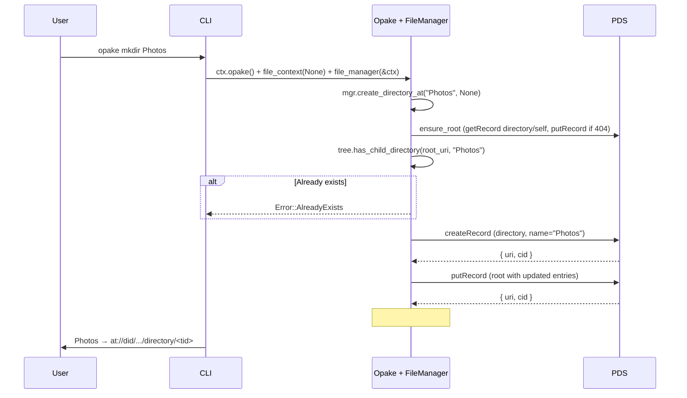
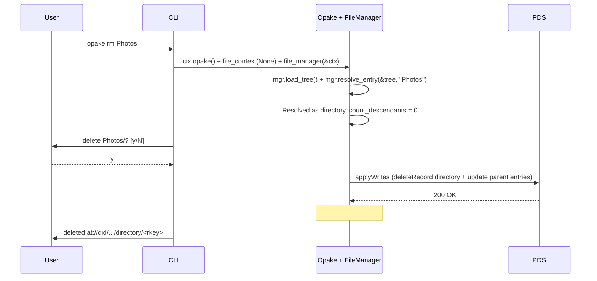
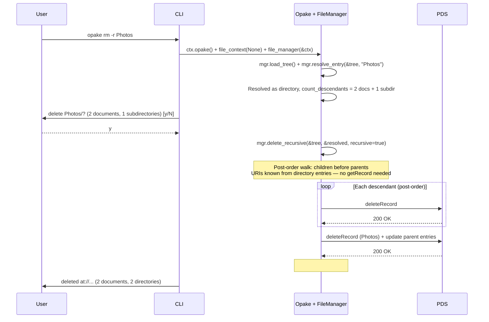
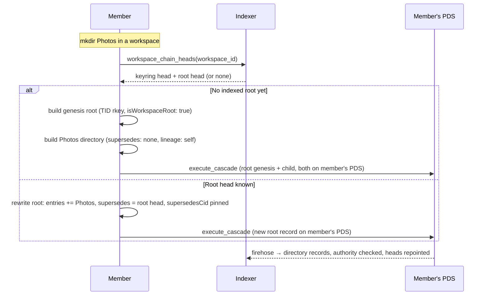

# Directory Operations

## Create Directory

Creates a directory record and registers it as a child of the specified parent (or root). Checks for duplicate names via `tree.has_child_directory`.

Directories are children-on-parent: the parent's `entries` array holds the AT-URIs of its children. The root directory is a singleton at rkey "self". `tree.resolve_directory(path)` resolves directory-only paths without needing a document resolver.

## Delete (Non-Recursive)

Deletes an empty directory. Refuses if the directory has entries.

## Delete (Recursive)

Deletes a directory and all its contents via `mgr.delete_recursive`. Tree-walking delete in post-order (children before parents).

Post-order deletion means leaf documents are removed first, then empty subdirectories, then the target directory itself. The parent's entry list is only updated once (for the target directory -- descendant directories are deleted wholesale without updating their parents' entries, since the parents are also being deleted).

## Path Resolution

`FileManager::resolve_entry(&tree, reference)` resolves user-provided references to AT-URIs. Three input forms are supported:

| Input | Strategy | API cost |
|-------|----------|----------|
| `at://did/.../document/rkey` | Passthrough | 0 calls |
| `beach.jpg` (bare name) | Lazy document resolution in root children | 1 getRecord per child (early exit on match) |
| `Photos` (bare name, directory match) | `tree.resolve_directory` (in-memory) | 0 calls |
| `Photos/beach.jpg` | `tree.resolve_directory("Photos")` + lazy doc search in directory | 0 + N getRecord (early exit) |
| `Photos/Vacation/sunset.jpg` | Directory walk + lazy doc search | 0 + N getRecord (early exit) |

Bare names search only root's direct children (matching filesystem semantics). Use paths for nested items.

The tree is built from a single paginated `listRecords` call (directories only). `tree.resolve_directory(path)` resolves directory-only paths in memory without needing a document resolver. `tree.has_child_directory(parent_uri, name)` checks for duplicate directory names. `tree.is_document_uri(uri)` distinguishes document entries from directory entries.

Document resolution is lazy: `find_entry_in_directory` resolves documents one at a time via `getRecord`, with early exit on match. This avoids loading the entire document collection -- only the children of the relevant directory are fetched, and only until a match is found.

For recursive deletion (`rm -r`), `delete_recursive` determines descendant counts and URIs entirely from directory entry arrays -- document names aren't needed, so no `getRecord` calls are made for counting or collecting.

Future optimization: a local URI to name cache (#155) would eliminate repeated `getRecord` calls for the same directory's children.

---

## Workspace Directories

A cabinet directory is edited in place on its owner's PDS. A workspace directory cannot be — the tree is shared and no single PDS holds it. Instead each workspace directory *path* is a supersede chain: the canonical directory at that path is whichever record has no successor pointing at it, and any member advances the path by writing a new record on **their own** PDS that supersedes the prior head. Workspace directories carry `keyringKeyWrapping` (the metadata content key is wrapped under the group key, not to a single DID), a `workspaceId` back to the genesis keyring, and a `lineage` anchor to the chain's genesis. There is no owner-only write path and no proposal-then-apply step: the indexer validates authority at write time and repoints the head.

Because a listing entry pins the child's `targetCid`, superseding a nested directory changes its URI and CID, which invalidates its parent's entry — so a change never stops at one record. It **cascades**: the edited directory is rewritten, then every ancestor up to the workspace root is rewritten to pin its rewritten child, each new record superseding the prior head at its level (`execute_cascade`, `build_deep_cascade_levels`). All the new records land on the author's PDS.

### Workspace root chain

A workspace has no directory until its first contributor writes one. That first write is a **genesis** root: a TID-rkeyed directory stamped `isWorkspaceRoot: true`, with no `supersedes`. The flag — not a rkey convention — is what marks the root chain; the indexer enforces that only managers may set it, that it never flips across a supersede, and that a workspace has at most one active root chain (`spec:tree-chains § The workspace root is a flag-marked chain, forward-walked from genesis`). Concurrent first writers each stamp the flag; the indexer's `chain_heads` compare-and-set picks one winner and the losers self-heal on retry.

### Authority at write time

The indexer authorizes each directory supersede against the workspace's live keyring head. A manager may add, remove, substitute, or reorder entries freely. An editor's supersede must be **additive**: every entry present in the prior canonical directory is still present, unless it has been advanced — replaced by an entry whose target supersedes the dropped one (a document edit or a rename). A viewer may not author directory records at all. This is the wiki-authority contract (`spec:tree-chains § Editor supersedes are additive; managers are unrestricted`); clients re-check it before writing for a fast, clear error, but the indexer's check is authoritative.

Reads federate. The root's `entries` hold AT-URIs that may resolve to records on any member's PDS; a reader (the indexer, or a client doing public XRPC) walks the listing and fetches each target from whichever PDS hosts it. Storage and egress land on the contributor who wrote each record, not on any central owner.
