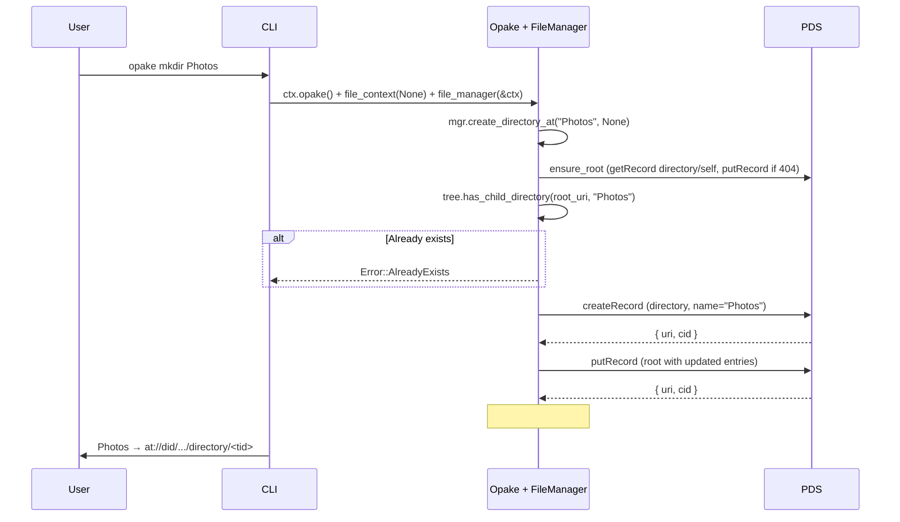
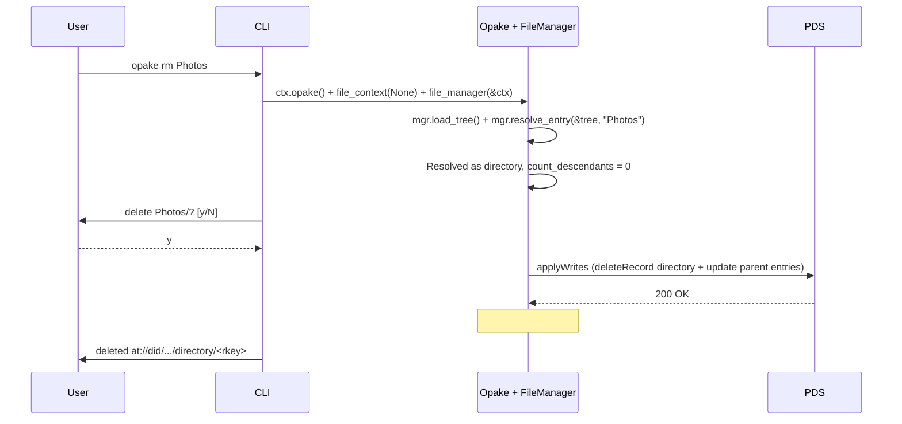
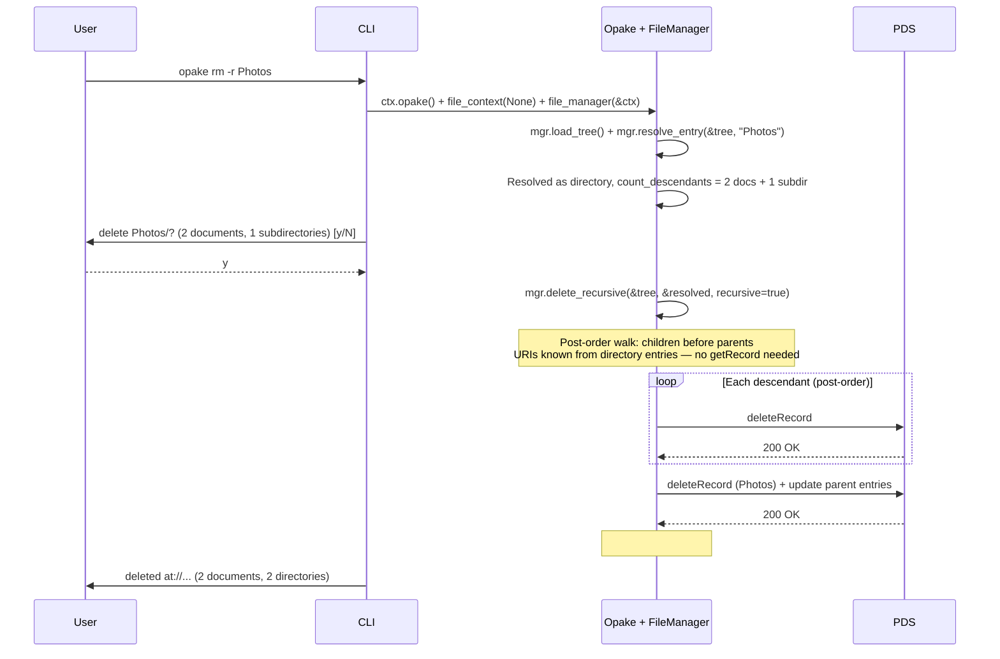
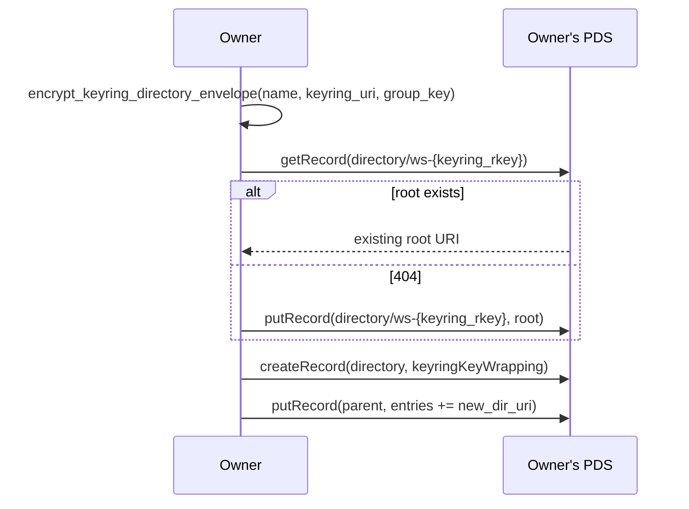
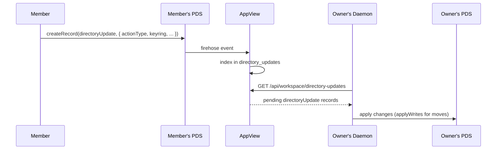

# Directory Operations

## Create Directory

Creates a directory record and registers it as a child of the specified parent (or root). Checks for duplicate names via `tree.has_child_directory`.

Directories are children-on-parent: the parent's `entries` array holds the AT-URIs of its children. The root directory is a singleton at rkey "self". `tree.resolve_directory(path)` resolves directory-only paths without needing a document resolver.

## Delete (Non-Recursive)

Deletes an empty directory. Refuses if the directory has entries.

## Delete (Recursive)

Deletes a directory and all its contents via `mgr.delete_recursive`. Tree-walking delete in post-order (children before parents).

Post-order deletion means leaf documents are removed first, then empty subdirectories, then the target directory itself. The parent's entry list is only updated once (for the target directory -- descendant directories are deleted wholesale without updating their parents' entries, since the parents are also being deleted).

## Path Resolution

`FileManager::resolve_entry(&tree, reference)` resolves user-provided references to AT-URIs. Three input forms are supported:

| Input | Strategy | API cost |
|-------|----------|----------|
| `at://did/.../document/rkey` | Passthrough | 0 calls |
| `beach.jpg` (bare name) | Lazy document resolution in root children | 1 getRecord per child (early exit on match) |
| `Photos` (bare name, directory match) | `tree.resolve_directory` (in-memory) | 0 calls |
| `Photos/beach.jpg` | `tree.resolve_directory("Photos")` + lazy doc search in directory | 0 + N getRecord (early exit) |
| `Photos/Vacation/sunset.jpg` | Directory walk + lazy doc search | 0 + N getRecord (early exit) |

Bare names search only root's direct children (matching filesystem semantics). Use paths for nested items.

The tree is built from a single paginated `listRecords` call (directories only). `tree.resolve_directory(path)` resolves directory-only paths in memory without needing a document resolver. `tree.has_child_directory(parent_uri, name)` checks for duplicate directory names. `tree.is_document_uri(uri)` distinguishes document entries from directory entries.

Document resolution is lazy: `find_entry_in_directory` resolves documents one at a time via `getRecord`, with early exit on match. This avoids loading the entire document collection -- only the children of the relevant directory are fetched, and only until a match is found.

For recursive deletion (`rm -r`), `delete_recursive` determines descendant counts and URIs entirely from directory entry arrays -- document names aren't needed, so no `getRecord` calls are made for counting or collecting.

Future optimization: a local URI to name cache (#155) would eliminate repeated `getRecord` calls for the same directory's children.

---

## Workspace Directories

Workspace directories use `keyringKeyWrapping` instead of `directKeyWrapping`. They live on the workspace owner's PDS. All members can read them via unauthenticated public fetches.

### Create Workspace Directory (Owner)

### Propose Directory Change (Non-Owner Member)

### Workspace Root Convention

Each workspace has its own root directory at a deterministic rkey: `ws-{keyring_rkey}`. This allows idempotent `putRecord` creation without discovery. The workspace root is separate from the owner's personal root (`directory/self`).
