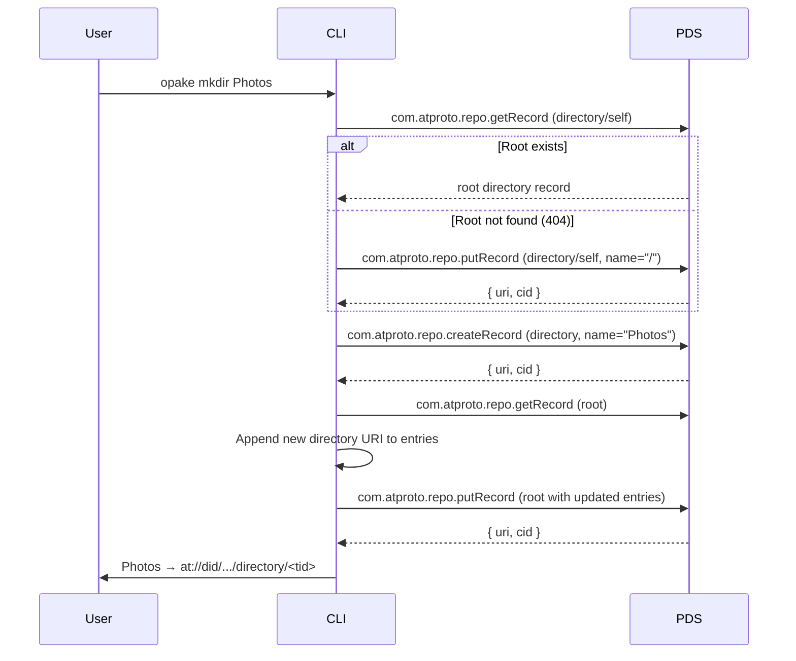
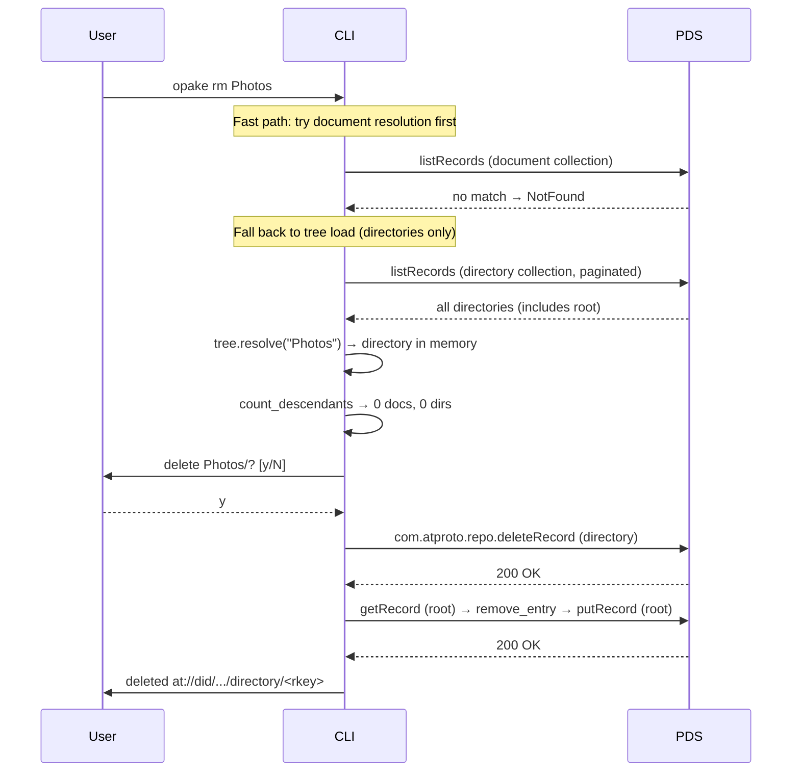
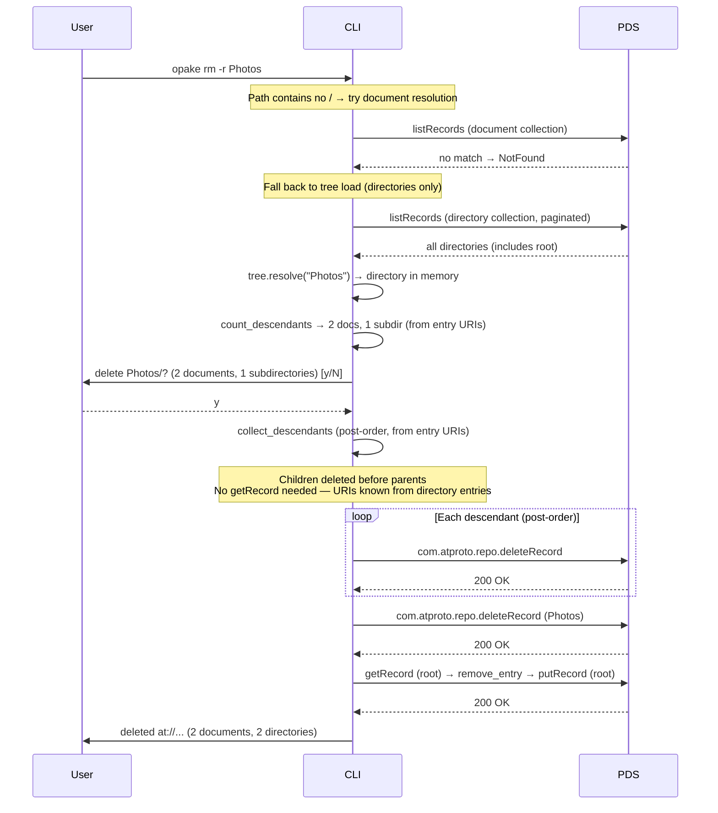

# Directory Operations

## Create Directory

Creates a directory record and registers it as a child of the root.

Directories are children-on-parent: the parent's `entries` array holds the AT-URIs of its children. The root directory is a singleton at rkey "self".

## Delete (Non-Recursive)

Deletes an empty directory. Refuses if the directory has entries.

## Delete (Recursive)

Deletes a directory and all its contents in post-order (children before parents).

Post-order deletion means leaf documents are removed first, then empty subdirectories, then the target directory itself. The parent's entry list is only updated once (for the target directory — descendant directories are deleted wholesale without updating their parents' entries, since the parents are also being deleted).

## Path Resolution

The `DirectoryTree` resolves user-provided references to AT-URIs. Three input forms are supported:

| Input | Strategy | API cost |
|-------|----------|----------|
| `at://did/.../document/rkey` | Passthrough | 0 calls |
| `beach.jpg` (bare name) | `documents::resolve_uri` (fast path) | 1 paginated call |
| `Photos` (bare name, no document match) | Tree load + in-memory search | 1 paginated + 0 calls |
| `Photos/beach.jpg` | Tree load + walk + getRecord per doc child | 1 paginated + N getRecord |
| `Photos/Vacation/sunset.jpg` | Tree load + walk + getRecord per doc child | 1 paginated + N getRecord |

Bare names search only root's direct children (matching filesystem semantics). Use paths for nested items.

The tree is built from a single paginated `listRecords` call (directories only). Directory segments are walked in memory. When the final segment targets a document, each document child URI in the parent directory is fetched individually via `getRecord` to match by name. This avoids loading the entire document collection — only the children of the relevant directory are fetched.

For recursive deletion (`rm -r`), descendant counts and URIs are determined entirely from directory entry arrays — document names aren't needed, so no `getRecord` calls are made for counting or collecting.

Future optimization: a local URI → name cache (#155) would eliminate repeated `getRecord` calls for the same directory's children.
