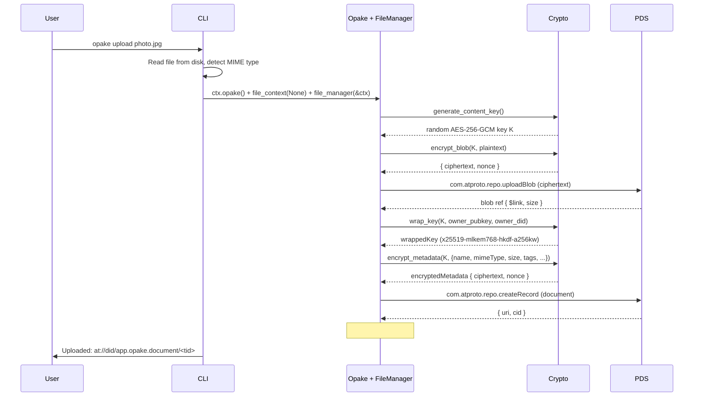
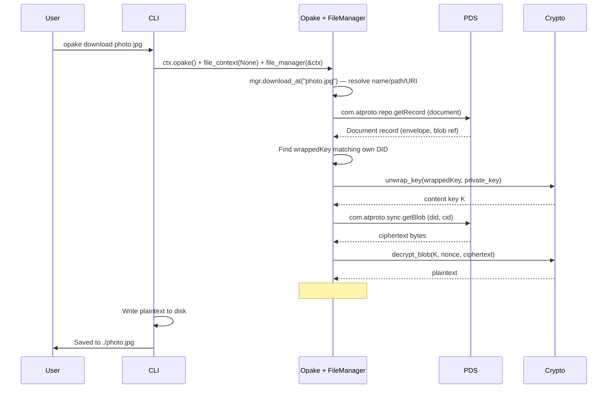
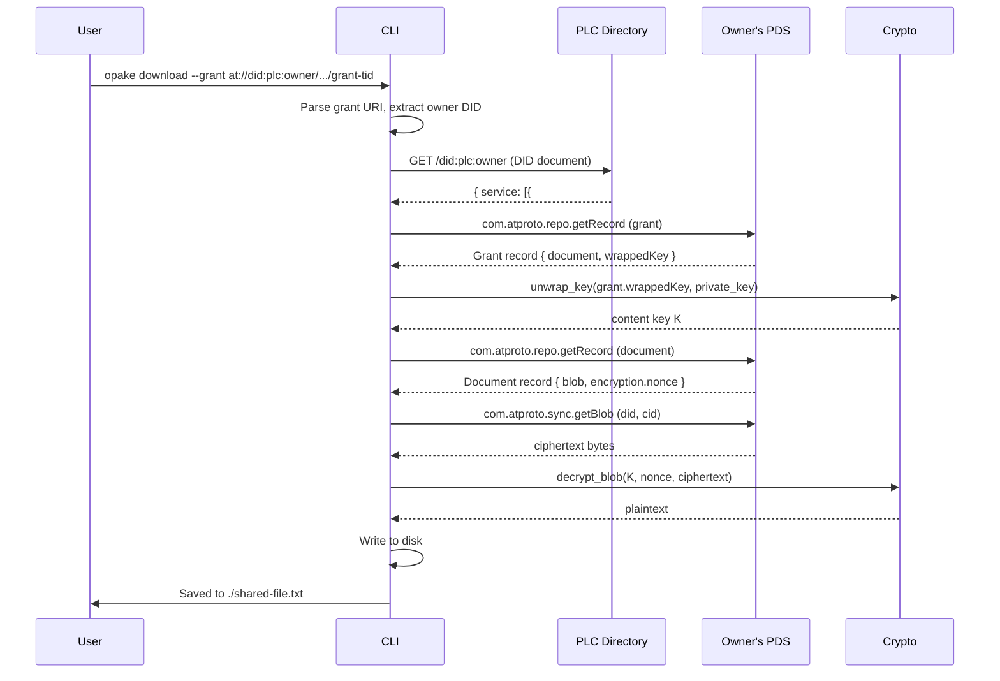
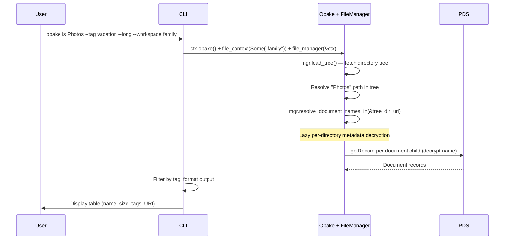
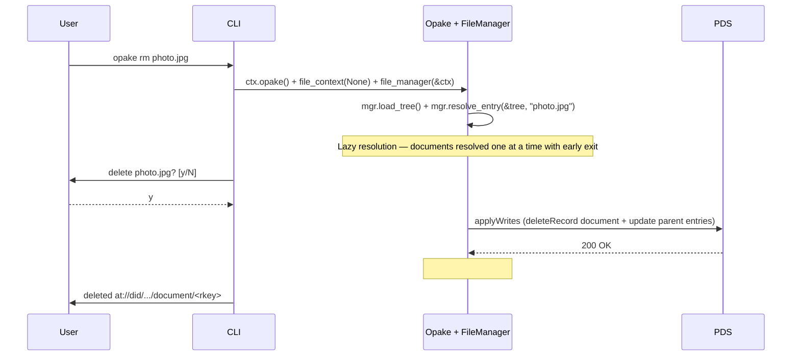

# Document Operations

## Upload

Encrypts a file and uploads it as an opaque blob with a metadata record.

## Download (Own Files)

Fetches a document you own, unwraps the content key, and decrypts.

## Download (Shared Files — Cross-PDS)

Downloads a file shared with you by another user. Requires the grant URI (auto-discovery via `inbox` is not yet implemented).

Data never leaves the owner's PDS. The recipient fetches everything directly from the source.

## List

Directory-aware listing with optional workspace, path, tag filter, and long format.

## Delete

Deletes a document record. The blob becomes orphaned and is eventually garbage-collected by the PDS. If the document is tracked in a directory, the parent's entry list is updated.

For recursive directory deletion, see [directories.md](directories.md).

For recursive deletion (`rm -r`), `delete_recursive` walks the directory tree in post-order (children before parents), deleting all descendants before the target directory itself. See [directories.md](directories.md#delete-recursive) for details.
