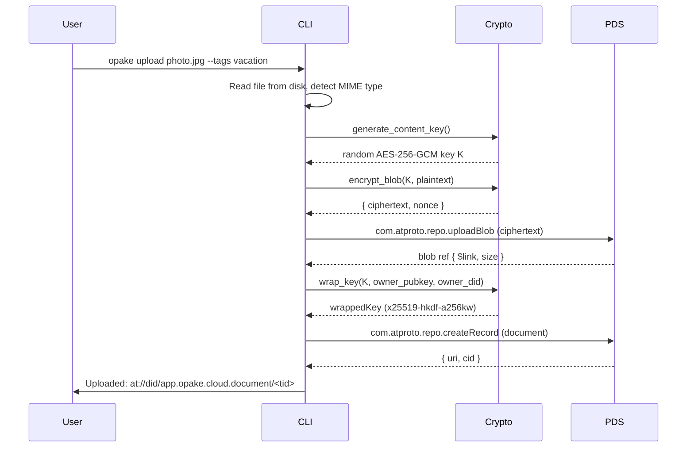
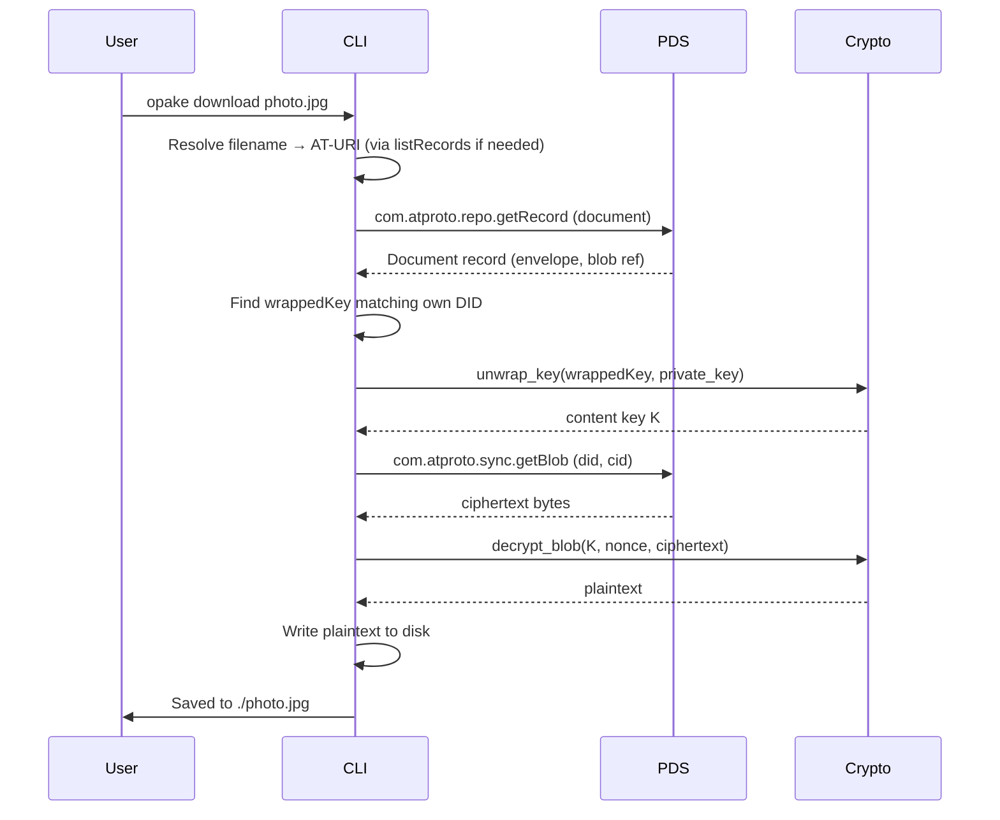
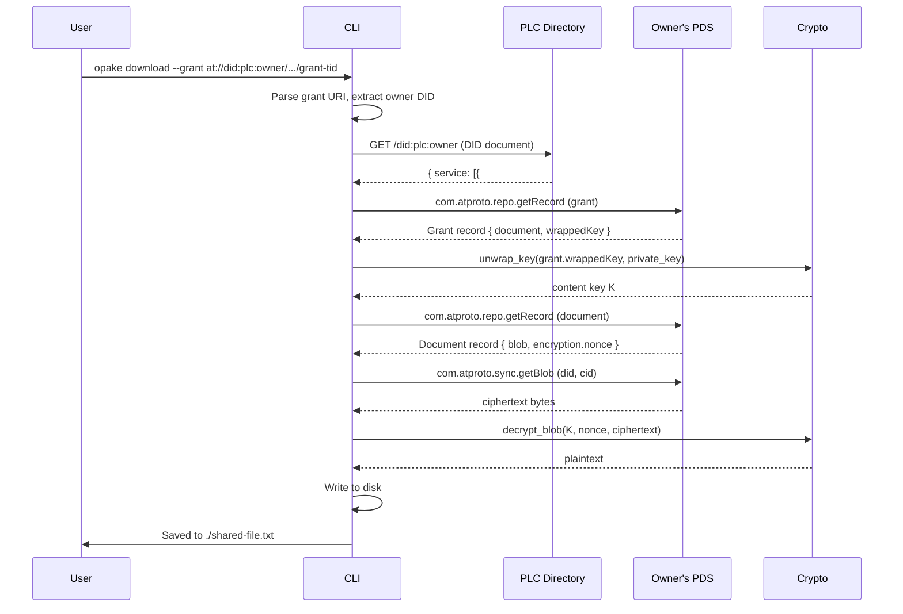
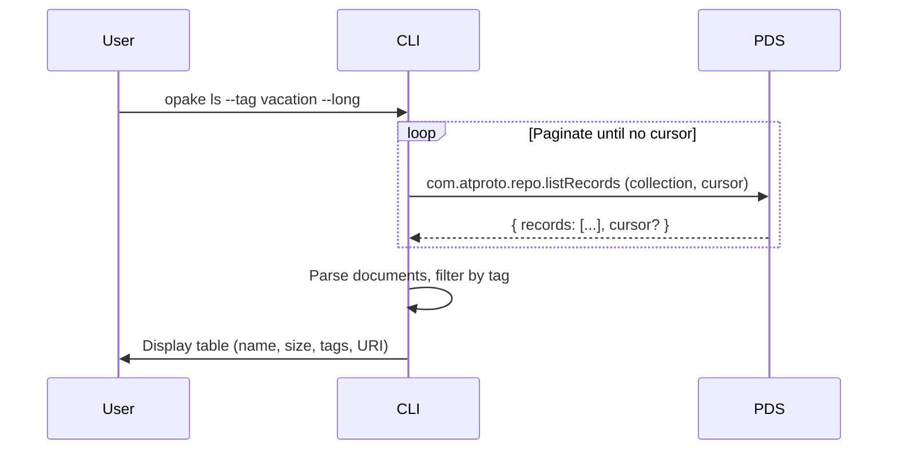
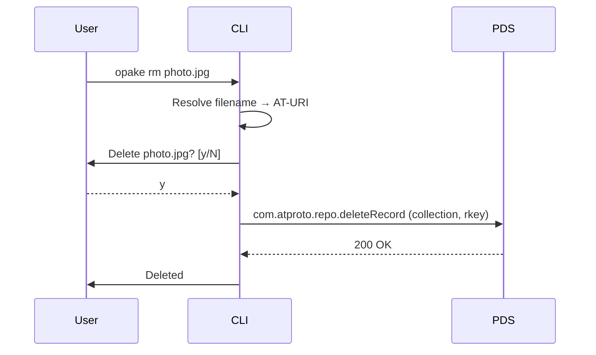

# Document Operations

## Upload

Encrypts a file and uploads it as an opaque blob with a metadata record.

## Download (Own Files)

Fetches a document you own, unwraps the content key, and decrypts.

## Download (Shared Files — Cross-PDS)

Downloads a file shared with you by another user. Requires the grant URI (auto-discovery via `inbox` is not yet implemented).

Data never leaves the owner's PDS. The recipient fetches everything directly from the source.

## List

Lists document records on your PDS with optional tag filtering.

## Delete

Deletes a document record. The blob becomes orphaned and is eventually garbage-collected by the PDS.

