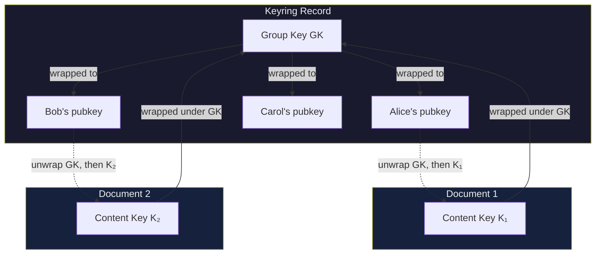
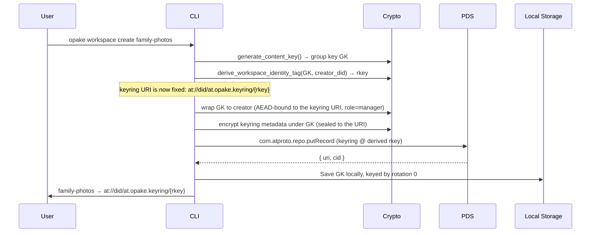
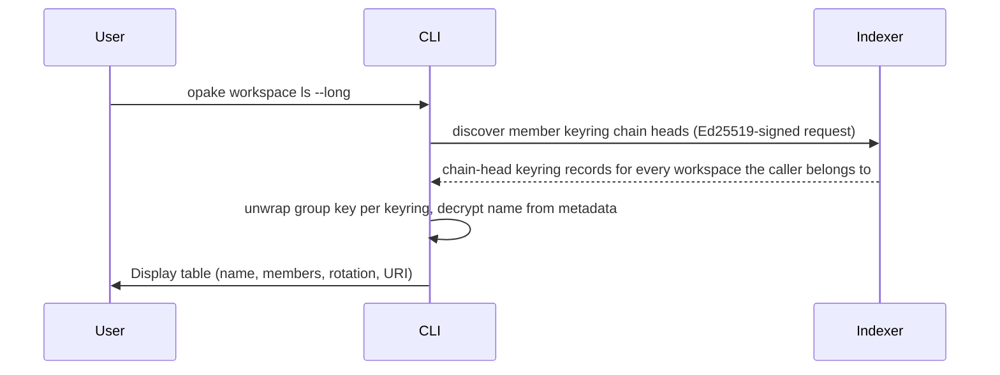
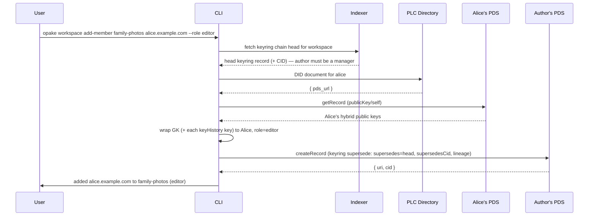
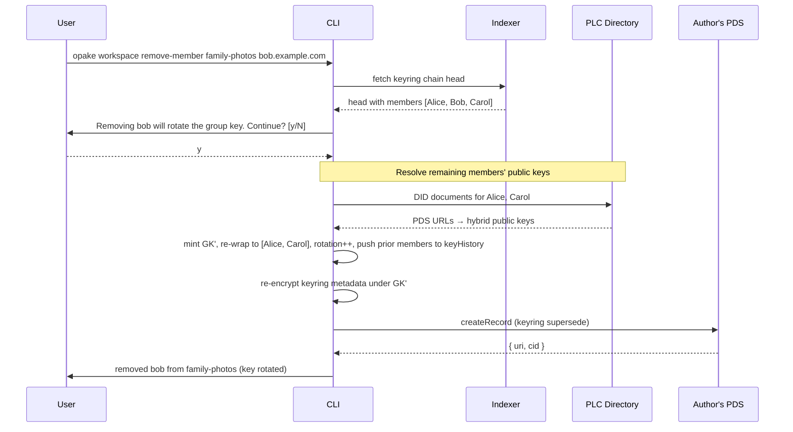
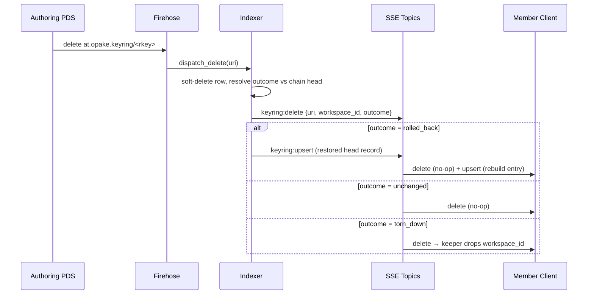
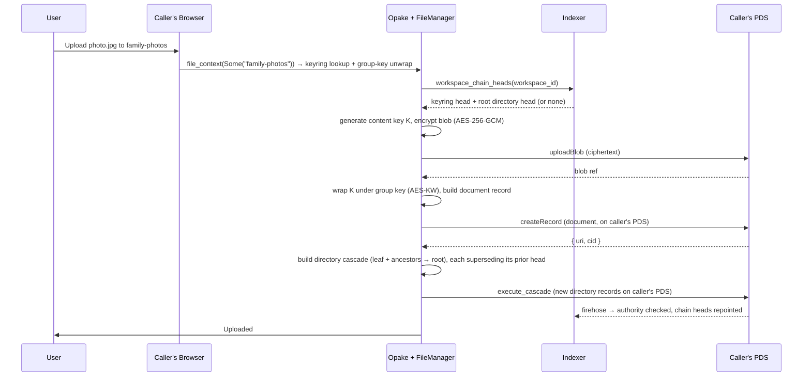
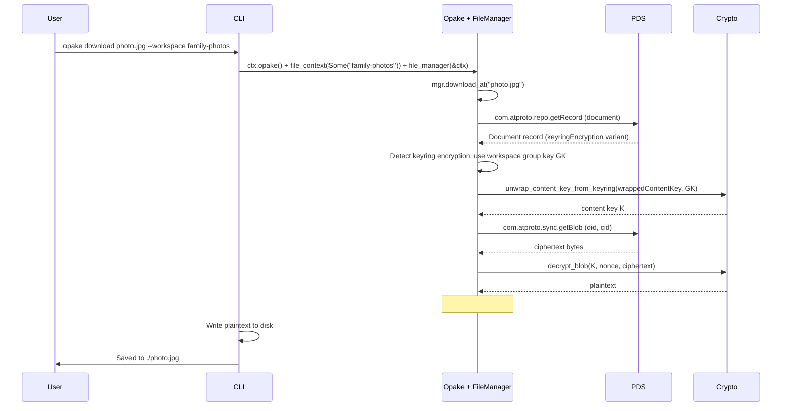

# Workspaces

A **workspace** is the domain concept: a named, shared space with a member list, a group key, and a federated directory tree. Its wire format is the `at.opake.keyring` record — a keyring holds the group key wrapped to each member and the role each member holds. The CLI speaks `opake workspace`; the lexicon stays `at.opake.keyring`.

A workspace has no owner role. Whoever authored the genesis keyring is a manager like any other, and every capability attaches to a role, never to a DID's history (`spec:workspace-membership § Three roles, no owner`).

## Keyring Model

Two-layer key wrapping for group access. Per-document content keys are wrapped under the group key (AES-KW), and the group key is wrapped to each member's hybrid public-key bundle (X25519 + ML-KEM-768).

## Create Workspace

The genesis keyring's identity is derived, not assigned. The rkey is a tag computed from the freshly-minted group key and the creator's DID (HKDF → Ed25519 public key → `base32(SHA-256[..16])`), so the record's full AT-URI is known *before* the group key is wrapped. That URI is the workspace identity for its entire lifetime, and it is bound into the wrap's AEAD context and the metadata seal — the record is `putRecord`d at that exact rkey rather than letting the PDS pick one (`spec:workspace-identity § Genesis URI is the workspace identity`).

The group key never appears in plaintext on the PDS — only the wrapped copies live in the record. Every adoption path (a member syncing, a device pairing) re-derives the tag from the group key it unwrapped and checks it against the URI, so a keyring that lies about its identity is caught (`spec:workspace-identity § Identity adoption verifies by derivation`). The keyring carries no `owner` field: authority flows from the DID in the genesis URI and from the member list, not from a stored owner.

## List Workspaces

A workspace lives across every member's PDS, so `listRecords` on one repo would only surface the keyrings that repo happens to host. The membership truth is the indexer's: it consumes every PDS's firehose and knows every keyring chain head the caller is a member of, owned or joined. `workspace ls` therefore asks the indexer, not the local repo (`discover_member_workspaces`).

A freshly created workspace has a short visibility gap: the record exists on the creator's PDS immediately, but `ls` only surfaces it once Jetstream delivers the commit to the indexer's firehose consumer (`spec:indexer-consistency § Acceptance does not imply visibility`).

## Membership is a keyring supersede

Membership is not edited in place. Every change — add, remove, leave, re-role — is a new keyring record that **supersedes** the current chain head, written on the *author's* PDS. The head may sit on another member's PDS; the author fetches it (indexer-reported), builds the new member list, and writes a record carrying `supersedes` = the prior head URI, `supersedesCid` = its CID, and `lineage` = the genesis URI. The indexer validates the author's authority against the prior head and repoints the chain.

The authority rule: a supersede is valid iff the author is currently a manager, *or* the author is a non-manager removing exactly themselves — the new list equals the head's minus the author, with everyone else's role and wrap carried verbatim. Anything else from a non-manager is rejected (`spec:workspace-membership § Keyring supersede authority is manager-only, except pure self-removal`). The client re-checks this before writing for a fast error; the indexer's check is authoritative.

### Add Member

A manager wraps the current group key to the recipient's published hybrid keys, appends the wrap with the assigned role, and — for each retained `keyHistory` rotation the manager can still unwrap — wraps that historical key to the joiner too, so a post-rotation joiner reads pre-rotation documents (`spec:key-rotation § New members can read the full history they are admitted to`). Adding a DID already in the list is rejected before any write. Direct manager add is the only admission channel: no invitation or request-to-join exists.

### Remove Member

Removal rotates. The authoring manager mints a new group key, re-wraps it for every *remaining* member, bumps `rotation`, and pushes the prior rotation's members into `keyHistory` before replacing them. The removed member holds no wrap for the new key — that is the forward-secrecy contract (`spec:workspace-membership § Removal rotates the group key; leave does not`). Documents written under earlier rotations stay readable to remaining members via `keyHistory`; the removed member keeps whatever they already had (no historical revocation).

### Leave and role change

**Leave** is a self-removal supersede that does *not* rotate: the leaver authors it, so any key they minted is a key they already know — rotating buys no forward secrecy. The record carries the prior rotation, the prior key history, and every other member's wrap and role unchanged, dropping only the author. Two guards apply: the last member cannot leave (an empty workspace is destruction, which is unsupported), and the only manager cannot leave while others remain (a manager-less workspace can never mutate membership again) — they must promote someone first (`spec:workspace-membership § Leave guards — no orphaned workspaces`).

**Role change** is a manager-authored supersede carrying the prior member list with only the targeted member's role changed; untargeted members' roles carry forward unchanged (`spec:workspace-membership § Role changes are manager-authored supersedes`).

## Keyring Record Deletion

Anyone can delete keyring records from their own PDS — the chain is distributed (genesis on the creator's PDS, each supersede on the authoring manager's), so a delete tombstone is ordinary record cleanup, not a workspace operation. What the delete *means* depends on where the record sat in the supersede chain, and only the indexer can resolve that. It broadcasts the resolution as an `outcome` on the `keyring:delete` SSE payload; clients act on the outcome and never compare the deleted URI against tracked state.

| Deleted record | Outcome | Indexer | Clients |
|---|---|---|---|
| Genesis or superseded intermediate | `unchanged` | Chain head untouched | No-op — the genesis URI identifies the workspace, not a live record |
| Chain head, live record remains | `rolled_back` | Head rolls back to the **newest live record**; restored record re-broadcast as `keyring:upsert` | Delete is a no-op; the follow-up upsert rebuilds the entry (member set, rotation, metadata) |
| Sole live record | `torn_down` | `chain_heads` rows for the workspace removed | Keeper drops the entry keyed by `workspace_id` |

The rollback target is the newest live record for the workspace rather than the tombstone's `supersedes` link: soft-deleted rows are purged after 7 days, so the direct-predecessor link can dangle, and following it would misclassify a living chain as torn down. `torn_down` is exactly "no live record remains" — at that point no wrapped group keys exist anywhere and the workspace is materially dead. A payload without a recognizable outcome (older indexer) deserializes as `unchanged`, so a version-skewed client can go stale but never wrongly drops a workspace.

Note that a head delete *undoes* whatever that head changed: deleting the supersede that removed Bob reinstates Bob's membership, because the restored record still carries his wrapped key. This is inherent to chain rollback, not special-cased — the re-broadcast upsert carries the restored member set and every client rebuilds from it.

See the keyring-tombstones spec (`openspec/specs/keyring-tombstones/spec.md`) for the normative contract.

## Upload to a Workspace

Every workspace upload is the same shape regardless of the caller's role: the document record lands on the **caller's own** PDS, then a directory supersede cascade registers it in the tree. There is no owner-only path and no proposal-then-apply step. The blob is encrypted under a fresh per-document content key (AES-256-GCM); that content key is wrapped under the workspace group key (AES-KW). The caller then advances the directory chain — a genesis root if the workspace has none yet, a single-level root supersede for a root-level upload, or a deep cascade root → target subdirectory — with the new records written on the caller's PDS. The indexer authorizes the supersede (additive for editors, unrestricted for managers) and repoints the heads.

The directory listings hold AT-URIs that may resolve to records on any member's PDS. Reads federate: the indexer (or a client doing public XRPC) walks `entries` and fetches each document from whichever PDS hosts it. Storage and egress land on the contributor that wrote each file, not on any central owner. See [directories.md](directories.md#workspace-directories) for the cascade mechanics.

## Download Workspace Document

Automatically detected -- the FileManager peeks at the document's encryption type and uses the workspace's group key.

