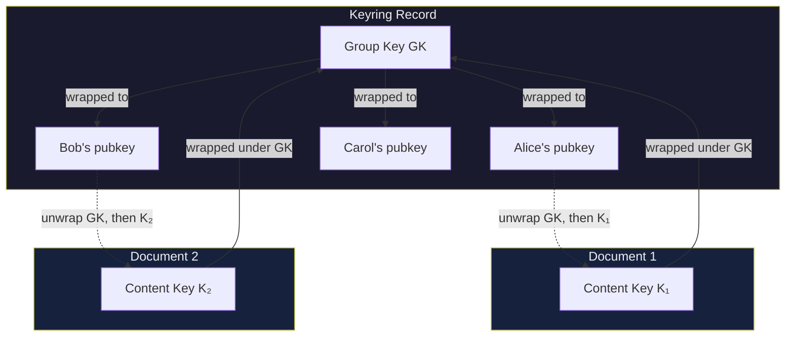
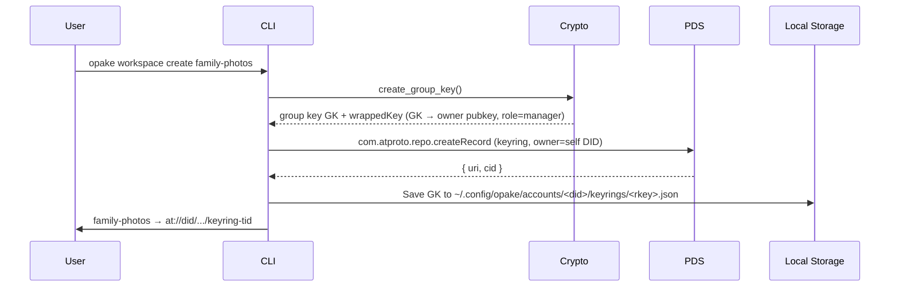
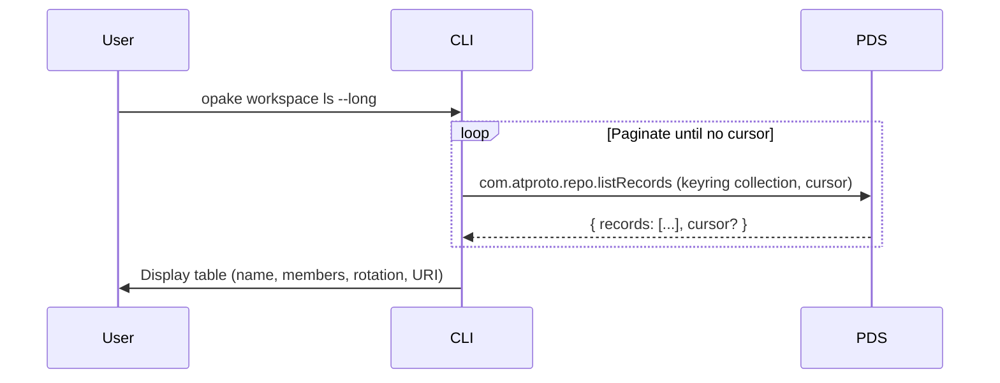
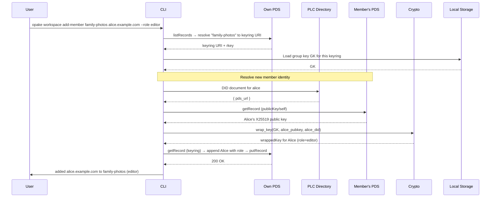
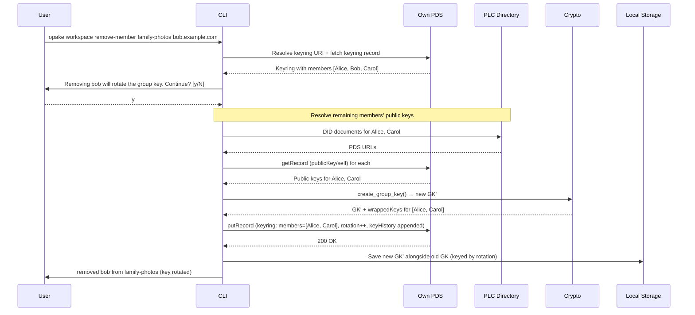
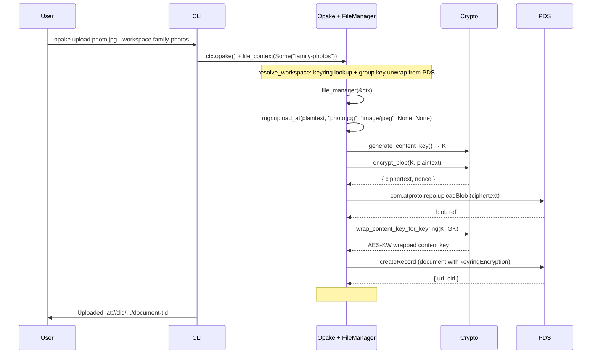
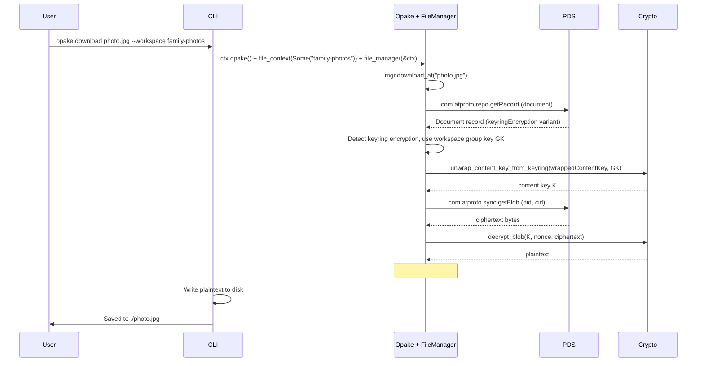

# Keyrings

## Keyring Model

Two-layer key wrapping for group access. Per-document content keys are wrapped under the group key (AES-KW), and the group key is wrapped to each member's X25519 public key.

## Create Keyring

Generates a group key, wraps it to the owner (with `role: manager`), creates the keyring record with the `owner` field set to the creator's DID, and stores the group key locally.

The group key is never stored in plaintext on the PDS — only the wrapped copies live in the keyring record. The `owner` field identifies the canonical keyring owner for AppView authorization.

## List Keyrings

## Add Member

Resolves the new member's identity, wraps the group key to their public key with the specified role, and appends them to the keyring record.

## Remove Member

Removes the member, generates a new group key, re-wraps to all remaining members, and increments the rotation counter.

Before replacing the group key, the old rotation's remaining member entries are archived into the keyring's `keyHistory` array. This lets remaining members still decrypt documents uploaded under previous rotations — even on a new device, the old wrapped group keys are preserved in the record.

Existing documents encrypted under the old group key stay as-is. New uploads use the new group key. Removed members' wrapped keys are excluded from history, so they cannot recover old group keys from the record.

## Upload with Workspace

Encrypts a file and wraps the content key under the workspace's group key instead of individual public keys.

The document record references the keyring URI and stores `wrappedContentKey` (content key wrapped under GK) instead of per-DID wrapped keys.

## Download Workspace Document

Automatically detected -- the FileManager peeks at the document's encryption type and uses the workspace's group key.

