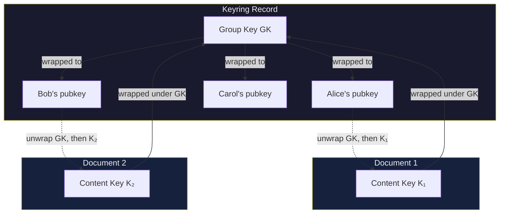
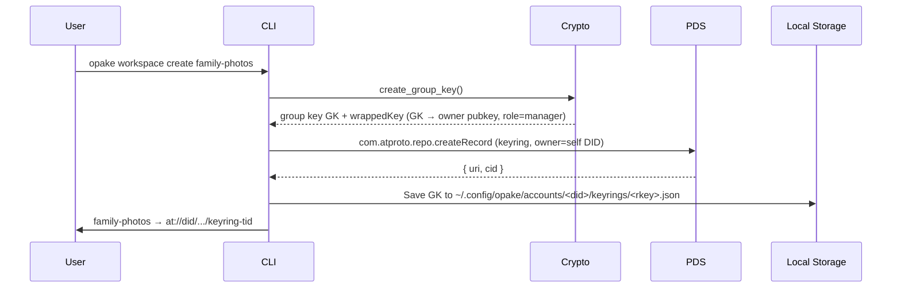
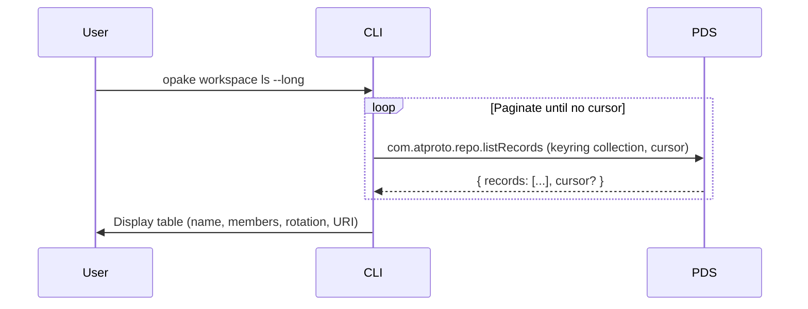
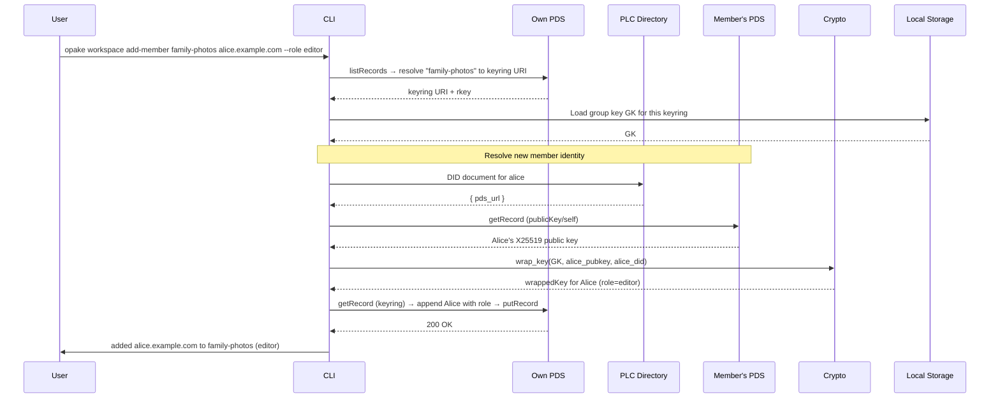
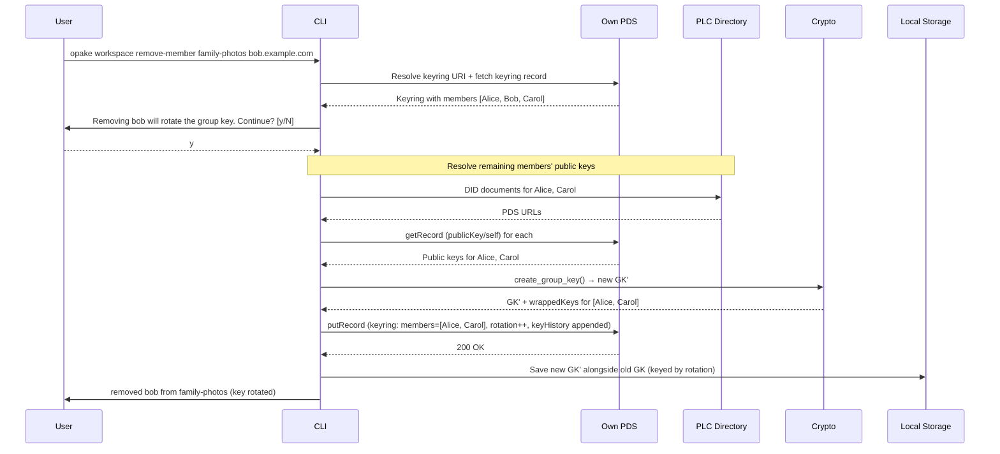
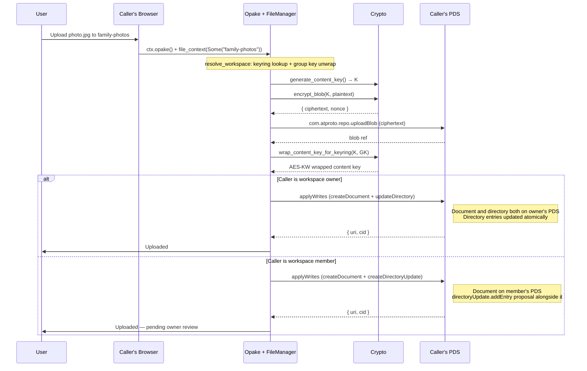
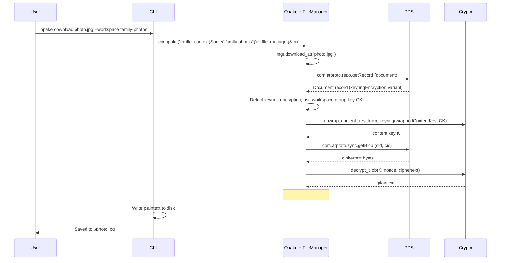

# Keyrings

## Keyring Model

Two-layer key wrapping for group access. Per-document content keys are wrapped under the group key (AES-KW), and the group key is wrapped to each member's X25519 public key.

## Create Keyring

Generates a group key, wraps it to the owner (with `role: manager`), creates the keyring record with the `owner` field set to the creator's DID, and stores the group key locally.

The group key is never stored in plaintext on the PDS — only the wrapped copies live in the keyring record. The `owner` field identifies the canonical keyring owner for Indexer authorization.

## List Keyrings

## Add Member

Resolves the new member's identity, wraps the group key to their public key with the specified role, and appends them to the keyring record.

## Remove Member

Removes the member, generates a new group key, re-wraps to all remaining members, and increments the rotation counter.

Before replacing the group key, the old rotation's remaining member entries are archived into the keyring's `keyHistory` array. This lets remaining members still decrypt documents uploaded under previous rotations — even on a new device, the old wrapped group keys are preserved in the record.

Existing documents encrypted under the old group key stay as-is. New uploads use the new group key. Removed members' wrapped keys are excluded from history, so they cannot recover old group keys from the record.

## Upload with Workspace

Workspace uploads split by caller role, but both write the canonical `app.opake.document` record to the **caller's** PDS — federated, atproto-shaped. The keyring (which holds the group key wrapped to each member) and the directory record (which holds the entry list) stay on the workspace owner's PDS.

- **Owner uploads** are atomic on the owner's PDS: blob + document + directory entry update in a single `applyWrites`.
- **Member uploads** are atomic on the member's PDS: blob + document + a `directoryUpdate.addEntry` proposal in a single `applyWrites`. The owner's daemon applies the proposal to register the entry in the workspace directory.

The encryption surface is identical in both cases: a per-document content key, AES-256-GCM blob, content key wrapped under the workspace group key (AES-KW). The difference is only the second write op (directory entry vs. directoryUpdate proposal).

The directory entry list on the owner's PDS holds at-URIs that may resolve to records on any member's PDS. Reads federate: the indexer (or a client doing public XRPC) walks `entries` and fetches each document from whichever PDS hosts it. Storage and egress costs land on the contributor that wrote the file, not the workspace owner.

After the owner's daemon applies the `directoryUpdate.addEntry` proposal, the directory's `modifiedAt` advances and the editor's cleanup module deletes the proposal record (see [revisions.md](revisions.md#editor-side-cleanup)).

## Download Workspace Document

Automatically detected -- the FileManager peeks at the document's encryption type and uses the workspace's group key.

