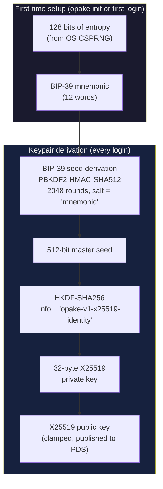
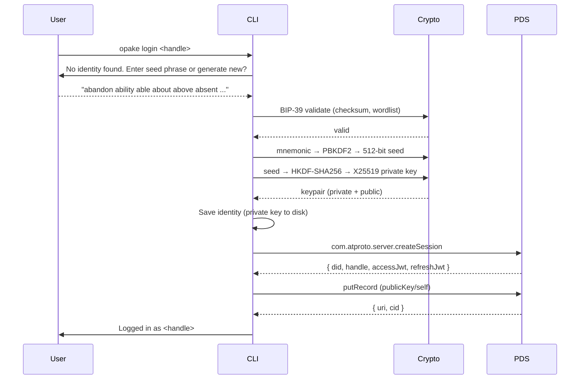
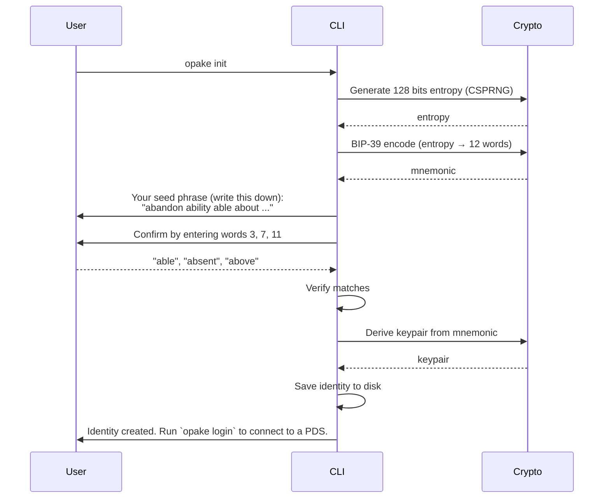
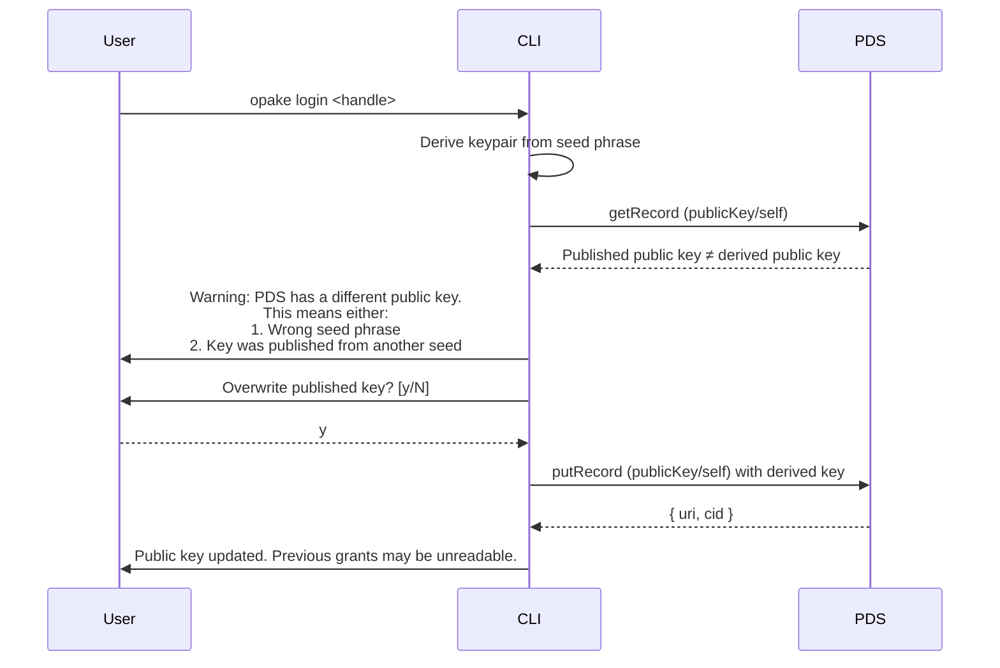

# Multi-Device Identity (Planned)

Deterministic keypair derivation from a BIP-39 mnemonic. Same seed on any device produces the same X25519 keypair — no key sync protocol needed. Replaces the current plaintext keypair file at `~/.config/opake/accounts/<did>/identity.json`.

## Keypair Derivation

The mnemonic is the root secret — everything else is derived. Losing it means losing access to all encrypted data. The HKDF info string includes the schema version for domain separation, same convention as key wrapping.

## First Login (New Device)

If the published public key doesn't match the derived one, the CLI warns — either a wrong seed phrase or a key was published from a different seed. The user decides whether to overwrite.

## Generate New Identity

The confirmation step guards against clipboard-and-forget. The seed phrase is shown exactly once — the CLI never stores or displays it again.

## Key Mismatch Recovery

Overwriting the published key breaks any existing grants or keyring memberships that wrapped keys to the old public key. The CLI should be loud about this.
