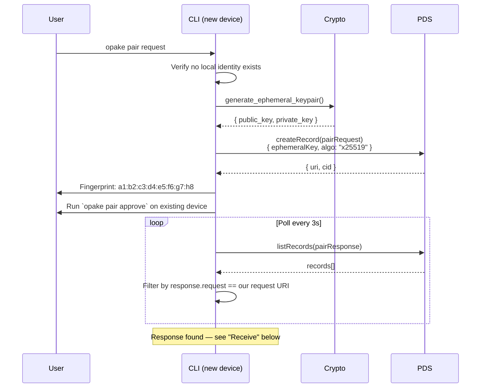
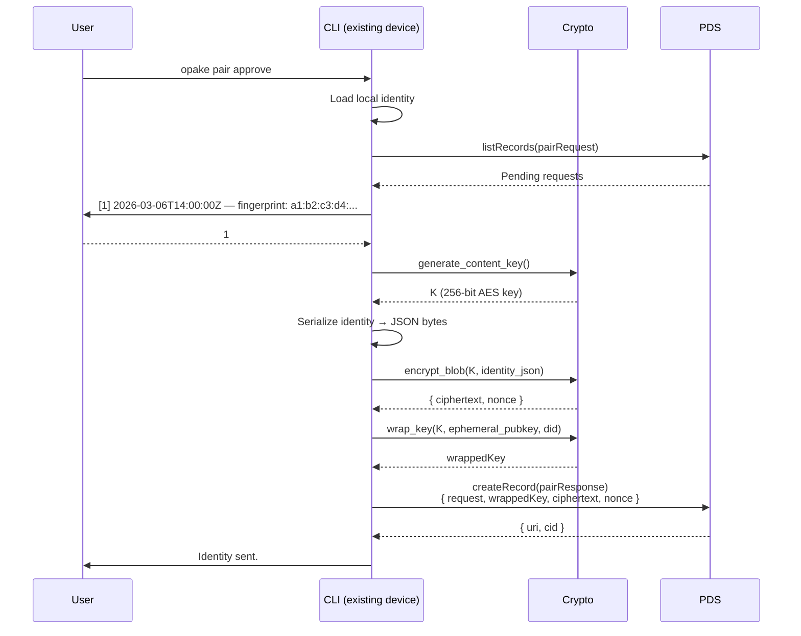
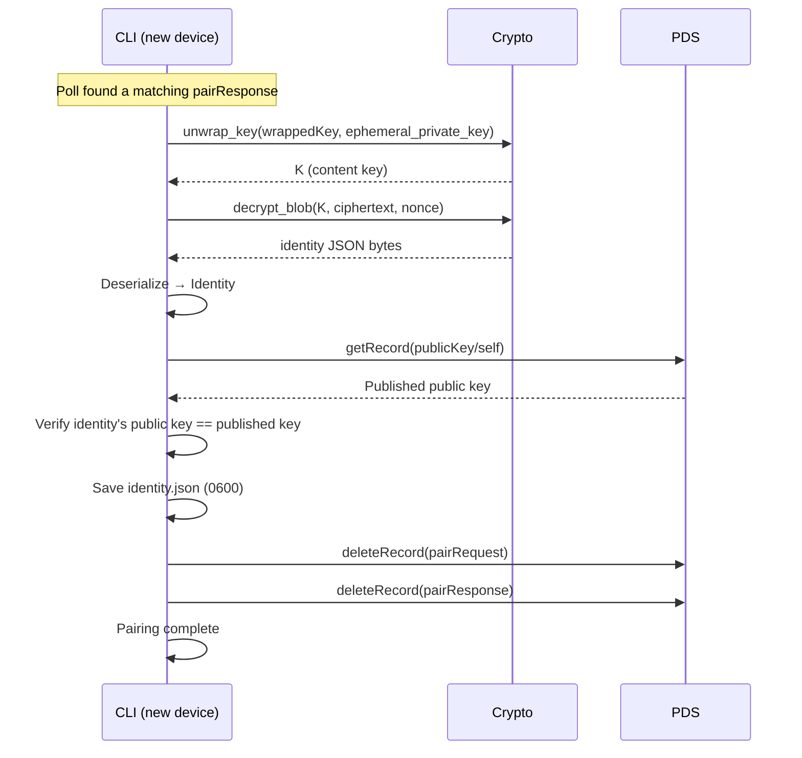
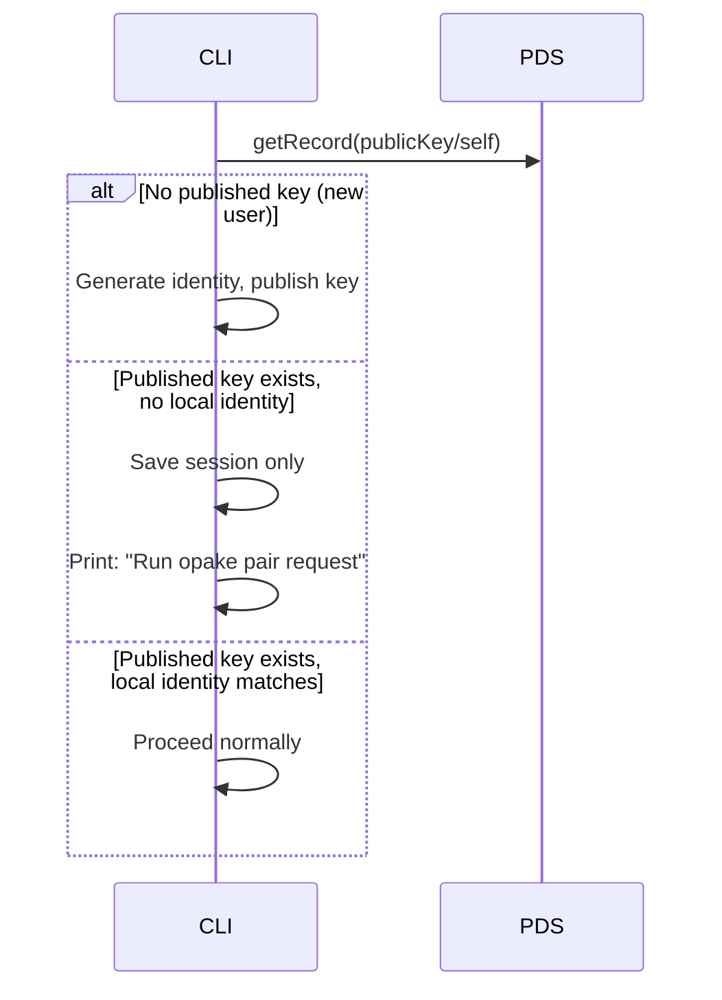

# Device Pairing

Transfer an encryption identity from an existing device to a new one, using the PDS as a relay. Both devices are authenticated to the same DID.

## Pair Request (new device)

The ephemeral private key stays in memory. The fingerprint (first 8 bytes of the public key, hex-encoded) is displayed for out-of-band verification.

## Pair Approve (existing device)

The identity payload includes the X25519 encryption keypair, Ed25519 signing keypair, and the DID — everything needed to operate as that account.

## Receive (new device, after poll succeeds)

The verification step guards against a corrupted or tampered response — the derived public key must match what's already published on the PDS.

## Login Detection

When `opake login` runs on a device without a local identity, it checks for an existing `publicKey/self` record on the PDS before generating a new keypair:

This prevents accidental key overwrites that would break encryption on the existing device.

## Security Properties

- **Ephemeral key exchange** — the DH keypair exists only in memory during the pairing session. No long-term secret is exposed in the PDS records.
- **Visual SAS** — key fingerprints are displayed for comparison but not programmatically enforced. True zero-trust verification is a follow-up.
- **Same encryption as documents** — the identity payload uses AES-256-GCM + x25519-hkdf-a256kw, the same primitives as file encryption. No new crypto.
- **Record cleanup** — both pairing records are deleted after transfer. Stale request cleanup is tracked separately.
