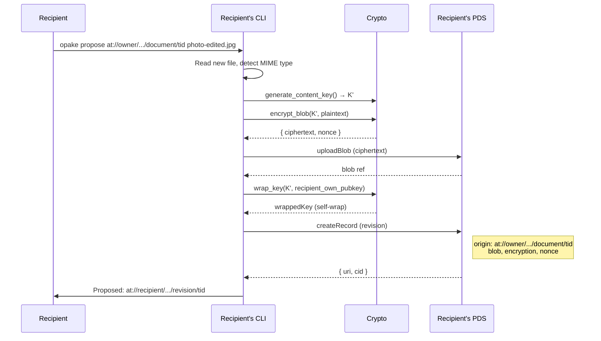
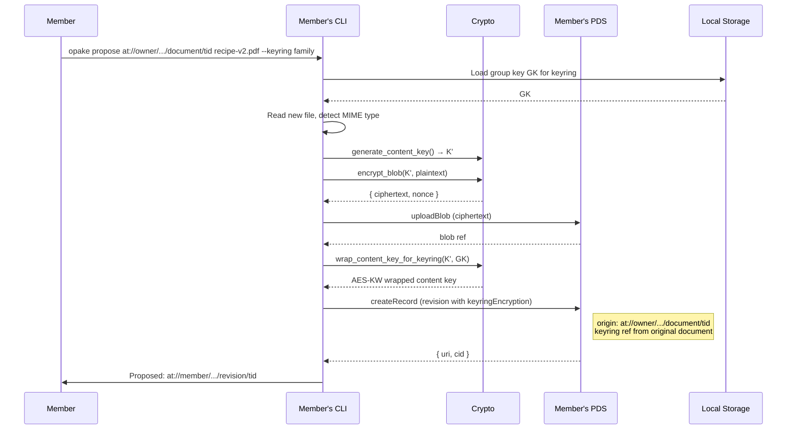
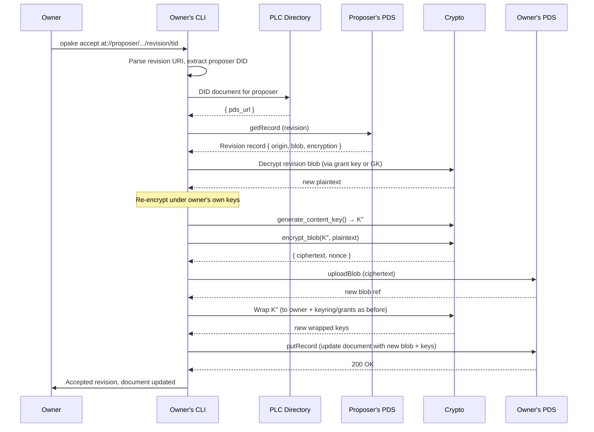
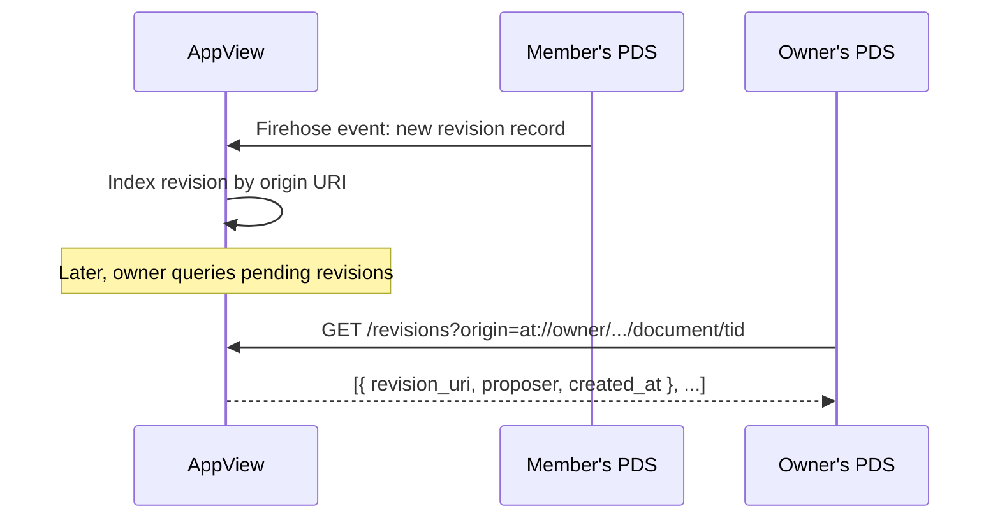

# Revisions (Planned)

Collaborative editing via revision records. Each member uploads revisions to their own PDS — data stays under their control, and the AppView stitches it together. Same pattern as Bluesky replies: your content lives on your PDS, the AppView presents the thread.

## Propose Revision (Direct Share)

A grant recipient uploads a revised version of a shared document to their own PDS.

The revision record lives on the recipient's PDS. It references the original document via an `origin` AT-URI. The owner's data is untouched.

## Propose Revision (Keyring Member)

A keyring member uploads a revised version, encrypted under the shared group key.

Any keyring member can decrypt the revision — they already have GK.

## Accept Revision (Owner)

The document owner reviews a proposed revision and applies it by replacing their blob.

The owner re-encrypts with a fresh content key rather than reusing the proposer's. This ensures the owner's document record remains self-consistent — all wrapped keys reference the same content key, and the blob is stored on the owner's PDS.

## Discovery via AppView

Without an AppView, revision discovery requires polling known members' PDSes. The AppView automates this by watching firehose events.

Without the AppView, `opake revisions <document>` can fall back to polling each keyring member's PDS for `app.opake.cloud.revision` records whose `origin` matches the document URI. Slow but functional, and zero-trust — no intermediary needed.
