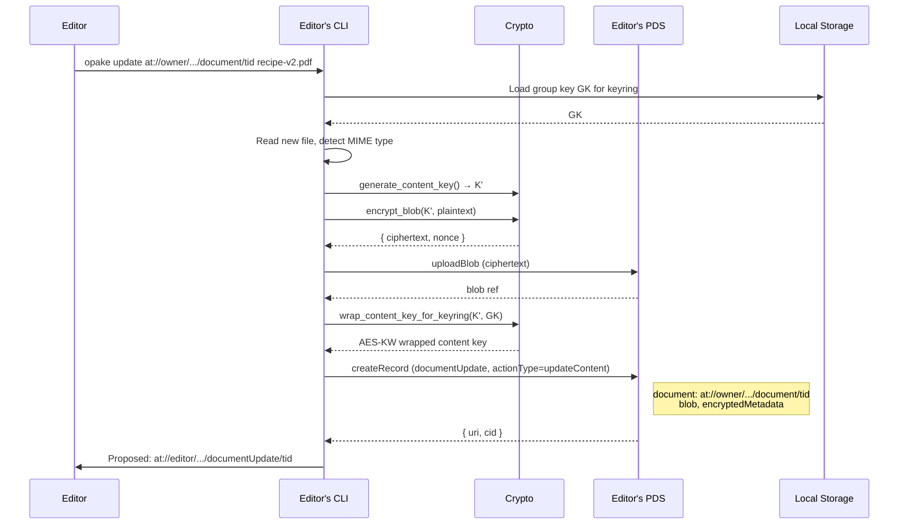
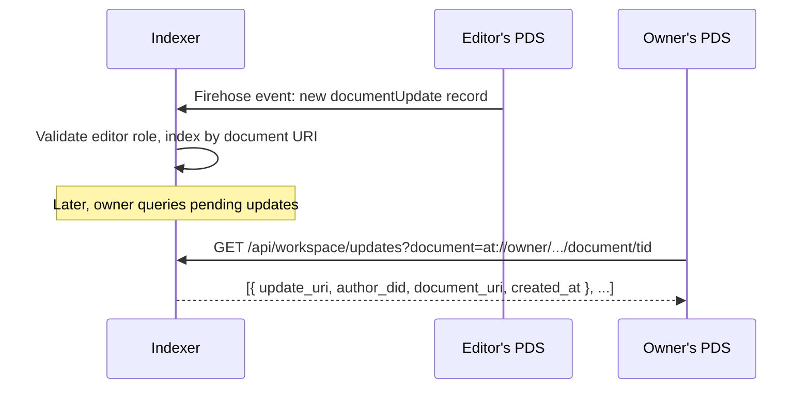

# Document Updates (Collaborative Editing)

Workspace mutations from non-owners (editors and managers) flow through `at.opake.documentUpdate` proposal records on the proposer's PDS. The owner's daemon applies them — re-hosting the proposed blob (`updateContent`) or replacing the encrypted metadata field (`updateMetadata`) on the existing document record. Same federated pattern as Bluesky replies: your contribution lives on your PDS; the indexer surfaces pending updates to the document owner.

Two action types:

| `actionType` | What it proposes | Owner apply |
|---|---|---|
| `updateContent` | New blob for an existing document | Re-host the proposed blob to the document owner's PDS; replace `blob` field. |
| `updateMetadata` | New encrypted metadata for an existing document | Replace the `encryptedMetadata` field. |

Both bump the document record's `modifiedAt` on apply. The proposer's editor-side cleanup uses that to detect "my proposal landed" and delete the now-redundant `documentUpdate` record from its own PDS — `Opake::cleanup_proposals_for_target` from SSE for online editors, `Opake::cleanup_outstanding_proposals` from sync as a bootstrap reconciliation pass otherwise.

New-document creation does not flow through `documentUpdate`. A workspace member uploads the document directly to their own PDS and writes a `directoryUpdate.addEntry` proposal so the owner can register the entry in the workspace directory — see [keyrings.md](keyrings.md#upload-with-workspace).

## Propose Update (Workspace Editor)

A workspace editor uploads a revised version of an existing document, encrypted under the shared group key.



The update record lives on the editor's PDS. It references the target document via the `document` AT-URI. The owner's data is untouched until they apply it.

## Apply Update (Document Owner)

The document owner reviews a proposed update and applies it by replacing the blob (or metadata) on their existing record.

```mermaid
sequenceDiagram
    participant Owner
    participant CLI as Owner's CLI
    participant PLC as PLC Directory
    participant EditorPDS as Editor's PDS
    participant Crypto
    participant OwnerPDS as Owner's PDS

    Owner->>CLI: opake apply at://editor/.../documentUpdate/tid

    CLI->>CLI: Parse update URI, extract editor DID
    CLI->>PLC: DID document for editor
    PLC-->>CLI: { pds_url }

    CLI->>EditorPDS: getRecord (documentUpdate)
    EditorPDS-->>CLI: Update record { document, blob, encryptedMetadata }

    Note over CLI: For updateContent: re-host the editor's blob<br/>on the owner's PDS so the owner controls availability.
    CLI->>EditorPDS: getBlob (cid)
    EditorPDS-->>CLI: ciphertext bytes
    CLI->>OwnerPDS: uploadBlob (ciphertext)
    OwnerPDS-->>CLI: new blob ref

    CLI->>OwnerPDS: putRecord (document with new blob or metadata; modifiedAt bumped)
    OwnerPDS-->>CLI: 200 OK

    CLI->>Owner: Applied update
```

The owner does **not** re-encrypt — the proposal is already encrypted under the same workspace content key the document uses. Re-encryption is only needed when the document owner is changing keyrings (workspace forks, ownership migration), neither of which is implemented yet.

## Editor-Side Cleanup

After the owner applies the proposal, the document record's `modifiedAt` advances past the proposal's `createdAt`. The editor's cleanup module sees this and deletes the proposal record:

- **SSE-driven (online editor):** the indexer broadcasts the `document:upsert` event including `modifiedAt`. `Opake::cleanup_proposals_for_target` enumerates the editor's outstanding proposals targeting this URI and deletes any with `createdAt < modifiedAt`.
- **Bootstrap (offline catch-up):** on workspace sync (or SSE reconnect), `Opake::cleanup_outstanding_proposals` enumerates the editor's `documentUpdate` / `directoryUpdate` / `keyringUpdate` proposals via `listRecords`, fetches each target record's current `modifiedAt`, and applies the same comparison. Catches anything missed while offline.

Both are idempotent (`deleteRecord` of a record that's already gone returns 404 and is treated as success). Race-tolerant: if two editors propose conflicting updates and the owner applies one, both editors' proposals get cleaned up — the unapplied one is lossy, the editor re-proposes if they still want their version.

## Discovery via Indexer

The Indexer watches firehose events for `documentUpdate` records and indexes them by target document.



Without the Indexer, discovery falls back to polling each workspace member's PDS for `at.opake.documentUpdate` records whose `document` field matches. Slow but functional.
