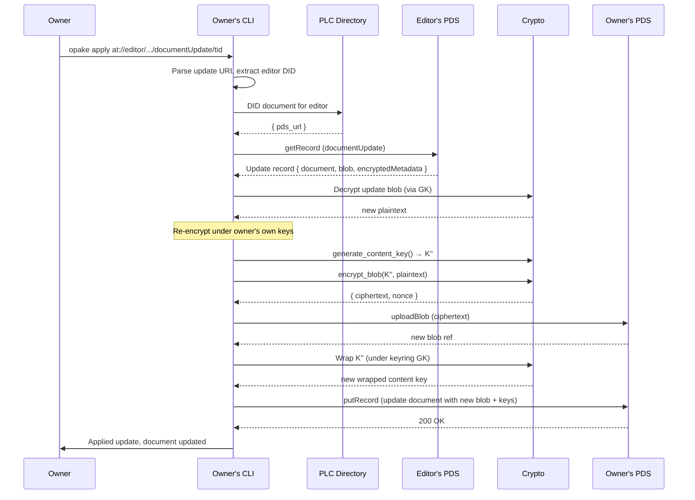
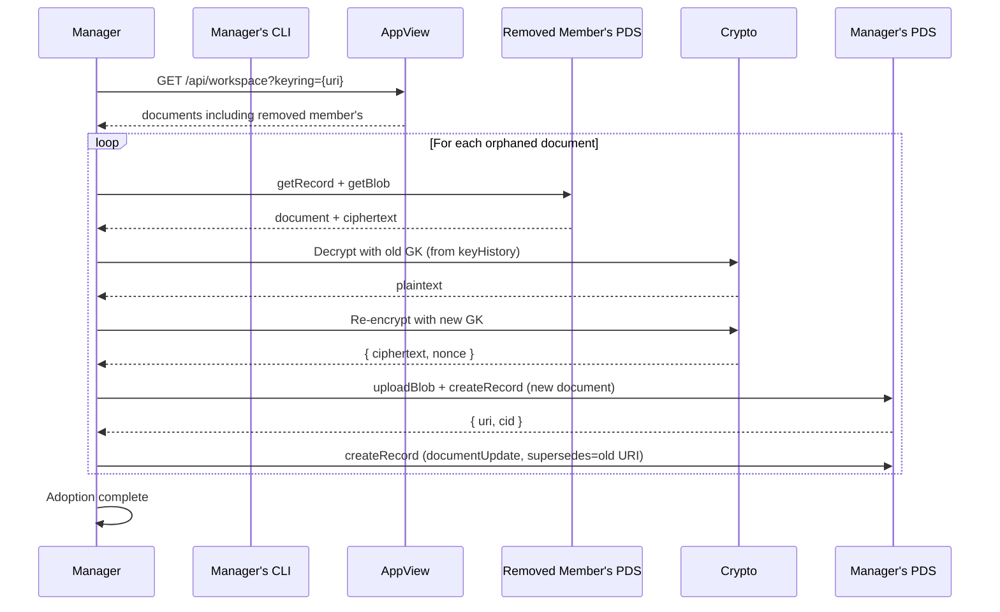
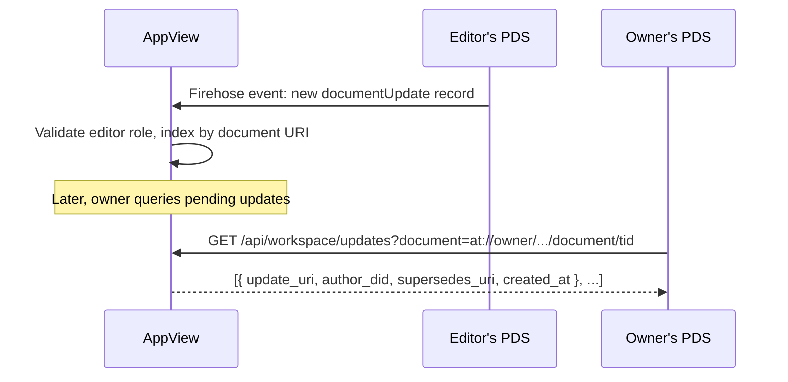

# Document Updates (Collaborative Editing)

Collaborative editing via `app.opake.documentUpdate` records. Each editor uploads updates to their own PDS — data stays under their control, and the AppView surfaces pending updates to the document owner. Same pattern as Bluesky replies: your content lives on your PDS, the AppView presents the thread.

## Propose Update (Workspace Editor)

A workspace editor uploads a revised version of a document, encrypted under the shared group key.

The update record lives on the editor's PDS. It references the target document via the `document` AT-URI. The owner's data is untouched until they apply it.

## Apply Update (Document Owner)

The document owner reviews a proposed update and applies it by replacing their blob.

The owner re-encrypts with a fresh content key rather than reusing the editor's. This ensures the owner's document record remains self-consistent — all wrapped keys reference the same content key, and the blob is stored on the owner's PDS.

## Document Adoption

When a member is removed from a workspace, their documents need to be migrated. A remaining manager downloads, re-encrypts under the new group key, and uploads to their own PDS with a `supersedes` field for lineage.

Adoption must happen while the removed member's PDS is still serving data. The daemon should adopt eagerly on removal, not lazily.

## Discovery via AppView

The AppView watches firehose events for `documentUpdate` records and indexes them by target document.

Without the AppView, discovery falls back to polling each workspace member's PDS for `app.opake.documentUpdate` records whose `document` field matches. Slow but functional.
