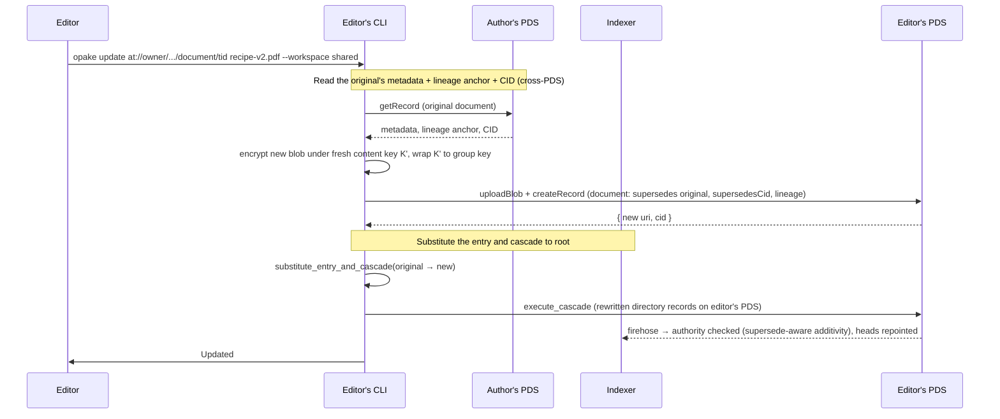

# Cross-Author Editing

A workspace is collaborative, but no member can write into another member's repo. When you edit a document you did not author — revising its content, or renaming a directory someone else created — you cannot mutate the original record. Instead you write a *new* record on your own PDS that **supersedes** the original, then repoint the parent directory listing at it through a curatorial substitute cascade. The original AT-URI is retired; the new one takes its place as the canonical version at that path.

There is no proposal record, no owner review queue, and no owner daemon that applies changes. Authority is decided at write time by the indexer, exactly as it is for any directory supersede: an editor's curatorial edit is admitted because the superseding record names what it replaces; a viewer's is refused.

## Editing another member's document

`update_content` branches on who authored the target. If the document lives on the caller's own repo, it re-encrypts under the same content key and `putRecord`s in place (same URI, new CID). If it belongs to another member, the caller writes a superseding document instead.

The superseding record carries the original's metadata (name, MIME type, tags, description — read cross-PDS from the original) but new content under a fresh per-document content key wrapped to the current group key. It stamps `supersedes` = the original URI and `supersedesCid` = the original's CID, and it threads the original's `lineage` anchor onto the new record so the blob and metadata seal under the object's stable identity rather than the new record's own URI (`spec:lineage § Lineage is the chain's genesis URI, carried on every supersede`).

The editor does not re-encrypt to a new keyring — the new content is already under the same workspace group key the document uses. Re-encryption is only needed when changing keyrings entirely (a workspace fork or ownership migration), which is a separate, deferred operation.

## The substitute cascade

Pointing the parent listing at the new document is a **non-additive** edit on its face — one entry drops, another appears. The indexer admits it for an editor only because the new target's `supersedes` field names the dropped entry: supersede-aware additivity treats "the entry I removed is superseded by the entry I added" as advancing the path, not deleting from it (`spec:tree-chains § Editor supersedes are additive; managers are unrestricted`). A manager needs no such link.

`substitute_entry_and_cascade` finds the directory that currently lists the old target (from the local tree topology, validated against the indexer's root), rewrites its listing to point at the new target and CID, then cascades that change up every ancestor to the workspace root — each level superseding its prior head, each new record on the caller's PDS. Renaming another member's directory takes the identical path: write a superseding directory record, then substitute-and-cascade its parent.

## Reading the current version

Because canonical state is always the chain head, a reader never needs to know an edit happened. Consumers build the live tree from chain heads only (`spec:tree-chains § Consumers build the live tree from chain heads only`): the parent listing points at the head document, and a reader that walks the listing fetches the current version from whichever member's PDS now hosts it. The retired original still exists on its author's PDS as a superseded chain member; it is simply no longer referenced by any live listing.
