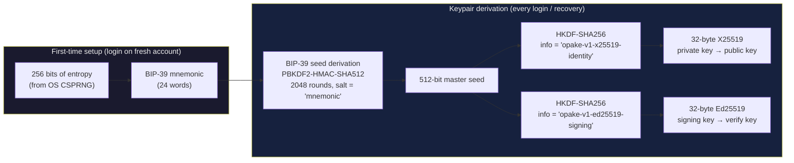
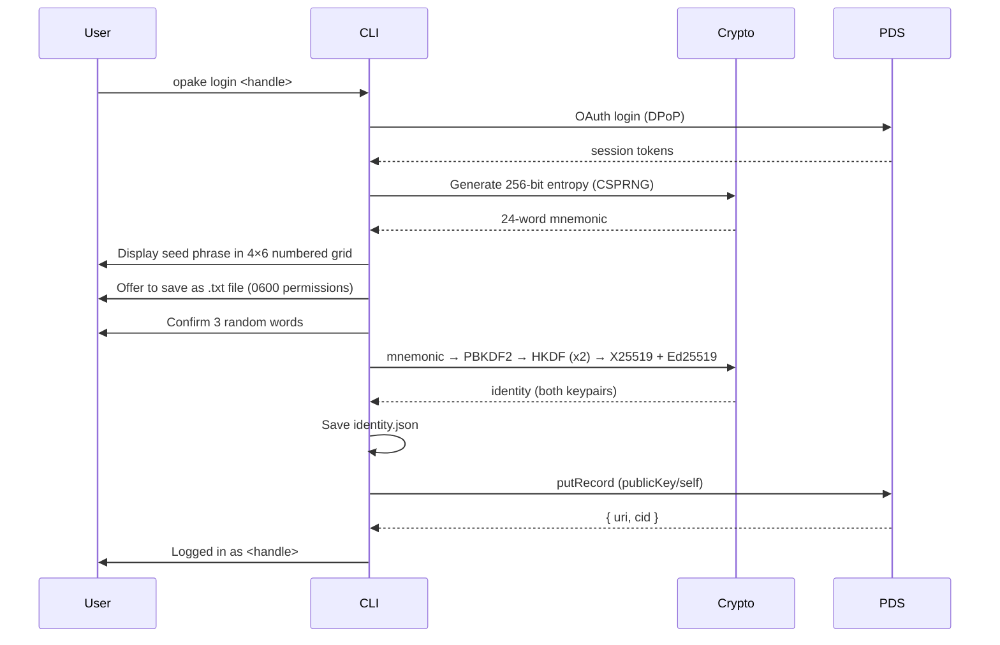
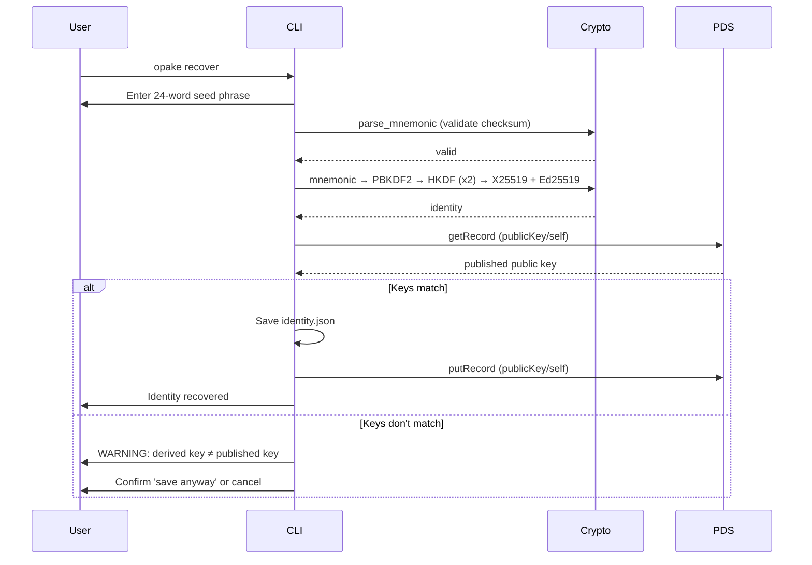

# Seed Phrase Recovery

Deterministic keypair derivation from a BIP-39 mnemonic (24 words / 256-bit entropy). The seed phrase is the last-resort recovery mechanism when you've lost access to all devices. Same phrase always produces the same X25519 encryption keypair and Ed25519 signing keypair.

For setting up additional devices when you still have access to an existing one, use [device pairing](pairing.md) instead — it's faster and doesn't require typing 24 words.

## Derivation Pipeline



The mnemonic is the root secret — both keypairs are derived from it. Losing the phrase means losing access to all encrypted data and signing capability. The HKDF info strings include the schema version for domain separation, consistent with the key wrapping convention.

## First Login (New Account)

Seed phrase generation is the default identity creation path. No random keypair fallback.



The web UI follows the same flow via WASM: generate → display grid → copy/download → confirm 3 words → derive → publish.

## Recovery (Existing Account, New Device)



The CLI also supports `opake recover --file seed.txt` for importing from a .txt backup. The file parser is lenient — handles numbered grids, numbered lists, plain word lists.

## Key Mismatch

A mismatch between the derived public key and the published `publicKey/self` means:

- Wrong seed phrase (for a different account)
- Account was set up before seed phrases were the default (random keypair)

If the user confirms, the new key is published but existing data encrypted to the old key remains unreadable. The CLI and web UI both warn about this explicitly.

## Grid Format

The seed phrase is displayed and stored as a 4-column × 6-row numbered grid:

```
 1. mimic          7. action         13. zebra          19. crawl
 2. short          8. bundle         14. rain           20. pen
 3. have           9. wagon          15. addict         21. flavor
 4. picnic        10. wrong          16. legend         22. useful
 5. neck          11. balance        17. swallow        23. caution
 6. awful         12. palm           18. space          24. focus
```

This format is shared between CLI (`format_mnemonic_grid` / `parse_mnemonic_grid` in opake-core) and the web UI. The parser handles column-major reordering when numbers are present.
