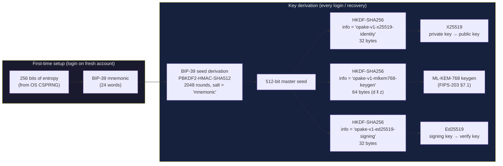
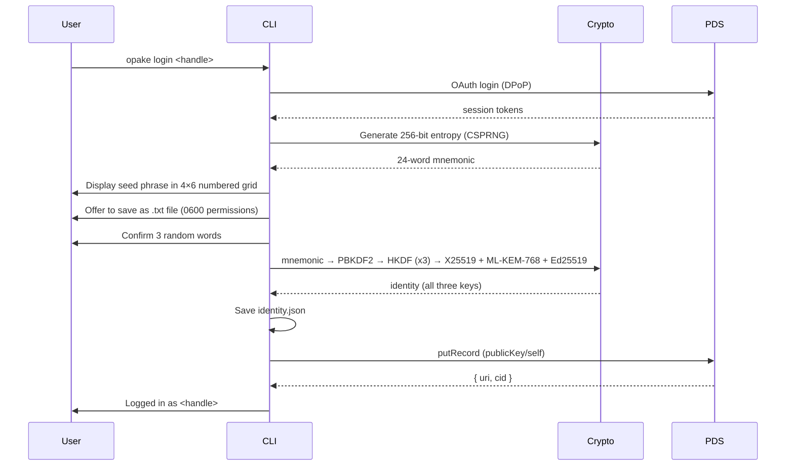
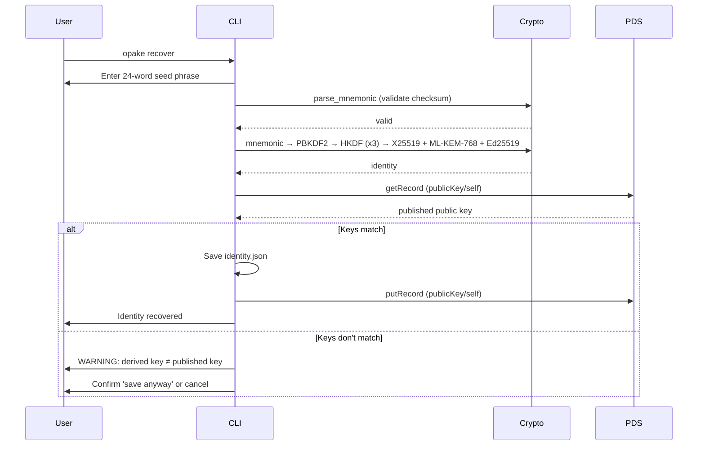

# Seed Phrase Recovery

Deterministic key derivation from a BIP-39 mnemonic (24 words / 256-bit entropy). The seed phrase is the last-resort recovery mechanism when you've lost access to all devices. The same phrase always produces the same three keys: an X25519 encryption keypair, an ML-KEM-768 post-quantum keypair, and an Ed25519 signing keypair (`spec:auth-identity § Identity keys derive deterministically from the mnemonic`).

For setting up additional devices when you still have access to an existing one, use [device pairing](pairing.md) instead — it's faster and doesn't require typing 24 words.

## Derivation Pipeline



The mnemonic is the root secret — all three keys derive from it, with no randomness and no per-device input. The X25519 and ML-KEM-768 keys together form the hybrid encryption identity; the Ed25519 key signs records and authenticates the client to the indexer. Losing the phrase means losing access to all encrypted data and signing capability. The HKDF info strings carry a version label (`opake-v1-*`) for domain separation and never change in place — altering any derivation parameter would silently orphan every identity recovered from existing words, so a future scheme lives alongside the v1 path under new labels (`spec:auth-identity § The derivation path is version-pinned and immutable`).

## First Login (New Account)

Seed phrase generation is the default identity creation path. No random keypair fallback.



The web UI follows the same flow via WASM: generate → display grid → copy/download → confirm 3 words → derive → publish.

## Recovery (Existing Account, New Device)



The CLI also supports `opake recover --file seed.txt` for importing from a .txt backup. The file parser is lenient — handles numbered grids, numbered lists, plain word lists.

## Key Mismatch

A mismatch between the derived public key and the published `publicKey/self` means either the wrong seed phrase (one belonging to a different account) or an account whose published key was generated by some scheme other than this derivation path. Recovery re-derives and cross-checks against the published key before trusting it (`spec:auth-identity § Recovery re-derives and cross-checks the published key`).

If the user confirms anyway, the new key is published but existing data encrypted to the old key remains unreadable. The CLI and web UI both warn about this explicitly.

## Grid Format

The seed phrase is displayed and stored as a 4-column × 6-row numbered grid:

```
 1. mimic          7. action         13. zebra          19. crawl
 2. short          8. bundle         14. rain           20. pen
 3. have           9. wagon          15. addict         21. flavor
 4. picnic        10. wrong          16. legend         22. useful
 5. neck          11. balance        17. swallow        23. caution
 6. awful         12. palm           18. space          24. focus
```

This format is shared between CLI (`format_mnemonic_grid` / `parse_mnemonic_grid` in opake-core) and the web UI. The parser handles column-major reordering when numbers are present.
