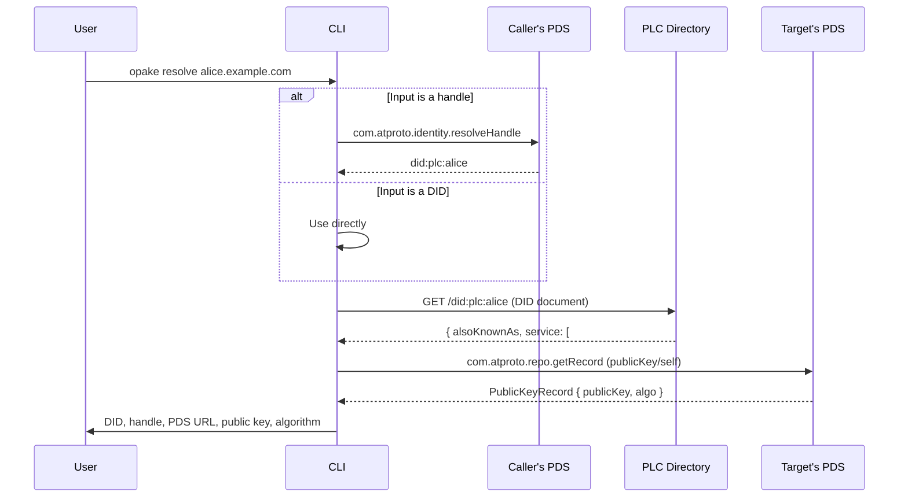
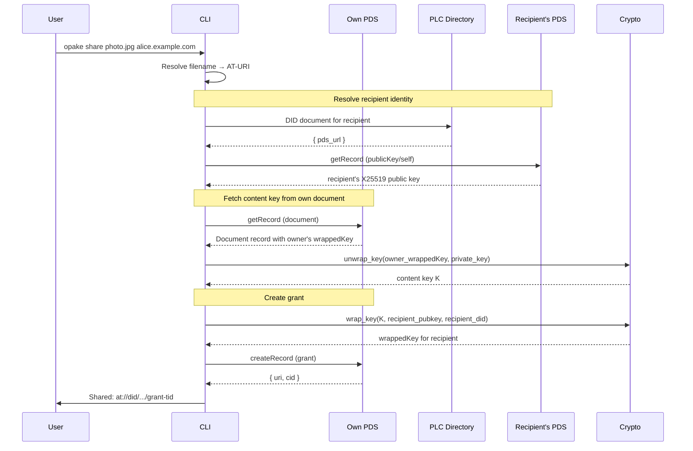
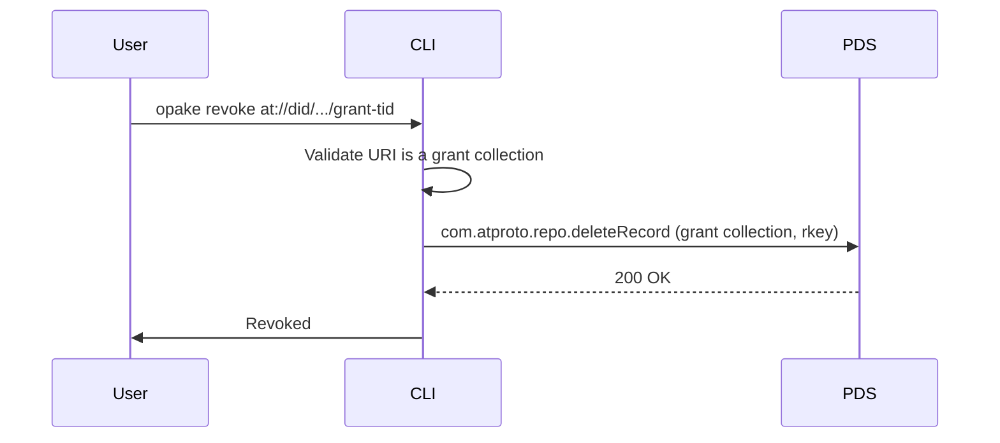
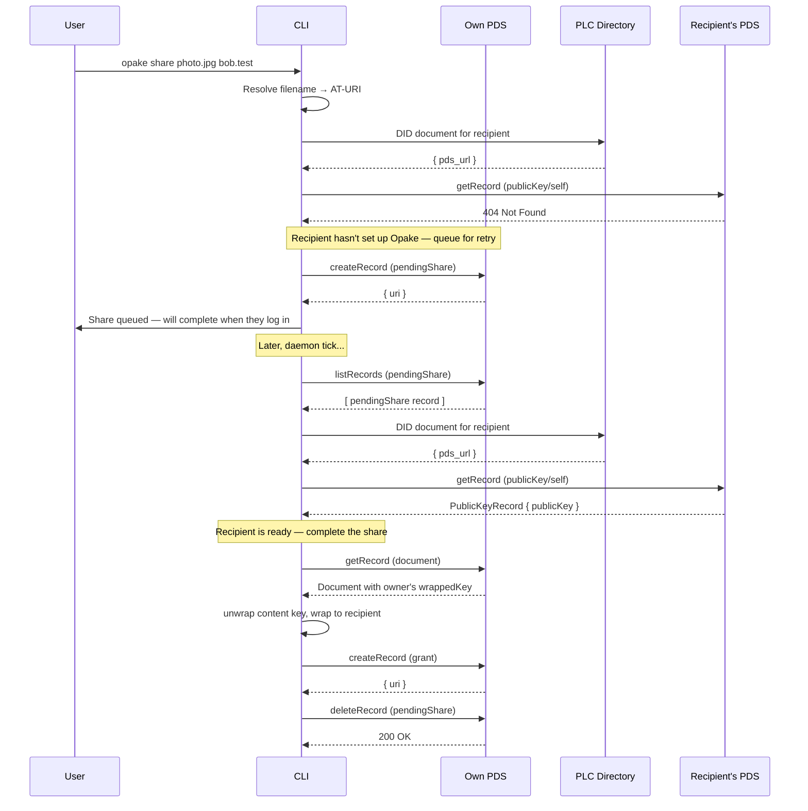

# Sharing

## Resolve

Resolves a handle or DID to its PDS and X25519 public key. Used internally by `share`, exposed as a standalone command for inspection.

## Share

Grants another user access to a document by wrapping the content key to their public key.

## Revoke

Deletes a grant record. The recipient loses network access to the wrapped key.

For true forward secrecy, the document should also be re-encrypted with a new content key — the schema supports this but the CLI doesn't automate it yet.

## Pending Share (recipient not ready)

When the recipient hasn't set up Opake yet (no `publicKey/self`), the share is queued as a `pendingShare` record on the PDS. The daemon retries periodically.

Pending shares expire after 7 days. The daemon also deletes expired records on each pass.
