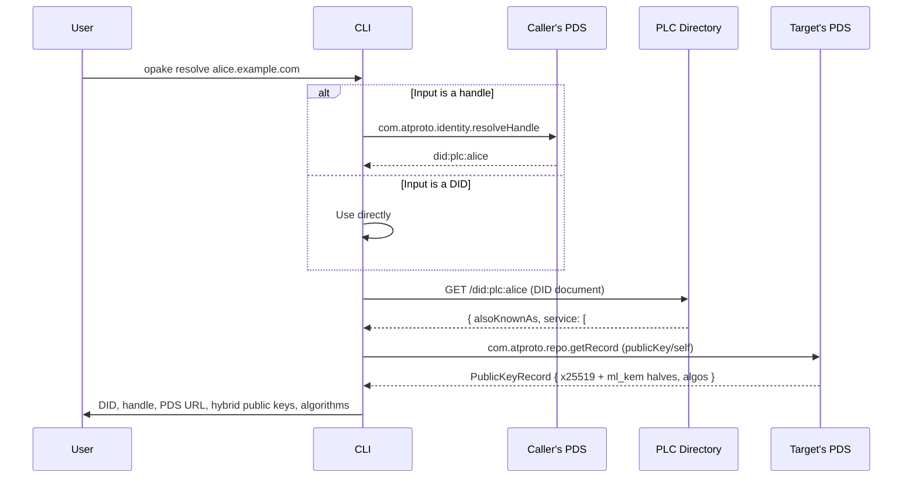
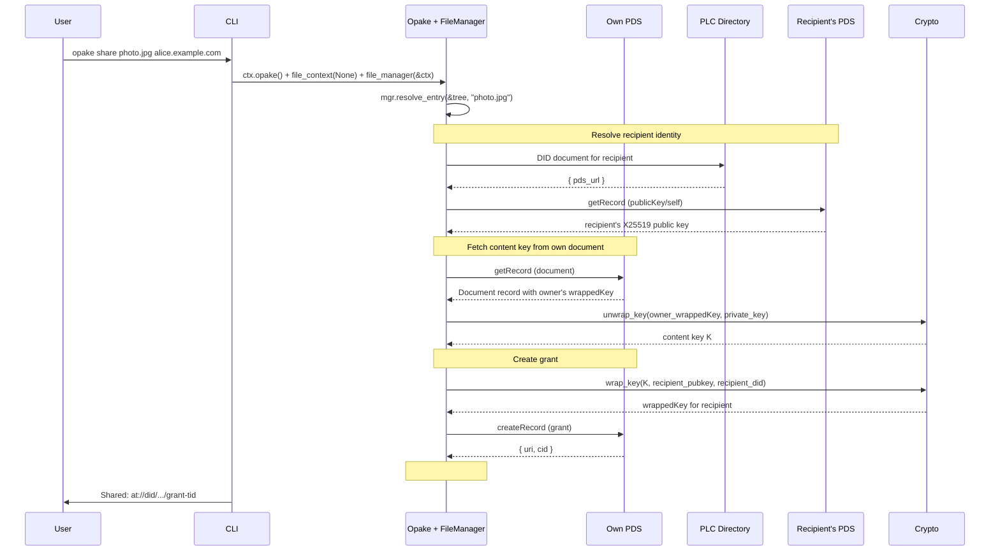
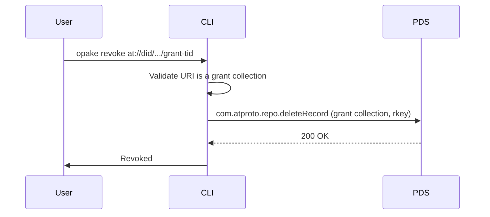
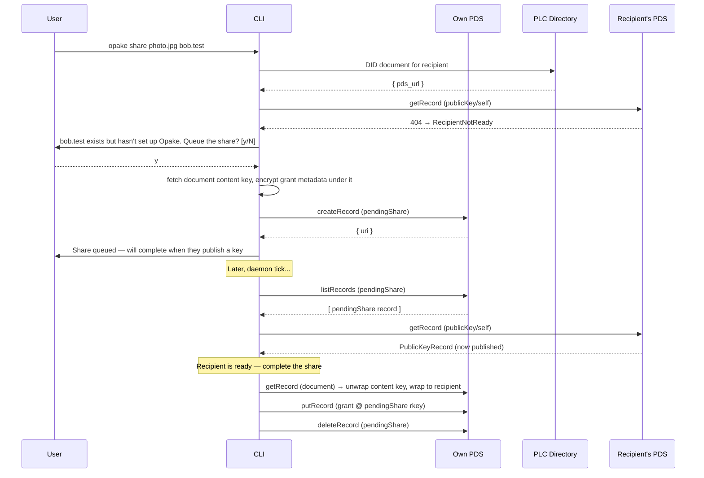

# Sharing

## Resolve

Resolves a handle or DID to its PDS and X25519 public key. Used internally by `share`, exposed as a standalone command for inspection.

Resolution rejects a public-key record whose declared algorithm is not `x25519` / `ml-kem-768` before decoding any key bytes, so a corrupt or mislabelled key fails here with a clear reason rather than deep inside a wrap call (`spec:sharing-grants § The recipient's keys are discovered from their published public-key record`).

## Share

Grants another user access to a document by wrapping the content key to their public key. Sharing is **cabinet-only**: a share hands out one document's content key to one recipient as a standalone grant record. Workspace documents are reached through group keys, not grants, so `share` from a workspace context is refused (`spec:sharing-grants § Sharing is cabinet-only`).

## Revoke

Deletes a grant record. The recipient loses network access to the wrapped key.

For true forward secrecy, the document should also be re-encrypted with a new content key — the schema supports this but the CLI doesn't automate it yet.

## Pending Share (recipient not ready)

A recipient who exists but has not published a `publicKey/self` record cannot receive a share yet. Resolution distinguishes this case — a valid DID with no key surfaces as `RecipientNotReady`, not `NotFound`, so a typo'd handle still fails outright. The client does **not** queue automatically: it warns that the recipient exists but has not set up Opake, and queues a `pendingShare` only on the user's explicit confirmation (`spec:sharing-grants § A share to a not-yet-ready recipient is queued, not dropped`). The pending record carries the document, the recipient as entered, and the grant metadata encrypted under the document's content key — no plaintext, and enough to reconstruct the grant later.

Completion writes the grant at the **pending share's own rkey** via an idempotent `putRecord`, not at a fresh rkey via `createRecord`. That is what keeps the retry runner exactly-once when more than one runner is live — a daemon and an open tab, say. Both derive the same grant rkey from the same pending record and upsert there, so the repo converges on one grant instead of one per runner. The `deleteRecord` that follows is idempotent cleanup: a runner that finds the pending record already gone treats that as done. See [Background maintenance](../FLOWS.md#background-maintenance--multi-runner-coordination) for the full race walkthrough and [docs/BACKGROUND_WORK.md](../BACKGROUND_WORK.md) for the contract.

Pending shares expire after 7 days. The daemon also deletes expired records on each pass.
