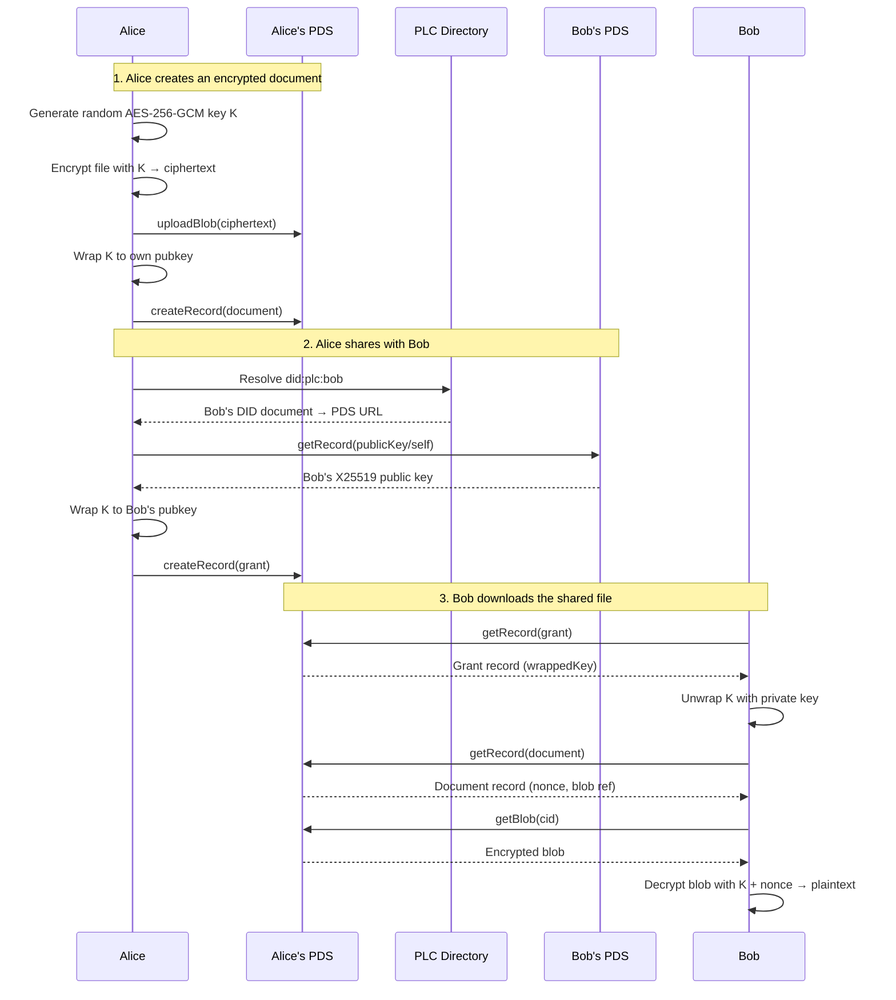
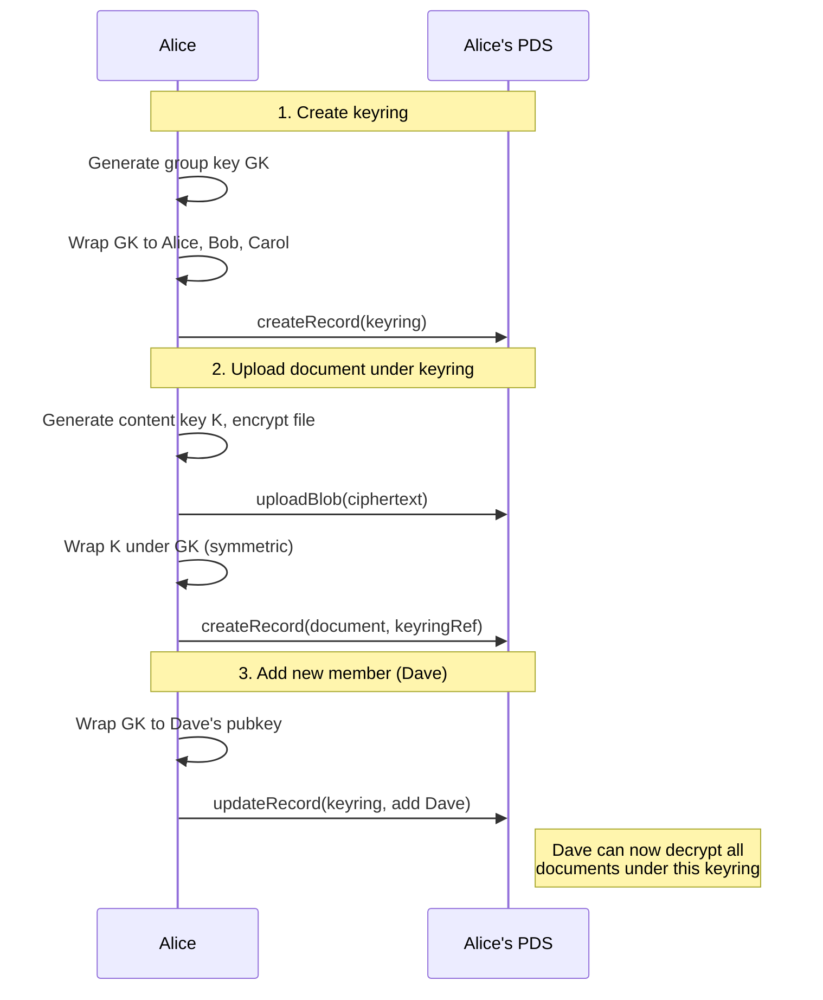
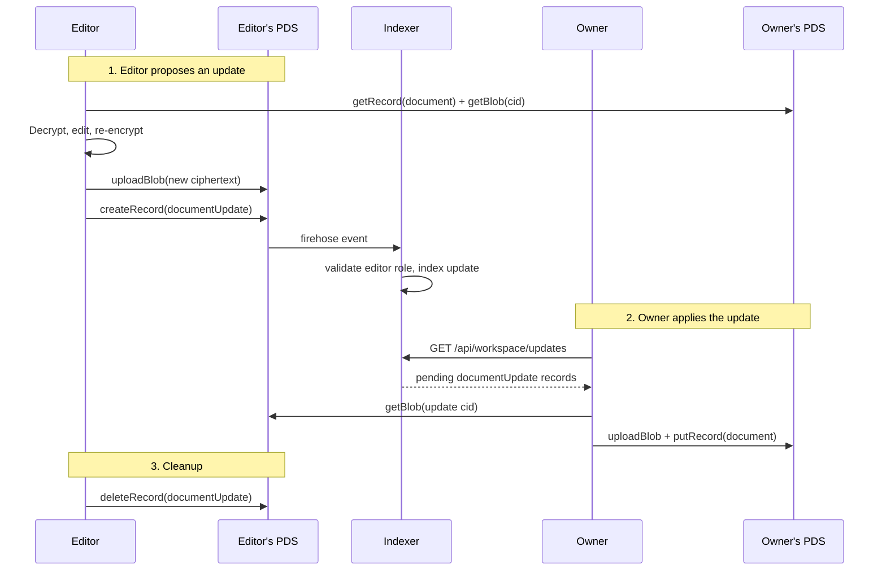
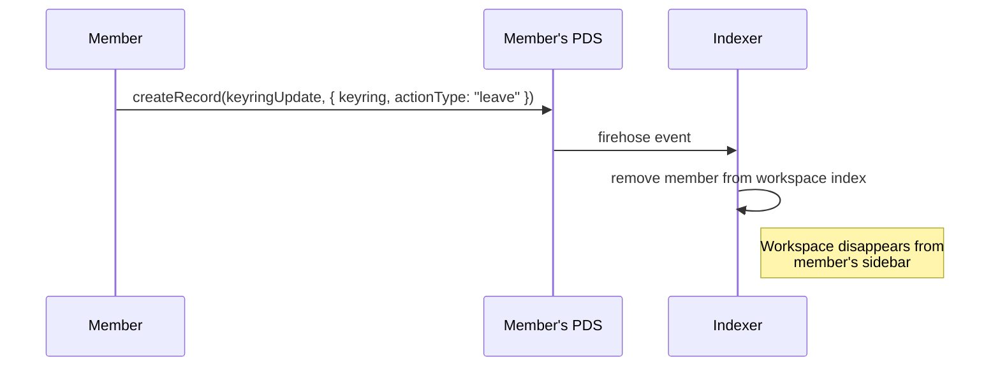
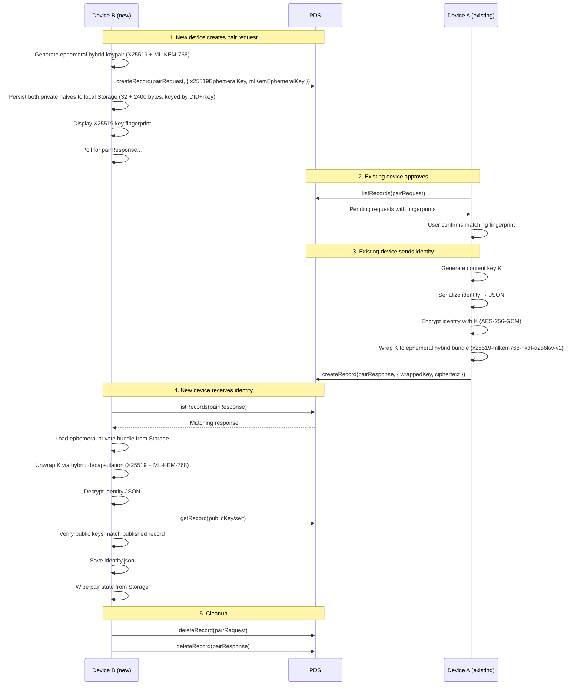

<!-- 
  NOTE TO EDITORS: 
  Opake uses a dual-documentation system. If you modify the AT Protocol 
  schemas or lexicon definitions in this file, you MUST also update the 
  corresponding MDX content in `apps/web/src/content/` to prevent documentation drift. 
-->

# at.opake.* Lexicon Schemas

An encrypted personal cloud built on AT Protocol.

## Architecture

The encryption model follows the same hybrid pattern as git-crypt:
- Each file/record is encrypted with a **random symmetric key** (AES-256-GCM)
- That symmetric key is **wrapped** (encrypted) to each authorized DID's public key
- Wrapped keys are stored as atproto records, publicly visible but useless without the private key
- File content is uploaded as a PDS blob (opaque encrypted bytes)

## Lexicon Overview

| NSID | Type | Purpose |
|------|------|---------|
| `at.opake.accountConfig` | record | Singleton per-account config/preferences (rkey: `self`), synced across devices |
| `at.opake.defs` | defs | Shared type definitions (encryption envelope, wrapped key, etc.) |
| `at.opake.directory` | record | A directory containing an ordered list of child document/directory AT-URIs |
| `at.opake.document` | record | An encrypted file/document with metadata |
| `at.opake.publicKey` | record | Singleton X25519 encryption public key (rkey: `self`) for key discovery |
| `at.opake.keyring` | record | A named group (workspace) with a shared symmetric key, wrapped to each member with a role |
| `at.opake.grant` | record | A share grant — gives a DID access to a specific document's key |
| `at.opake.documentUpdate` | record | A proposed update to another member's document — content, metadata, or adoption |
| `at.opake.directoryUpdate` | record | A proposed structural change to a workspace directory (placement, move, create, rename, delete) |
| `at.opake.pendingShare` | record | A queued share intent — retried by daemon until recipient signs up or expires (7 days) |
| `at.opake.keyringUpdate` | record | A proposed update to a workspace keyring (member add/remove, metadata, role change) |
| `at.opake.pairRequest` | record | Ephemeral public key from a new device requesting identity transfer |
| `at.opake.pairResponse` | record | Encrypted identity payload sent in response to a pair request |
| `at.opake.authFullAccess` | permission-set | OAuth permission set bundling all `at.opake.*` collections — for `include:` scopes |

## Flow: Sharing a file with another DID

Data never leaves Alice's PDS. Bob fetches everything from the source.

## Flow: Group sharing via keyring

Any keyring member unwraps GK with their private key, then uses GK to unwrap each document's content key K. Removing a member archives the old rotation's member entries into `keyHistory`, then rotates GK and re-wraps to the remaining members — per-document content keys and blobs stay untouched. The history lets remaining members decrypt pre-rotation documents even on new devices.

## Flow: Collaborative editing via documentUpdate

The owner's client is the only one that writes to the canonical document record. Editors propose changes; owners apply them. Last-write-wins by `createdAt` for conflict resolution.

## Flow: Leaving a workspace

The member's wrapped key still exists on the keyring record — they *could* still decrypt. This is a visibility opt-out, not a key revocation. The owner can follow up with a proper removal (key rotation) if needed.

## Flow: Device-to-device identity pairing

Both devices are authenticated to the same DID. The PDS is just a relay — the encryption is the access control. Ephemeral key fingerprints are displayed for visual SAS comparison.

For detailed sequence diagrams of every CLI operation, see [docs/flows/](../docs/flows/).
