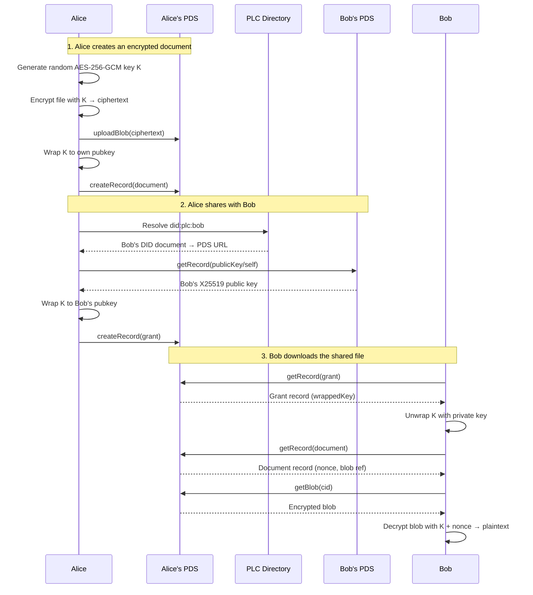
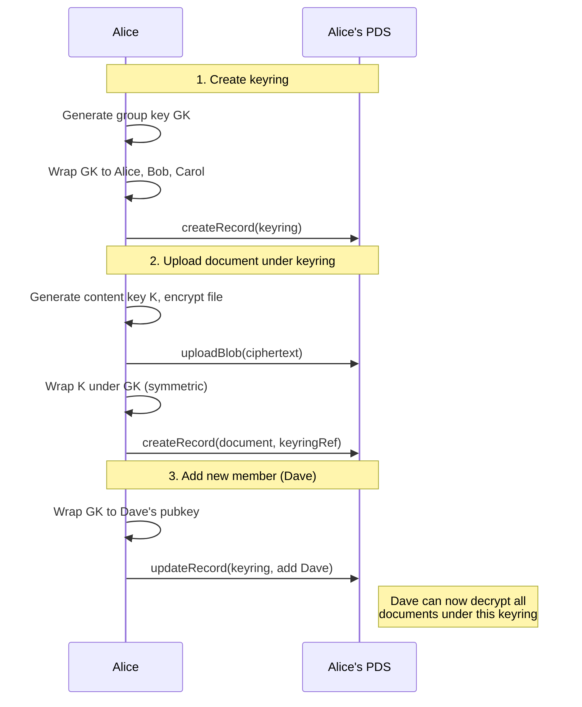

# app.opake.cloud.* Lexicon Schemas

An encrypted personal cloud built on AT Protocol.

## Architecture

The encryption model follows the same hybrid pattern as git-crypt:
- Each file/record is encrypted with a **random symmetric key** (AES-256-GCM)
- That symmetric key is **wrapped** (encrypted) to each authorized DID's public key
- Wrapped keys are stored as atproto records, publicly visible but useless without the private key
- File content is uploaded as a PDS blob (opaque encrypted bytes)

## Lexicon Overview

| NSID | Type | Purpose |
|------|------|---------|
| `app.opake.cloud.defs` | defs | Shared type definitions (encryption envelope, wrapped key, etc.) |
| `app.opake.cloud.document` | record | An encrypted file/document with metadata |
| `app.opake.cloud.publicKey` | record | Singleton X25519 encryption public key (rkey: `self`) for key discovery |
| `app.opake.cloud.keyring` | record | A named group with a shared symmetric key, wrapped to each member |
| `app.opake.cloud.grant` | record | A share grant — gives a DID access to a specific document's key |

## Flow: Sharing a file with another DID

Data never leaves Alice's PDS. Bob fetches everything from the source.

## Flow: Group sharing via keyring

Any keyring member unwraps GK with their private key, then uses GK to unwrap each document's content key K. Removing a member archives the old rotation's member entries into `keyHistory`, then rotates GK and re-wraps to the remaining members — per-document content keys and blobs stay untouched. The history lets remaining members decrypt pre-rotation documents even on new devices.

For detailed sequence diagrams of every CLI operation, see [docs/flows/](../docs/flows/).
