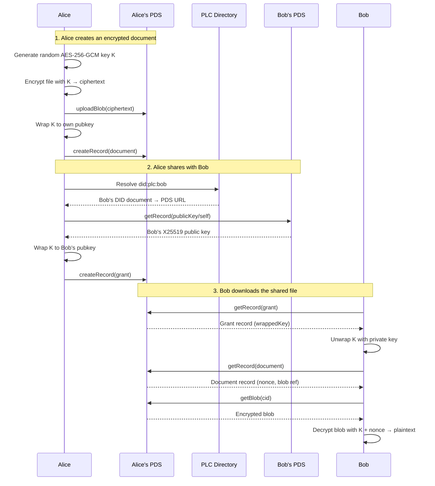
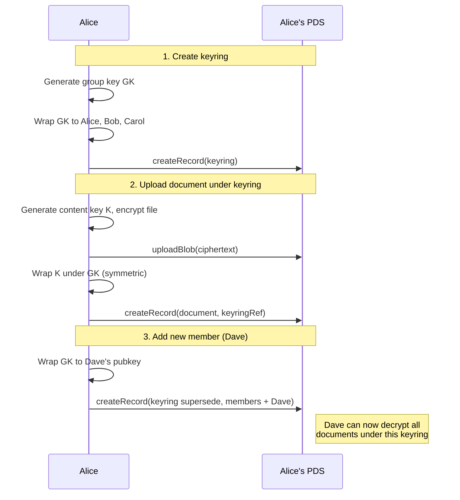
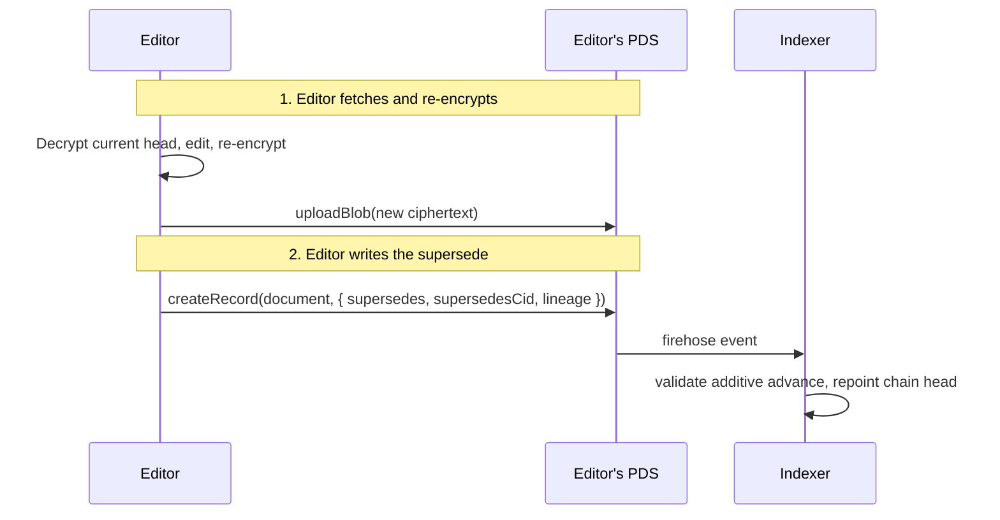
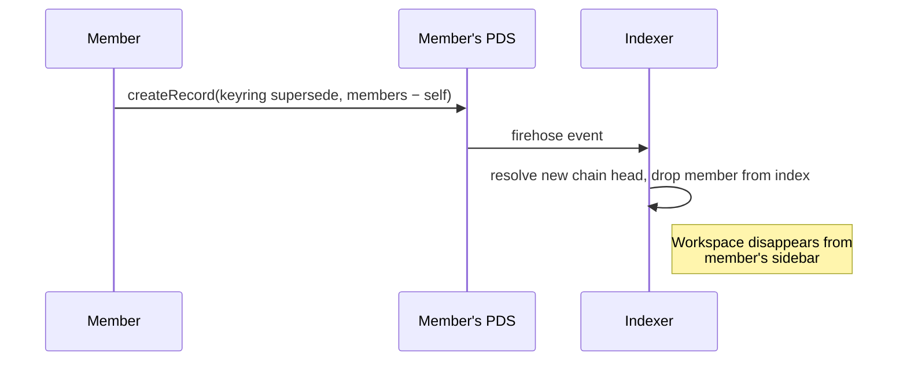
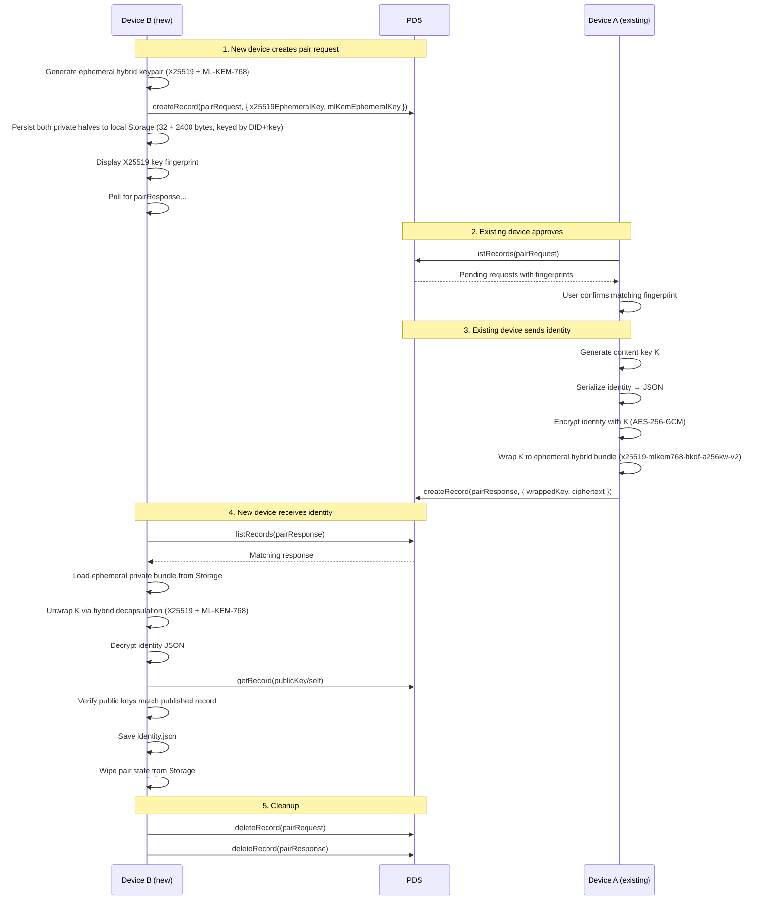

<!-- 
  NOTE TO EDITORS: 
  Opake uses a dual-documentation system. If you modify the AT Protocol 
  schemas or lexicon definitions in this file, you MUST also update the 
  corresponding MDX content in `apps/web/src/content/` to prevent documentation drift. 
-->

# at.opake.* Lexicon Schemas

An encrypted personal cloud built on AT Protocol.

## Architecture

The encryption model follows the same hybrid pattern as git-crypt:
- Each file/record is encrypted with a **random symmetric key** (AES-256-GCM)
- That symmetric key is **wrapped** (encrypted) to each authorized DID's public key
- Wrapped keys are stored as atproto records, publicly visible but useless without the private key
- File content is uploaded as a PDS blob (opaque encrypted bytes)

## Lexicon Overview

| NSID | Type | Purpose |
|------|------|---------|
| `at.opake.accountConfig` | record | Singleton per-account config/preferences (rkey: `self`), synced across devices |
| `at.opake.defs` | defs | Shared type definitions (encryption envelope, wrapped key, etc.) |
| `at.opake.directory` | record | A directory containing an ordered list of child document/directory AT-URIs |
| `at.opake.document` | record | An encrypted file/document with metadata |
| `at.opake.publicKey` | record | Singleton X25519 encryption public key (rkey: `self`) for key discovery |
| `at.opake.keyring` | record | A named group (workspace) with a shared symmetric key, wrapped to each member with a role; the head of a supersede chain whose genesis URI is the workspace identity |
| `at.opake.grant` | record | A share grant — gives a DID access to a specific document's key |
| `at.opake.pendingShare` | record | A queued share intent — retried by the daemon until the recipient publishes a public key or the record expires (7 days) |
| `at.opake.pairRequest` | record | Ephemeral public key from a new device requesting identity transfer |
| `at.opake.pairResponse` | record | Encrypted identity payload sent in response to a pair request |
| `at.opake.authFullAccess` | permission-set | OAuth permission set bundling all `at.opake.*` collections — for `include:` scopes |

## Schema evolution

Records carry a top-level `opakeVersion`. Any client can read that field on any record, of any version, and it is the whole compatibility test: a record whose version a client supports is understood; a higher version means "written by a newer client." Two rules keep that test honest.

**Fields only grow, and only in ignore-safe ways.** A schema version may add optional fields. It may never remove a field, make an optional field required, or change what an existing field means for a reader that ignores the new one. A change that can't be expressed that way is not a version bump — it is a new NSID. This is why the crypto-envelope fields on every record are `required`: those markings are permanent, so the current lexicons are the last chance to get required-vs-optional right before v1.

**New vocabulary rides a version bump.** Some fields hold identifier strings from a fixed registry — key-wrap and content-encryption algorithms (`wrappedKey.algo`, the encryption-envelope `algo`), the public-key and pairing algorithm identifiers, and `keyringMember.role`. Each schema version pins the exact set of values these fields may hold, cumulatively (a value valid at version N stays valid forever). Introducing a new value — a new algorithm, a new role — bumps `opakeVersion` together with the new entry, so a record can never quietly use vocabulary its declared version doesn't sanction. A record that declares version N but carries a value outside N's set is malformed, not merely new. The registry lives in [`vocabulary.json`](vocabulary.json) — one artifact, read by both the Rust client and the indexer, so neither can drift.

The consequence for encryption agility: a new algorithm that fits the existing wire shape is a vocabulary bump. A genuinely different construction (a new envelope layout, a different KEM shape) is a structural change and takes a new NSID — the same door as any other breaking change. The X25519 → X25519+ML-KEM migration went through the algorithm registry precisely because it kept the wire shape; that is the sanctioned path.

Validation happens in three places, each trusting less than the last: the author's PDS rejects malformed writes when it can resolve the lexicons; the indexer refuses malformed or vocabulary-violating records at ingest; and the client treats every record as untrusted, degrading around anything it can't read rather than failing wholesale. Only the last is load-bearing — the others are hygiene.

## Supersede chains: derived identity and the content pin

Keyrings, directories, and documents each form a **supersede chain**: a record with no successor is the canonical head, and each non-genesis record names its predecessor via `supersedes`. Two chain-level fields sit outside the per-record crypto envelope and deserve calling out.

**Derived genesis keyring rkey (`key: "any"`).** The `at.opake.keyring` record `key` is `any`, not `tid`. The genesis keyring's rkey is a *derived tag* — a 26-character lowercase-base32 string computed from the genesis (rotation-0) group key and the owner DID (`base32-lower(SHA-256(Ed25519_pubkey(HKDF(K₀, transcript("opake-workspace-identity", owner_did))))[..16])`; construction in [CRYPTO.md](../docs/CRYPTO.md#workspace-identity)). Because the genesis URI *is* the workspace identity, that identity commits to key material only members hold: a party cannot mint a keyring claiming a workspace whose rotation-0 key it lacks. Clients re-derive the tag and compare it to the declared anchor on every adoption path, members-only and offline — the indexer can't, as it holds no group key. Keyring supersedes use ordinary client-generated TIDs; the `any` key is what lets one collection hold both the derived-tag genesis and TID-keyed supersedes.

**`supersedesCid` — the content pin.** Every superseding record (keyring, directory, document) carries `supersedesCid` alongside `supersedes`: the CID of the immediate predecessor named by `supersedes`. It is **required whenever `supersedes` is present** (enforced at the app layer pre-v1), names the immediate predecessor only, and is never copied through a cascade — each level pins its own predecessor. **At v1 the pin compares the CID a serving host *reports*, not a hash recomputed from bytes**: clients don't compute atproto CIDs yet, so it detects CID disagreement between honest, non-colluding hosts (stale cache, accidental substitution, indexer/PDS reporting inconsistent heads) but **not** a malicious host serving tampered bytes under the true CID. True byte-level tamper-evidence — recomputing the CID from fetched bytes — is deferred to replication-tier work. The field is present now as a pre-v1 wire reservation so byte-binding lands later as an already-present field rather than a post-freeze migration.

## Flow: Sharing a file with another DID

Data never leaves Alice's PDS. Bob fetches everything from the source.

## Flow: Group sharing via keyring

Any keyring member unwraps GK with their private key, then uses GK to unwrap each document's content key K. Membership is not edited in place: a manager advances the keyring by writing a supersede whose `members` array is the new roster, and the canonical keyring is the chain head (`spec:workspace-membership § Adding a member is a manager-authored supersede`). Removing a member is a supersede that archives the old rotation's member entries into `keyHistory`, rotates GK, and re-wraps to the remaining members — per-document content keys and blobs stay untouched (`spec:workspace-membership § Removal rotates the group key; leave does not`). The history lets remaining members decrypt pre-rotation documents even on new devices.

## Flow: Collaborative editing via document supersede

There is no proposal record and no owner who alone may write the canonical document. An editor writes a new `at.opake.document` on their *own* PDS that supersedes the current one; the indexer validates the supersede's authority at write time and repoints the workspace snapshot at the new head.

The canonical document at any path is the head of its supersede chain — the record no successor points at. The indexer's authority check is role-shaped: an editor's supersede must be *additive* (advance the chain, not fork or truncate it), while a manager is unrestricted (`spec:tree-chains § Editor supersedes are additive; managers are unrestricted`). Concurrent supersedes fork the chain, and the indexer picks a deterministic winner (`spec:tree-chains § Concurrent supersedes fork, and the indexer picks a deterministic winner`). Document adoption — substituting a departed member's document — rides the same shape: the substitute supersedes the original by URI.

## Flow: Leaving a workspace

A member leaves by writing a keyring supersede on their own PDS that drops themselves from `members`. Self-removal is permitted without manager authority (`spec:workspace-membership § Keyring supersede authority is manager-only, except pure self-removal`).

Leave deliberately does not rotate the group key: the leaver already holds it, so rotating buys no forward secrecy (`spec:workspace-membership § Removal rotates the group key; leave does not`). It is a cooperative departure — a visibility opt-out. Forward secrecy against a departed member arrives with the next manager-authored removal, which does rotate. The last member cannot leave, and the only manager must promote a successor first, so the chain is never orphaned (`spec:workspace-membership § Leave guards — no orphaned workspaces`).

## Flow: Device-to-device identity pairing

Both devices are authenticated to the same DID. The PDS is just a relay — the encryption is the access control. Ephemeral key fingerprints are displayed for visual SAS comparison.

For detailed sequence diagrams of every CLI operation, see [docs/flows/](../docs/flows/).
